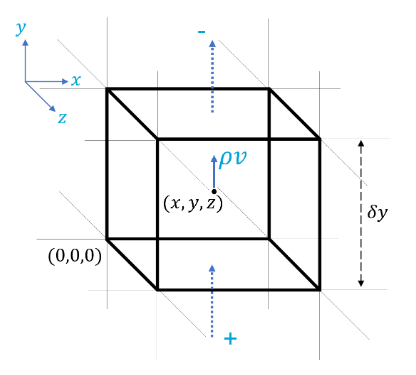
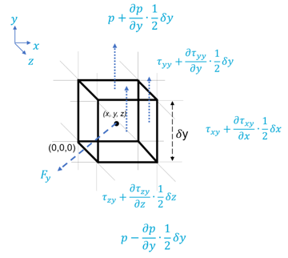

# Conservation laws

MMMMM
In general we will consider conservation problems, for example a simple mass balance:

$$
\textrm{Input} - \textrm{Output} = \Delta \textrm{Storage}
$$

For mass

- 


```{note} Important things to retain from this chapter

* A simple mathematical form of the conservation law for any physical quantity
* The conservation of mass for a fluid
* The conservation of momentum for a fluid (Navier-Stokes equation)

```

Establishing a relationship between the Lagrangian and Eulerian frames, was the first step to the FVM. Now, let us see how the Lagrangian derivative can allow one to express the **fundamental conservation laws** in a manner that is consistent with the FVM.  

Consider the infinitesimally small finite volume shown below (in 3D):



The height of the volume is shown as $\delta y$. You are in an Eulerian frame observing the volume through which a fluid is only flowing in and out along the $y$ axis. It enters through the bottom face and leaves through the top face. The velocity of the fluid at the center of the cube is simply the $y$ component of the velocity, $v$.

Now, recall Gauss’s theorem (check again that chapter if needed!). The change in mass inside this volume is simply the difference of the mass flux through the surfaces. As the first step, let us calculate this flux. We have the **velocity at the centre of the cell**, how can one get the **velocity on the top and bottom faces** using this information?

If you thought of interpolation, then you are correct! One can write the flux on the top face (velocity normal to the face times the area):

$$\begin{gather*}(\rho v)_{top}=(\rho v)_{center}+\frac{\partial(\rho v)_{center}}{\partial y}\frac{\delta y}{2}\\(\rho v)_{bottom}=(\rho v)_{center}-\frac{\partial(\rho v)_{center}}{2}\frac{\delta y}{2}\end{gather*}$$

Next the mass inside the cell variation with time is simply:

$$\left|\frac{\partial(\rho_{center}\delta x\delta y\delta z)}{\partial t}\right| = \frac{\partial\rho_{center}}{\partial t}(\delta x\delta y\delta z)$$

where $\rho$ is the density of the fluid (the volume of the cell remains unchanged at the center of the cell). Note, however, that its value is not constant and, therefore, **Gauss's theorem** dictates:

$$\frac{\partial\rho_{center}}{\partial t}(\delta x\delta y\delta z)=(\rho v)_{bottom}(\delta x\delta z)-(\rho v)_{top}(\delta x\delta z)$$

The signs for top and bottom here are as follows - a flux into the cell is positive and a flux leaving the cell is negative. From the above expressions, one obtains (after dropping the "center" subscript):

$$\frac{\partial\rho}{\partial t}=-\frac{\partial(\rho v)}{\partial y}$$

Extending to 3D and 3 components of flux, one can generalise the above equation as:

$$\frac{\partial\rho}{\partial t}=-\frac{\partial(\rho u)}{\partial x}-\frac{\partial(\rho v)}{\partial y}-\frac{\partial(\rho w)}{\partial z}$$

or using the vector notation

$$\frac{\partial\rho}{\partial t}+\mathbf{\nabla}\cdot(\rho\mathbf{v})=0$$

Expanding the operator $\mathbf{\nabla}\cdot(\rho\mathbf{v})$ using the product rule:

$$\mathbf{\nabla}\cdot(\rho\mathbf{v})=\rho\mathbf{\nabla}\cdot\mathbf{v}+(\mathbf{v}\cdot\mathbf{\nabla})\rho$$

Combining this result with the previous expression, we define

$$\frac{\partial\rho}{\partial t}+\rho\mathbf{\nabla}\cdot\mathbf{v}+(\mathbf{v}\cdot\mathbf{\nabla})\rho=0$$

Look at the above equation carefully. Do the first and the third term together match something that we spoke of before this section? You are correct if you guessed that they represent the Lagrangian derivative. So, the equation ultimately reads:

$$\frac{D\rho}{Dt}+\rho\mathbf{\nabla}\cdot\mathbf{v}=0$$

This is the conservation law for mass, i.e. mass can neither be created nor destroyed *(classical mechanics)*.

## A general conservation law?

The equation

$$\frac{\partial\rho}{\partial t}+\mathbf{\nabla}\cdot(\rho\mathbf{v})=0$$

can be generalised to represent the conservation of any property that is known to be conserved. Let us start by writing

$$\frac{\partial(\rho\phi)}{\partial t}+\mathbf{\nabla}\cdot(\rho\phi\mathbf{v})$$

Upon expanding the two terms using the chain rule, one obtains:

$$\phi\frac{\partial\rho}{\partial t}+\rho\frac{\partial\phi}{\partial t}+\phi\mathbf{\nabla}\cdot(\rho\mathbf{v})+\rho(\mathbf{v}\cdot\mathbf{\nabla})\phi$$

Now combine the terms to rewrite the equation as:

$$\phi\left[\frac{\partial\rho}{\partial t}+\mathbf{\nabla}\cdot(\rho\mathbf{v})\right]+\rho\left[\frac{\partial\phi}{\partial t}+(\mathbf{v}\cdot\mathbf{\nabla})\phi\right]$$

We know that the term in with the square brackets on the left is zero (*why?*), whereas the term on within the square brackets on the right is the Lagrangian derivative of $\phi$. So, one can simply write:

$$\rho\frac{D\phi}{Dt}=\frac{\partial(\rho\phi)}{\partial t}+\mathbf{\nabla}\cdot(\rho\phi\mathbf{v})$$

Coincidentally, setting $\phi=1$ simply gives the conservation of mass as derived previously using Gauss's theorem. The above equation is the general conservation law for any quantity using information from an Eulerian frame.

***Think about this:* what does one obtain if $\phi$ is set equal to the velocity?**

If you keep in mind that density is representative of mass, you will realize we obtain **conservation of momentum**! In that case, what should the right-hand side of the above equation be? What can bring about a change in momentum (Newton's second law)? The right-hand side will read $\rho\frac{Dv}{Dt}$ or the density (mass) times acceleration - which is simply the **force**.

Hence, the conservation law of momentum obtained by setting $\phi$ equal to the velocity is simply **Newton’s second law of motion**. Let’s have a look at this in more detail, to derive the fundamental yet extremely challenging equation of fluid mechanics. 

<!-- ## The Navier-Stokes equations -->

```{note} Before we begin this section... 

Let us recall what we have derived so far:

* The relationship between the **divergence** of a quantity inside a fixed volume and the **flux** of the same quantity through the surface enclosing the volume (**Gauss’s theorem**);
* The **Lagrangian derivative** that translates the information obtained in an **Eulerian** frame (most common in fluid mechanics) **to a Lagrangian** (particle tracking) measurement;
* A simple **conservation law** for the **mass inside a volume** and relating it back to Gauss’s theorem;
* **Extending the conservation law** for mass to any quantity of interest. 

```

Now, we will use the conservation law with velocity as the quantity of interest. Let us start with the general conservation law:

$$\rho\frac{D\phi}{Dt}=\frac{\partial(\rho\phi)}{\partial t}+\mathbf{\nabla}\cdot(\rho\phi\mathbf{v})$$

For simplicity, let us set $\phi=v$, i.e. the y-component of velocity, to obtain:

$$\rho\frac{Dv}{Dt}=\frac{\partial(\rho v)}{\partial t}+\mathbf{\nabla}\cdot(\rho v\mathbf{v})$$

From Newton’s second law, the left-hand side is the **change of momentum** or the **force**. This force is the sum total of all forces acting on a particle. If the particle is infinitesimally small volume filled with a fluid, the forces will be

* **Pressure**, that seeks to the compress the fluid
* **Shear**, due to friction, which seeks to change the shape of the volume element
* **Gravity**, the weight of the volume

The sum of all these forces in the $y$ direction will equal $\frac{\partial(\rho v)}{\partial t}+\mathbf{\nabla}\cdot(\rho v\mathbf{v})$. The schematic shows these forces in detail:



Without going into much detail, the forces in the $y$ direction can be summarized (and keeping the same structure as shown in the last list of bullet points) as:

* The pressure $p$ that acts in all directions equally
* The three components of the stress tensor in the $y$ direction, namely the normal stress $\tau_{yy}$ acting on the top and bottom faces; and the shear stresses on the left-right and front-back faces, $\tau_{xy}$ and $\tau_{zy}$
* A body force (like gravity) with a component in the $y$ direction, $F_y$

For each force, one must interpolate the value at the center of the cell to estimate the flux at the faces as done previously for the mass flux. If done correctly, we will obtain:

$$\rho\frac{Dv}{Dt}=\frac{\partial(\rho v)}{\partial t}+\mathbf{\nabla}\cdot(\rho v\mathbf{v})=\frac{\partial\tau_{xy}}{\partial x}+\frac{\partial(-p+\tau_{yy})}{\partial y}+\frac{\partial\tau_{zy}}{\partial z}+F_y$$

Extending to all three directions, we obtain **Newton's second law for an incompressible fluid**:

$$\rho\frac{Dv}{Dt}=\frac{\partial(\rho v)}{\partial t}+\mathbf{\nabla}\cdot(\rho v\mathbf{v})=\nabla p+\mathbf{\nabla}\cdot(\mu\mathbf{\nabla}v)+\mathbf{F}$$

The above equation, together with the conservation of mass (i.e. the continuity equation):

$$\frac{\partial\rho}{\partial t}+\mathbf{\nabla}\cdot(\rho\mathbf{v})=0$$

form the **Navier-Stokes equation**.