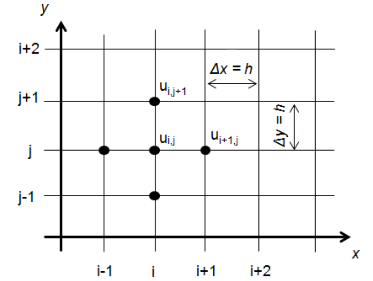
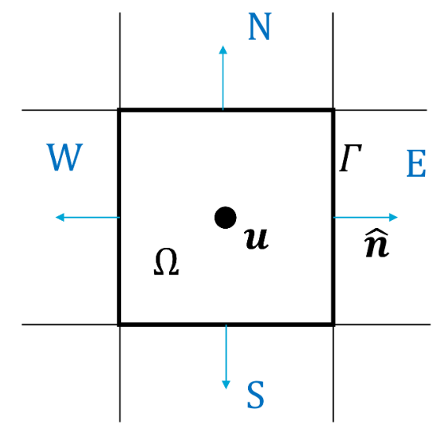

# Gauss's Theorem

```{note} Important things to retain from this chapter

* Mathematical relationship between divergence and its integral
* Relationship between the integral of a physical quantity inside a fixed volume with the flux through the volume’s boundaries (Gauss's theorem).  
* A discrete form of the above expressions.  

```

## Definition and explanation

FVM begins with Gauss's theorem that relates the **flux of a vector field through a closed surface** with the **divergence of the vector field inside the volume** enclosed by that closed surface.

```{warning}
All **bold** variables are vectors and must be mathematically treated as such.
```


```{admonition} A simple analogy

Imagine you have a bucket of water that has a few holes at the bottom and a few inlets connected to pipes at the top. The pipes bring in a finite amount of water, while the holes at the bottom lead to a constant discharge from the bucket. Intuition alone tells us that the change in volume of water inside the bucket is simply the sum of the rates at which the water enters the bucket through the pipes and leaves through the holes. **Gauss's theorem is simply a generalised mathematical expression of this phenomenon**. 

```
```{figure} ./figs/gauss1.png
---
width: 60%
name: gauss1
---
Generalized schematic of a 3D "volume", $\Omega$, illustrated by a 2D ellipse. The bounding surface $\Gamma$, surface normal vector $\mathbf{\hat{n}}$ and vector field 
```

Consider the volume shown in the figure above, let us call it $\Omega$. Let the surface enclosing the volume be $\Gamma$ and $d\Gamma$ be a small surface element with a normal vector $\mathbf{\hat{n}}$. Assume we are *observing* the vector field $u$ inside this volume, which is transported across the surface in time.


For simplicity and relevance, let us consider $\mathbf{u}$ to be velocity. Hence, one can write

$$\mathbf{u}=u_{\hat{i}}+v_{\hat{j}}+w_{\hat{k}}$$

The divergence of any vector $u$ is a measure of the strength of a source or a sink of a vector in space. A **positive divergence** is a **source** and a **negative divergence** is a **sink**. Mathematically:

$$\mathbf{\nabla}\cdot\mathbf{u}=\left(\frac{\partial}{\partial x}\hat{i}+\frac{\partial}{\partial y}\hat{j}+\frac{\partial}{\partial z}\hat{k}\right)\cdot\left(u_{\hat{i}}+v_{\hat{j}}+w_{\hat{k}}\right)=\frac{\partial u}{\partial x}+\frac{\partial v}{\partial y}+\frac{\partial w}{\partial z}$$

On the other hand, the surface experiences a constant inflow or outflow of the vector. The flux $\Lambda$ through an infinitesimally small unit of surface $\Gamma$, $d\Gamma$, is defined as

$$\Lambda=\mathbf{u}\cdot\mathbf{\hat{n}}d\Gamma$$

or the amount of $u$ at the surface in the direction of the surface's normal times the area of the surface. In the case of the bucket, the flux is the volumetric flow rate of the water in through the pipes and out through the holes.

Gauss's theorem simply relates the surface flux to the volumetric divergence through this mathematical expressions:

$$\int_{\Omega}\mathbf{\nabla}\cdot\mathbf{u}d\Omega=\oint_{\Gamma}\mathbf{u}\cdot\mathbf{\hat{n}}d\Gamma$$

i.e. the volumetric integral of the divergence of $\mathbf{u}$ is the closed surface integral of the flux of $\mathbf{u}$. Now, let us see how this works in a discrete setting and enables us to develop the FVM.

## A volume-based discretisation

From points in FDM, we will now discretize space as finite volumes as shown in the figure below



Each of the squares (having the discrete points as corners) will now become a volume with a known (and later calculated) value of $\mathbf{u}$ at the geometrical center.



The intersection of the lines is where the points for the **FDM were located**. Now, let us apply Gauss's theorem here for a 2D velocity field $\mathbf{u}=u\hat{i}+v\hat{j}$ where all variables are functions of space and time, i.e. $u=u(x,y,t)$, for example. Please note that the value of $u$ is **only known at the center of the cell** and the center of the four faces labelled above as N, S, W and E. The value of $u$ at the center is assumed to be constant over the volume and denoted as $\mathbf{u_c}$:

$$\int_{\Omega}\mathbf{\nabla}\cdot\mathbf{u}d\Omega=\mathbf{\nabla}\cdot\mathbf{u_c}\int_{\Omega}d\Omega=\mathbf{\nabla}\cdot\mathbf{u_c}\Omega=\left(\frac{\partial u_c}{\partial x}+\frac{\partial v_c}{\partial y}\right)\Omega$$

The discrete closed surface integral reads:

$$\begin{align}\oint_{\Gamma}\mathbf{u}\cdot\mathbf{\hat{n}}d\Gamma &=\oint_{\Gamma_E}\mathbf{u_E}\cdot\mathbf{\hat{n_E}}d\Gamma+\oint_{\Gamma_W}\mathbf{u_W}\cdot\mathbf{\hat{n_W}}d\Gamma+\oint_{\Gamma_N}\mathbf{u_N}\cdot\mathbf{\hat{n_N}}d\Gamma+\oint_{\Gamma_S}\mathbf{u_S}\cdot\mathbf{\hat{n_S}}d\Gamma=\\ &=(u_E-u_W)\Delta y+(u_N+u_S)\Delta x\end{align}$$

**An indispensable expression**

The simple discrete expression we derived above, in an incredibly powerful tool in fluid mechanics, heat transfer and electrodynamics. The Gauss’ theorem translates simply into the 3 fundamental conservation laws of physics: 

* Change in mass inside a volume equals the rate at which mass enters or leaves through its surface (conservation of mass);
* Change in momentum of the volume equals the sum of all forces acting on its surface (conservation of momentum, Newton’s second law);
* Change in energy of the volume equals the sum of heat transfer and the work done at the surface (conservation of energy).  

But before we can derive the above equations in the context of the finite volume method, we need to understand the concept of **Eulerian** and **Lagrangian reference frames**.  