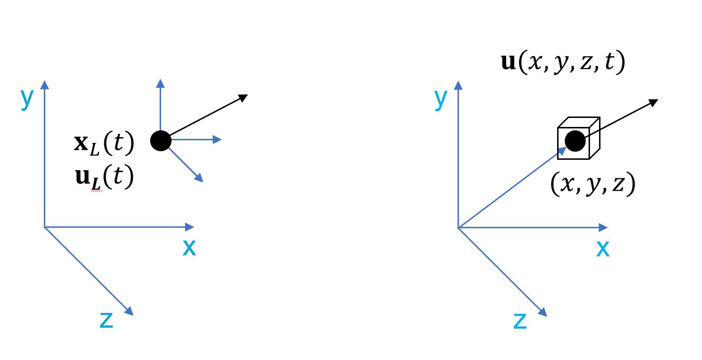
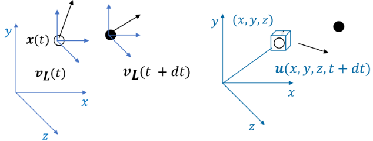

# Lagrangian derivative

```{note} Important things to retain from this chapter

* Relationship between Eulerian and Lagrangian frames 
* Lagrangian derivative that expresses this relationship mathematically 
* Why one works with an Eulerian frame (generally) in fluid mechanics  

```

## Lagrangian vs Eulerian

Lagrangian and Eulerian frames are two approaches used in fluid mechanics that describe the **motion and behaviour of a fluid** over time. They are distinct ways of modelling the movement of particles or elements within the fluid. Let's start with simple analogies to highlight their differences: 

**Lagrangian frame**

In a Lagrangian frame, one "follows" the fluid particles as they move through space i.e. one is attached to the fluid particle under observation. Imagine a fluid element that is coloured with a dye. One only track the velocity of that element as it moves.  

Lagrangian analysis is helpful for **understanding the history and trajectory of individual particles**. This approach is suitable for studying issues like particle dispersion, tracer movement or tracking the paths of specific objects in a flow. 

**Eulerian frame**

Instead of following individual particles, the Eulerian frame observes what is happening at **fixed points in space**. Instead of being attached to a particle (or an element of the fluid), one places a probe at a certain point inside the fluid and observes the change in velocity with time at that location as different fluid elements pass through that location.  

Eulerian analysis is more suitable for studying the **overall properties of the fluid** like flow patterns, pressure distribution or heat transfer. It provides a global view of what is happening in the fluid at various locations. 

---

In summary, the **Lagrangian frame** follows **individual elements as they move** through space, providing a detailed, particle-focused view. The **Eulerian frame**, on the other hand, observes **fixed points in space**, offering a broader, location-based perspective on the behaviour of the fluid. The choice between these frames depends on the specific problem one is trying to solve and in many cases, a combination of both frames may be used to gain a complete understanding of a fluid system. 

## Lagrangian derivative

Take a look into the two schematics shown below:



The one of the left shows a particle (black dot) moving in a Cartesian frame. You, as an observer, are observing the particle in the smaller frame attached to it. For you, the position of the particle (in the Cartesian frame) and its velocity, will simply be a function of time. *Why not space?* Because you are moving with the particle and, hence, will not witness any relative motion.  

The frame of the right is the same Cartesian frame, with the black dot. But in this case, you are an observer viewing the blue cube that is stationary in the Cartesian frame (it could be moving too but let’s keep things simple for now). The particle is the same as the particle in the frame on the left - its location and velocity with respect to the Cartesian frame remain the same. As the particle moves, it will enter and leave the box but you are fixed to the box. Hence, you will notice that the velocity and the location of the particle are a function of **both time and space**. 

As established by fundamental physics, the **velocity and location vectors** of the particle with respect to the Cartesian frames (both) **will be the same**! This is simply the **Lagrangian-Eulerian equivalence**. For a small change in time, $dt$, the schematic will look like this:



In the Lagrangian frame you, as an observer, have just moved with the particle and measuread a new velocity at time $t+dt$ (a function of time only). On the other hand, in the Eulerian frame, the black dot has simply left the cube and there is a new particle (white dot) with a different velocity that is function of both time and space. In this case, the spatial location is that of the cube, but the time is $t+dt$.

**If you noticed the difference, one sticks to a particle in the Lagrangian frame and in the Eulerian one sticks to a spatial location while observing the particles that come and go.** But, for an infinitesimally small $dt$ and if the particles form a continuum, i.e. the spatial scale at which the particles are being observed is much larger than the molecular scale. This means that the particles although separate can be viewed as a continuous mass (like a fluid).

---

Therefore, one can write that the small change in velocity in the Lagrangian frame for the black dot is the same as the change observed in the Eulerian frame as the black dot is replaced by the white dot, i.e.:

$$d\mathbf{v_L}(t)=d\mathbf{v}(x,y,z,t)$$

The right hand side is a function of 4 variables. The application of the chain rule of differentiation leads to:

$$d\mathbf{v_L}(t)=\frac{\partial\mathbb{v}}{\partial x}dx+\frac{\partial\mathbb{v}}{\partial y}dy+\frac{\partial\mathbb{v}}{\partial z}dz+\frac{\partial\mathbb{v}}{\partial t}dt$$

Dividing by $dt$ while recalling that $\frac{dx}{dt}=u$, which is the $x$-component of velocity, one gets:

$$\frac{d\mathbf{v_L}(t)}{dt}=u\frac{\partial\mathbb{v}}{\partial x}+v\frac{\partial\mathbb{v}}{\partial y}+w\frac{\partial\mathbb{v}}{\partial z}+\frac{\partial\mathbb{v}}{\partial t}$$

In the above equation, it is important to note that $\mathbf{v}$ is in bold and, therefore, it represents a **vector** $\implies$ the above equation is a **vector equation**. Each term in the equation will have the $x$, $y$ and $z$-components. Using Lagrangian-Eulerian equivalence, the velocity vectors on both sides should be the same in the Cartesian frame!

A mathematical trick allows one to express the above equation more compactly as

$$\frac{D\mathbf{v}}{Dt}=\frac{\partial\mathbf{v}}{\partial t}+(\mathbf{v}\cdot\nabla)\mathbf{v}$$

where the symbols have their usual meanings and $\mathbf{\nabla}$ is the gradient operator.

The derivative on the left-hand side is now written with an **uppercase D** to indicate a **Lagrangian frame**. The equation above relates the **derivative in a Lagrangian form** with the **information obtained in an Eulerian frame**. The equation can be generalised for any quantity, scalar or vector ($\phi$ is a scalar in this case) as

$$\frac{D\mathbf{v}}{Dt}=\frac{\partial\phi}{\partial t}+(\phi\cdot\nabla)\phi$$

In case you find it difficult to understand the above, take a pen and paper and start over again. Please **do not proceed to the next section without understanding this equation.**

```{note} Importance of the Lagrangian derivative

Before we go further, it is important as a summary to mention why one needs to know (and learn about) the Lagrangian derivative at all! In most cases conserving track/future, you’ll come across spatial flows wherein measurements are being performed at certain locations with probes, laser sheets or sound waves. Hence, you’ll always operate in an Eulerian frame i.e. not tracking a particle but observing a volume (or multiple volumes) of space.  

The Lagrangian derivative is the only way that one can convert that Eulerian spatial experimental data into something meaningful that gives you the history of the flow.  
```