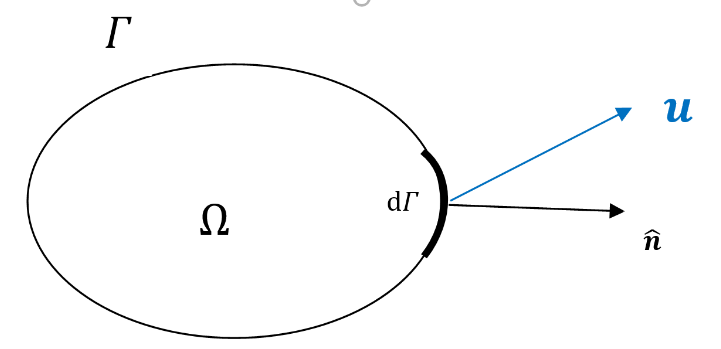
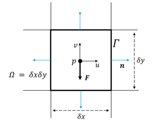
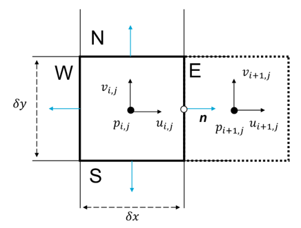

# Navier-Stokes equations

```{note} Important things to retain from this chapter

* Converting the Navier-Stokes equations (different mathematical operators in general) to their integral forms;
* Discretising the components of the integral form over a finite volume. Think of the components of the Navier-Stokes equation as different types of mathematical operators 

```

An exact solution to the Navier-Stokes equations is very complicated and hence, in nearly all practical applications, one must resort to solving these equations algebraically. Akin to the FDM, we can **solve the Navier-Stokes equations for fluids** using the **FVM**. The first-step would be to covert the continuous differential form of the Navier-Stokes equations to an integral form using Gauss’s theorem.

Consider again the following schematic:



Now let us integrate the two sides of the Navier-Stokes equations over the volume $\Omega$. The continuity equation once integrated looks like:

$$\frac{\partial}{\partial t}\left(\int_{\Omega}\rho d\Omega\right)+\int_{\Omega}\mathbf{\nabla}\cdot(\rho\mathbf{v}d\Omega=0$$

which, from Gauss's theorem:

$$\frac{\partial}{\partial t}\left(\int_{\Omega}\rho d\Omega\right)+\int_{\Gamma}\rho(\mathbf{v}\cdot\mathbf{n})d\Gamma=0$$

While the momentum equation upon integration and the application of Gauss's theorem reads

$$\frac{\partial}{\partial t}\left(\int_{\Omega}\rho\mathbf{v}d\Omega\right)+\int_{\Gamma}\rho\mathbf{v}(\mathbf{v}\cdot\mathbf{n})d\Gamma=\int_{\Gamma}p\mathbf{n}d\Gamma+\int_{\Gamma}\mathbf{\bar{\tau}}\cdot\mathbf{n}d\Gamma+\int_{\Omega}\mathbf{F}d\Omega$$

where $\mathbf{\bar{\tau}}$ is the stress tensor. The above equations are the **integral form of the Navier-Stokes equations**. As the final step of the FVM for solving the Navier-Stokes equations, we **discretise** these integral equations over a finite volume to convert them into algebraic equations that can be solved numerically.

## Finite volume discretisation *(once again)*

For the sake of clarity, let’s have a look at a short example of how the terms of the NS equations (and simplifications such the diffusion equation or the Poisson equation) can be discretised over a finite volume in their **integral form**.

Here is a schematic of a finite volume (yet again):



Let us have a look at how the pressure term is handled over a finite volume. Using Gauss's theorem, one obtained:

$$\int_{\Omega}\nabla pd\Omega=\int_{\Omega}p\mathbf{n}d\Gamma$$

The gradient of pressure at the centre of the volume is now simply the integral of the pressure over the surface (perimeter in the this case) of the volume. In a discrete setting, this integral is simply a summation (just as integrals are intended to be). Please remember that it is a **vector equation** and $n$ is the **outward normal** to the surface under consideration. Hence, we get:

$$\int_{\Gamma}p\mathbf{n}d\Gamma=(p_E-p_W)\delta y\hat{i}+(p_N-p_S)\delta x\hat{j}$$

The subscripts have their usual meanings. Try doing this for other terms of the Navier-Stokes equations. Now, once this is done, how can we find the values of pressure of the faces? By using **interpolation between adjacent cells**:



Using the schematic above, the pressure on the east face (E) can be obtained in 3 ways:

* **Central** scheme (also called linear)

$$p_E=\frac{p_{i+1,j}+p_{i,j}}{2}$$

* **Upwind** scheme

$$p_E=p_{i,j}$$

These are the 2 most common schemes used. **Can you guess the *order of accuracy* of both the schemes?**

Try to recall how $p_E$ can be expressed as a Taylor series expansion around the volume and how $p_{i+1,j}$ and $p_{i,j}$ can be expressed using the Taylor series around $p_E$ (followed by adding the 2 Taylor series to obtain $p_E$). If you perform these steps correctly, you will obtain that the **central** scheme is **second-order** accurate whereas the **upwind** scheme is **first-order** accurate.

Both schemes have their pros and cons, which are being the scope of this introductory week to the FVM. Those of you who will pursue tracks that contain fluid mechanics will hear about this later on as well.