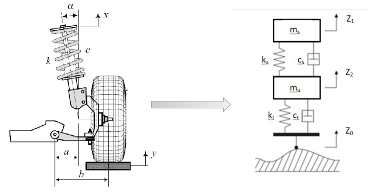
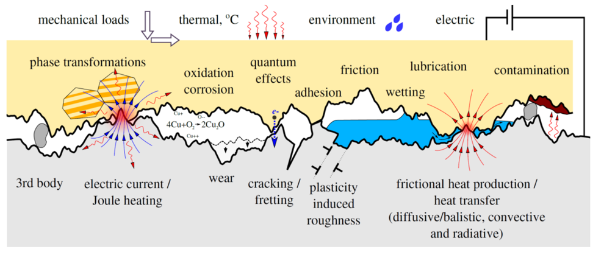
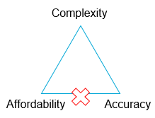

# Model Classification

## What is a Model?

**In short:** a purpose built abstraction of physical reality

Using a short practical example to illustrate this: imeagine you are throwing a projectile, let us say a basketball and you want to **model** its trajectory. To do so, you would write the following equations of motion:

$$\begin{cases}x=v_0t\cos\theta \\ t=v_0t\sin\theta-\frac{1}{2}gt^2\end{cases}$$

which would result in the following plots for different initial velocities, $v_0$, and angles, $\theta$

## Fit-for-purpose: Modelling Assumptions

It is important to keep in mind that **different purpose $\implies$ different model**. We will now look to different examples that illustrate this.

### Example 1: Mode Choice Modelling

Imagine you want to predict what would be the choice made by a rational individual to travel from Delft to Paris (i.e. given origin and destination). Would he choose to go by car or by train?

If we consider the simplest possible car dynamic model, where $v(t) = \bar{v}$, then it is very simple and easy to compute! But it will also depend on how rational individuals will make choices (travel time, travel cost, comfort, sustainability, etc.)

### Example 2: Emissions Modelling

Let us now consider a different scenario: we want to predict how much $\text{CO}_2$ a conventional internal combustion vehicle will produce on a trip. If we consider, again, the simplest possible car dynamic model, $v(t) = \bar{v}$, and the simplest model to predict the car emissions, based on "the faster you drive, the more $\text{CO}_2$ you emit":

$$e(t) = av(t)+b$$

then we get (combining the two models):

$$e(t) = a\bar{v}+b$$

But is this good enough to answer our question and predict the emissions of the vechicle? **No.** In fact, there are lots of factors that gain a stronger importance in this scenario:

* Type of the fuel used
* Speed
* Air resistance considered
* Wind speed and angle
* Car profile & drag

As an example of how things change with this factors, check the image below:

### Example 3: Comfort Modelling

And, for a final example, consider you wanted to predict how comfortable the ride on the vehicle would be. In this case, the speed would not matter as much as in the previous scenarios, and we would have factors as the vehicle's suspension playing a far greater role!

### Summary

In summary, the assumptions made in modelling will take our model to a certain position in this trade-off triangle!

* **Affordability and accuracy:** cheap and functional models, but with a limited scope
* **Accuracy and complexity:** very realistic models, but prohibitively expensive
* **Complexity and affordability:** the unicorn icon might speak for itself - difficult to achieve!

## Classifying Models

Models can be classified according to their nature, such as:

* Conceptual models
* Mechanistic models
* Phenomenological models
* Data-driven models

### Mechanistic Models

**Concept:**
* Physical, chemical, or biological laws to describe the behavior of constituting parts of the modeled system
* Embodies the idea that a complex system is the summation of many basic phenomena

**Examples:**
* Newton's laws for describing rigid body motion
* Elasticity theory to predict stresses

### Phenomenological Models

**Concept:**
* Mathematical consistency between quantities, relationship between quantities is hypothesized via dimensional analysis, for example
* Model is constructed by setting up appropriate experiments, measuring observations, fitting hypothetical structure with data (e.g. linear regressions)
* Development of new theories based on observations of a complex system

**Examples:**
* Friction force
* Drag force
* Behavioral modelling (e.g. route choice in transport)

### Data-driven models

**Concept:**
* Usage of data to create empirical and probabilistic relations between the desired output and input

**Examples:**
* Human behavior in driving (e.g. mode-choice example from earlier!)
* Structural health monitoring in manufacturing (e.g. via machine learning)
* Predictive maintenance in transport infrastructure
* Other highly complex, well-measurable phenomena

## Example: surface contact/friction modelling

Let us consider a complex, multi-physics, multi-scale problem - the modelling of surface contact/friction

### Mechanistic approach

What are the main characteristics of using this approach?

* Accurate geometrical representation of the surface roughness
* Usage of all physical and chemical laws to describe interactions
* Surfaces in contact could also be modelled from an atomistic point of view (molecular-particle models)

On our trade-off triangle, we would put this approach on the right edge of it, due to its **very high** computational cost and to the fact that it is only viable for scientific research (nanomaterials, for example).

### Phenomenological approach

What are the main characteristics of using this approach?

* Simpler rule, inferred from experimental measurements
* Not as accurate as the mechanistic approach, but good enough for certain applications
* Coulomb's friction is also a phenomenological model itself!

On our trade-off triangle, we would put this approach on the bottom edge of it, due to its low computational cost and for being accurate enough to predict phenomena at scale.