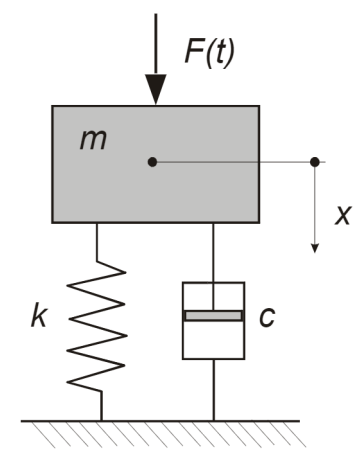
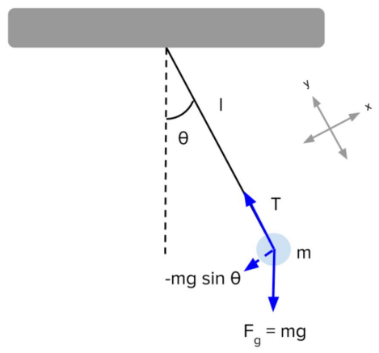

# Model Decisions

## Model classification vs modelling decisions

Instead of looking to model classification as seen in many books (and in the previous chapter), we will now focus on **modelling decisions** - the decisions made by us.

*And what is the main advantage of this?*

We will start seeing models as part of the creative and decision making process!

## Modelling decisions

In mechanics, usually we have to choose between static and dynamic models to solve certain problems. In classical mechanics, as you know, motion is governed by Newton's laws - the second law in particular - that allow us to write the famous main equation of motion that we know for years:

$$\underbrace{\sum_i^n F_i}_{\text{sum of all external forces}} = \overbrace{m\textbf{a}}^{\text{inertial terms}}$$

This equation can be tricky to solve: it is dynamic and nonlinear... However, it is also possible to simplify it! Let us take a look:

### Dynamic vs Static

#### Dynamic model

Let us consider the mass-spring system as a first example. For this system, Newton's equations of motion sketch as:

$$F-c\frac{dx}{dt}-kx = m\frac{d^2x}{dt^2} \Leftrightarrow m\frac{d^2x}{dt^2} + c\frac{dx}{dt}+kx = F$$

It is trivial to state that the response of the system will always have a dependence on the past and future states - a consequence of the differential equations. As seen before in this course, this dependency can be expressed using different ways to compute the derivatives:

**Backward differentiation scheme (past dependency)**

$$\frac{dx}{dt} \approx \frac{x(t)-x(t-\Delta t)}{\Delta t}$$

**Forward differentiation scheme (future dependency)**

$$\frac{dx}{dt} \approx \frac{x(t+\Delta t) - x(t)}{\Delta t}$$

#### Static model

Considering a static model, as the name suggests, we consider the response of the system only depending on present values!

If the terms with the derivatives are small and negligible when compared to $x$, then we find the following equation of motion:

$$\frac{d^2x}{dt^2},\frac{dx}{dt} << x \implies kx = F$$

**Under which circumstances does this occur?**

* *Slow loading rate:* constant $F$ or $F\cos(\omega t)$ if $\omega<\omega_0$, where $\omega_0$ is the natural frequency of the system

* Small mass and small values of the damping constant, $c$

#### Summary

|   | Mathematically | Conceptually |
|---|---|---|
| Dynamic | $\sum_i^n F_i = m\textbf{a}$  | Response of a system depends on the past (or the future) of the system |
| Static  | $\sum_i^n F_i = 0$  | Response of a system depends only on present values  |

### Linear vs Nonlinear

Let us consider one of the most typical Physics examples: the simple pendulum. The moment equation around the pivot point corresponds to a **nonlinear dynamic model**:

$$\frac{d^2\theta}{dt^2} + \frac{g}{l}\sin\theta=0$$

**However...** it can be linearized around a stable position, where we use $\sin\theta \approx \theta$. Thus, the equation of motion will become:

$$\frac{d^2\theta}{dt^2} + \frac{g}{l}\theta = 0$$

#### Summary

|   | Mathematically | Conceptually |
|---|---|---|
| Linear | $m\frac{d^2x}{dt^2}+c\frac{dx}{dt}+kx = F(t)$  |<ul><li>Superposition principle applies</li><li>Long term behavior does not depend on initial condition</li><li>Actual values of the variable $x$ are small</li></ul>|
| Nonlinear  | $m\frac{d^2x}{dt^2}+cx\frac{dx}{dt}+kx = F(x)$ $m\frac{d^2x}{dt^2}+c\frac{dx}{dt}+kx'' = F$ $m\left(\frac{d^2x}{dt^2}\right)''+c\frac{dx}{dt}+kx'' = F(x)$  |<ul><li>Superposition principle does not apply</li><li>Long and short term behavior highly dependent on initial condition</li></ul>|

### Time-invariant vs Time-variant

It is clear that all systems that we know are time-variant, i.e., their state changes with time, whether that change is over a **short or a long-time scale** (or both). Let us see some examples of changes in both short and long-time scales:

**Changes in short-time scale in Civil Eng. systems:**

* Human behavior in traffic system
* Wind turbines in operational conditions

**Changes in long-time scale in Civil Eng. systems:**

* Civil infrastructures (bridges, buildings, etc.) due to damage (even though they also change in a short-time scale, these changes can be consider negligible)

#### Summary

|   | Mathematically | Conceptually |
|---|---|---|
| Time-invariant | $m\frac{d^2x}{dt^2}+c\frac{dx}{dt}+kx=F(t)$ | The model coefficients or model parameters are constant |
| Time-variant | $m(t)\frac{d^2x}{dt^2}+c(t)\frac{dx}{dt}+k(t)x=F(t)$ | The model parameters do not change over time |

### Deterministic vs Stochastic

All systems, in reality, are stochastic to our eyes, since we never truly know the actual properties and inputs. However, under certain circumstances, this *stochasticity* can be neglected. Let us take a look to some examples of deterministic and stochastic systems:

**Cases of stochastic systems:**

Structures with known or unknown properties subject to unknown or known loads, respectively:

* Soil systems
* Traffic systems
* Buildings subject to wind, wave and earthquakes

**Cases of deterministic systems:**

Known structures subject to known static or dynamic loads. This only happens if the modeler decides that the variability of the system or the loads is low and has very little influence on the model outcome.

#### Summary

|   | Mathematically | Conceptually |
|---|---|---|
| Deterministic | $m\frac{d^2x}{dt^2}+c\frac{dx}{dt}+kx=F\cos(\omega t)$ | Will always produce the same output for a given input |
| Stochastic | Same equation but the parameters and the force can assume different values and are characterized by a **probabilistic distribution** | Will produce different outputs for a given input: **uncertainty** has a big role! |