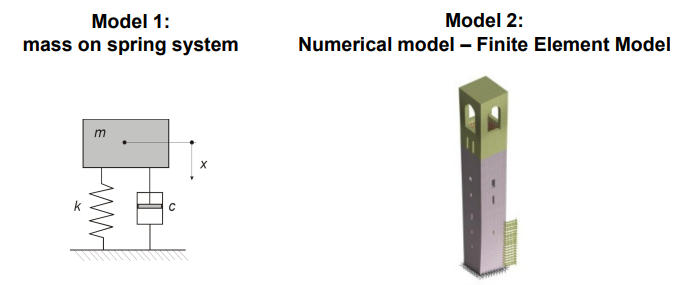
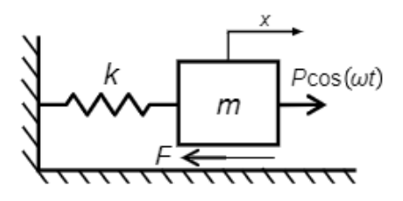

# Model Verification, Calibration and Validation

```{note}
*All models are wrong, but some are useful*
George Box (1913-2013)
```

## How can models be valid?

Under the assumption that we previously saw that all models are wrong... then **how can they even be considered valid?**

Let us consider two different models, the mass-spring system (model 1) and a tower (described by a numerical model, making using of the Finite Element Method).



Both models do **not exactly represent** the real structure, but they can be valid models in which we can trust to answer to certain research questions! For example:

* **Model 1:** What is the fundamental frequency of the structure?

Knowing the spring constant, $k$, the damping coefficient, $c$, and the mass we have on top, then we can exactly determine the natural (fundamental) frequency of the structure!

* **Model 2:** How does the structure deform at its fundamental frequency?

We need to use a more complex model to answer to this question, but the Finite Element Method would be an appropriate one, for example!

**Conclusion:** Our models are valid if they fit the purpose! (But this poses a new question...)

## How do we know they fit the purpose?

Essentially, models need to be **verified** and **validated to fit the purpose**. It is important to keep in mind that verification $\neq$ validation!

### Verification

**Verification** is the process of checking whether the model is correctly implemented with respect to the original conceptual model. It should answer the question: *Have we built the model right?*

For example, check whether:

* **It matches the assumptions**

If we assumed a linear behavior, for example, then the model's responses should obey the linear superposition principle.

* **All the main required aspects/actions are implemented**

Compare your model with a flow diagram that includes each logical action and check whether the model performs such actions!

* **Structured walk-through/one-step analysis**

Ask experts to go through the model; explain your steps to a non-expert person. This helps you to go throught the modelling steps again.

* **The results look reasonable for known input values (this can also be validation)**

Compare the model's results against analytical results (if possible) or benchmark solutions. This could also be done for parts of the model.

* **No numerical or math errors exist**

Running the model for extreme cases, checking asymptotic convergence of simulations or verifying a good representation of floating-point numbers are a few examples of performing this step.

### Validation

**Validation** is the process of testing the ability of the model in answering the research questions as best as possible. It has to fit the purpose! It should answer the question: *Have we built the right model?*

```{note}
But... what do we mean with research questions? Well, let us enumerate a few examples so you can have a clearer idea!

* What is the maximum displacement/acceleration/stress of a structure?
* What is the displacement or stress at a very specific location of the structures?
* How does the dynamic behavior of a structure change if the interaction with the soil is taken into account?
```

#### How do we validate a model?

To quantify how well such questions are answered, or **how the model fits the purpose**, we need to define features, metrics, and acceptable error ranges (limits and tolerances).

**Feature**

It depends on the purpose of a model, but it refers to the quantity that is chosen to be predicted. For example, the peak stress of a specific structural component. This is assessed by means of a **sensitivity analysis**

**Metric**

Measures the distance or error between the predicted feature by the model and the **reference value** of the chosen feature. Metrics are defined in Statistics (e.g. square of a difference, Mahalanobis distance, etc).

```{note}
We have mentioned **reference values of features**, which raises a question: with the respect to what are these errors measured? Where do we get the "true" behavior of an actual system?

Well, the answer is simple: either **from our own experience** (experiments, measured observations, etc), or **from other validated models**!
```

#### How do we get the reference behavior of a system?

As stated on the note before, we can do it in two different ways. The preferable option is always to have experimental data validation, but unfortunately that is not always possible... 


To compare it against other validated models, let us take a look into an example. Consider you a have a well validated and complex model able to represent the interaction between two surfaces. We would now like to use a simpler one, able to just reproduce the global sliding motion:



where $F$ is an arbitrary friction force chosen according to a certain phenomenological law. After comparing the results, multiple actions can be taken: we can add a bit more complexity to the model, choose another curve, etc.

#### What are the necessary steps for validation?

**Developed model**

When validating the model we have just deveoped, let us consider we find a **significant/unexpected mismatch**. Then, in this case we need to **re-model** - the model assumptions need to be revised and improved.

It this match improves, then we **validate** the model.

**Experimented or validated model**

For the experimented/validated model, if we find a **small/expected mismatch**, then we need to **calibrate** - adjust/tune the model parameters to improve the match.

Once again, in here, the final step is to achieve the model **validation**.

#### How is the model comparison performed?

To compare the model with either the experiment or the validated models, we assume we have a certain number of data points, obtained from experiments or from the validated model. Using this assumption, we can split this data points into two different sets:

* **Dataset 1:** we can use 40% of the data points for **comparative analysis and calibration** (30% or 50% is also good, no strict rule and this may change depending on the field of application). **Features** and **metrics** are important for this step.

* **Dataset 2:** remaining data set is meant for **validation**!

Once calibrated, we use the data by comparing the calibrated model (using the same feature and metric) against:

* Remaining set of data from experiments or simulated results
* Future collected data

#### Final notes on model validation

The consequences of making invalid models are mainly of two types:

* **Scientific:** wrong conclusions
* **Financial:** increased costs
* **Technical:** safety problems, discomfort

Be very systematic in verifying and validating models:

* Have a plan for experiments and model simulation to perform;
* Justify the chosen features and metrics;
* Mark out which changes have been made to the model;
* Make a track list of the corrected mistakes;
* Keep note of what changed in the results, for each modification performed in
the model;
* Clearly highlight for which parameter space the model is valid.