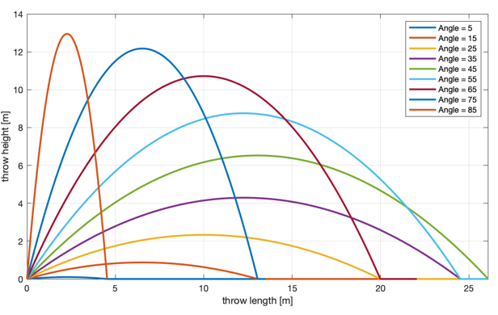
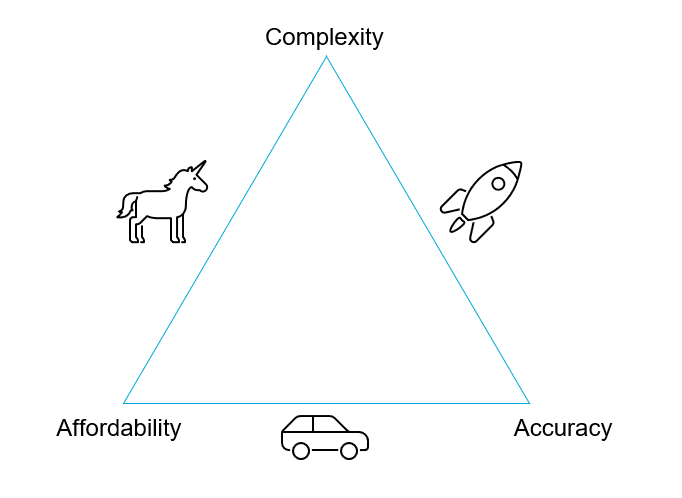

# Introduction to modelling

## What is a Model?

```{note}
**In short:** A model is a purpose built abstraction of physical reality.
```

In any engineering discipline, **we interact with a system** (Earth, ecosystem, water network…). Usually, we have questions about how the system behaves and how our intervention will affect it (e.g.: how a water body reacts when the cooling water from a nuclear power plant is discharged), or how the system will impact a proposed intervention (e.g.: a river which may flood close to our road). 

To answer that, we build an abstraction of the system which can mimic those aspects we are interested in. For instance, if we focus on the example from the cooling water and the water body, we can model the heat distribution in the water body to know the final temperature. Here we are only modelling some aspects of the system we are studying. What about the response from the species living there? Well, **if we do not need to know about this, and this doesnt affect our results in a meaningful way, our model is good enough to answer our question!**

|  |
| :--: |
| *Modelling procedure diagram [[1]](https://schoolbag.info/mathematics/numbers/103.html)* |

Once we are sure that the model can reproduce the behaviors we are interested in through **mathematization** ,i.e, the implimentation of the abstraction, we can further use it to make **computations**. Those computations need to be **interpreted** to get the answer to our actual question. We can also check if our model realistically represents the system we are modelling through **verification** - more about that later.

***

Using a short practical example to illustrate this: imagine you are throwing a projectile, let us say it is a basket ball, and you want to **model** its trajectory. To do so, you would write the following equations of motion:

$$\begin{cases}x=v_0t\cos\theta \\ y=v_0t\sin\theta-\frac{1}{2}gt^2\end{cases}$$

where $x$ and $y$ are the horizontal and vertical components of the position of the ball at time $t$, $v_0$ is the initial velocity, $\theta$ is the initial angle and $g$ is the gravity acceleration. The trajectory of the projectile depends on the velocity and angle we shoot the ball. In the figure below, different trajectories depending on $\theta$ and $v_0$ are shown. These are our predicted trajectories based on our very basic model.



We will discuss other outside factors that may affect the validity of the model in the following sections. For now, can you think of how you may modify this model to reflect the real-life behaviour more accurately?

## Fit-for-purpose: Modelling Assumptions

Our model will be based on a series of assumptions depending on the problem we are solving. It is important to keep in mind that **different purpose $\implies$ different model**, and that a model needs to be designed in a way that can give us relevant information back. We will now look to different examples that illustrate this.

### Example 1: Car or train?

Imagine you want to predict what would be the choice made by a rational individual to travel from Delft to Paris (i.e. given origin and destination). Would he choose to go by car or by train?


We can consider the simplest model: the traveller will choose the shortest travelling time. In this case, according to our model, the traveller will choose to go by car. However, does this model accurately asess the travellers preference? **No.** Modelling people choices is way more complicated, since they also depend on other factors such as travel cost, comfort, sustainability, etc.

### Example 2: modelling car emissions

Let us now consider a different scenario: we want to predict how much $\text{CO}_2$ a conventional internal combustion vehicle will produce on a trip. We can consider, again, the simplest possible models to represent the car dynamics and car emissions. 

For the first, let us take a car dynamics model where the velocity over time is constant. 

$$
v(t) = \bar{v}
$$

For the latter, let us take the simplest model to predict the car emissions: the faster you drive, the more $\text{CO}_2$ you emit", which can be formulated as:

$$e(t) = av(t)+b$$

where
* $e(t)$ is the emitted amount of $\text{CO}_2$.
% MMMMM * TODO: add others

Then, we can combine the two models obtaining:

$$e(t) = a\bar{v}+b$$

But is this good enough to answer our question and predict the emissions of the vechicle? **No.** In fact, there are lots of factors that gain a stronger importance in this scenario that the model does not take into account. These include:

* Type of the fuel used
* Traffic and driving style
* Air resistance and car profile
* Wind speed and angle
* Many more!


### Conclusions
In the case of both these examples, it is advisable to build the model in a different way. We will need to go back and adjust our assumptions, so that our model can be updated accordingly. This way, we can better capture the complexities of the problem, and include the factors that have the greatest importance in the given scenario. 

## Trade-offs
 When designing a model, we need the model to be good enough to give reasonable answers to our questions, but we do not want it to be that complex that it is computationally expensive or hinders the interpretation of the results. Therefore, the assumptions made in modelling will take our model to a certain position in this trade-off triangle.

* **Affordability and accuracy:** cheap and functional models, but with a limited scope. i.e., potentially lacking in complexity
* **Accuracy and complexity:** very realistic models, but prohibitively expensive. i.e., not affordable
* **Complexity and affordability:** the unicorn icon might speak for itself - difficult to achieve! i.e., its almost impossible to get an amazing model on a budget, that also accurately shows us what we need!



## Classifying Models

Models can be classified in different ways. Here, we are going to introduce the classification according to their nature. There are four categories:

* **Conceptual models**: representations of how reality looks at the highest level of abstraction. These are the least interesting ones in our course, so we will not go much more in-depth in them. 
* **Mechanistic models**: these models make use of first principle laws from physics, chemistry or biology to describe the behavior of the constitutive elements of the system. They are then systems of systems and can be very complex.
* **Phenomenological models**: these models rely on the mathematical consistency between quantities based on observations. This is, you take measurements during experiments, you have a look at them under the view of the existing first principles of physics and infer how they are related to each other. Therefore, they do not only rely on data but also they have to be mathematically sound.
* **Data-driven models**: these models, as the name indicated, make only use of data. Thus, you perform experiments, measure several variables and perform some sort of data analysis, such as regression, to figure out the relationship between input and outputs. 

Let's see the last three with some examples.
### Mechanistic Models

As said, these models make use of first principle laws from physics, chemistry or biology to describe the behavior of the constitutive elements of the system. They embodies the idea that a complex system is the summation of many basic phenomena, so a complex system can be modelled as a system of systems.

**Examples:**
* Newton's laws for describing rigid body motion
* Elasticity theory to predict stresses

### Phenomenological Models

They rely on the mathematical consistency between quantities build using, for example, dimensional analysis, and combine it with observations. Thus, the model is constructed by setting up appropriate experiments, measuring observations and fitting hypothetical structure with data (e.g. linear regressions). This allows to develop new theories based on observations of a complex system, rather than relying solely on data, as is done in data-driven models. 

**Example - Drag Forces:**

The drag force is the force that appears in an object which moves with respect to the surrounding fluid. We typically calculate it as

$$F_D = \frac{1}{2}\rho v^2C_DA$$

where

* $\rho$ is the density of the fluid
* $v$ is the velocity of the object with respect to the fluid
* $A$ is the cross-sectional area
* $C_D$ is the drag coefficient, a dimensionless number that depends on the shape of the object and conditions of the surrounding flow. It is typically calculated through relationships with the Reynolds' number - using then a combination of well-known physics (fluid mechanics here) and data.

### Data-driven models

They purely use data to create empirical and probabilistic relations between the desired output and input.

**Example - Forces on a wall:**

Imagine we want to predict the force of waves acting on a wall. To do so, we start by **going to the lab** and performing some experiments and measurements there. We perform them under different conditions, generating waves of different heights in a wave flume and measuring the forces on a model wall that is put inside. With the collected data, we fit a linear regression between the wave height and the measured forces. 

This is purely empirical and, thus, a data-driven model! We have simply used data to fit a relationship **input -> output**. These models can be very useful when trying to model very complex systems when there is lots of data available.

