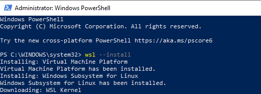
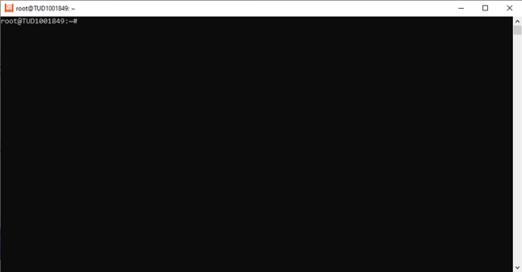
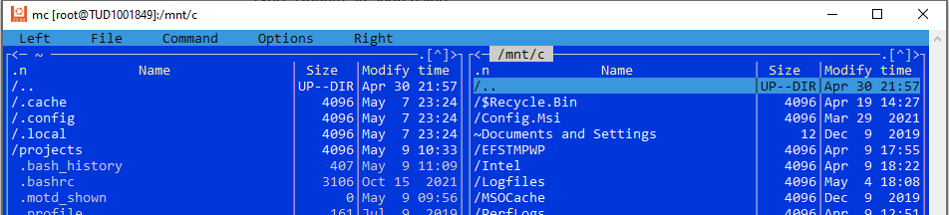
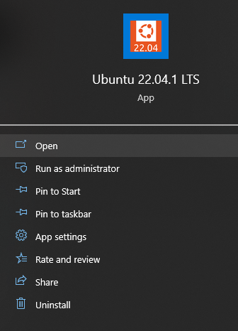

# Prerequisite software and data
Throughout this workshop, we will make use of several different software tools, which must be installed beforehand.
We will also make use of a data set to perform our computations, which is best downloaded beforehand, too.

## Input data for the tasks
```{eval-rst}
You can clone all files from gitlab repository:  https://gitlab.tudelft.nl/mude/bash-python-hpc-public or directly download the :download:`bash-python-hpc-public.zip <bash-python-hpc-public.zip>` archive. The material for Part 1 (notebooks) and Part 2 (data) is also available on JupyterHub.
```

## Software
You can use JupyterHub, the online framework with Jupyter Notebook and Bash terminal for the first and second parts.
Link: https://jupyter.lisa.surfsara.nl/jhltud001/hub/spawn-pending

There are few alternate ways to work with Python (Anaconda or WinPython) and Bash (MobaXterm, git bash, WSL) as well, you will find some details below.

For the third part we will use MobaXterm.

### Python

Python 3.7 or higher is needed. We will use the next Python modules: numpy, numba.
They can be installed with the command

```bash
pip install -r requirements.txt
```

from the Python directory of this repo. We also will use Jupiter Notebook.

If you use Windows, you can download and install
<a href=https://github.com/winpython/winpython/releases/download/5.0.20221030final/Winpython64-3.11.0.1.exe>WinPython</a>,
it contains Jupiter Notebook. Of course, Anaconda will also work for it.


### Bash (for Linux users)

If you work on Linux, you only need `open-ssh-client` installed. `ssh` command used to connect to remote Linux host (supercomputer) and run commands there.


### Bash (for Windows users)

**MobaXterm**

To run Linux commands on the remote machine we will use <a href=https://mobaxterm.mobatek.net/>MobaXterm</a> software. It is a Windows SSH-client application. You can download it
<a href=https://mobaxterm.mobatek.net/download-home-edition.html>here</a>.
You can run the terminal in MobaXterm on your local machine, and run Linux commands too.

**WSL**
Windows 10 users might install Ubuntu based on WSL (Windows subsystem for Linux), this allows running Linux commands on their local machine.

**WSL installation and using instructions**

* Run PowerShell from Administrator
* Run `wsl --install`
:::{figure-md} markdown-fig
</img>

Expected output when running the WSL installation command in PowerShell.
:::
* Reboot Windows
* Open Microsoft Store
* Type "Ubuntu" in the search line
* Select "Ubuntu 22.04 LTS"
* Click "Get" to install
* Click "Run" after the installation
* The window with a Linux command line should appear:
:::{figure-md} markdown-fig
</img>

This Linux command line should pop.
:::
* It is a bare Linux, so you need to install packages (Python, etc)
* You might want to install a file manager, for example Midnight Commander. Use following commands for this:
```bash
sudo apt update
sudo apt install mc
```
Then type `mc` to run Midnight Commander.
:::{figure-md} markdown-fig
</img>

Midnight commander.
:::
* Use "Start" button to run Ubuntu later:
:::{figure-md} markdown-fig
</img>

How to run Ubuntu.
:::

**git bash**

Git Bash is a part of Git software. It allows to execute Linux commands on Windows (uses MINGW).