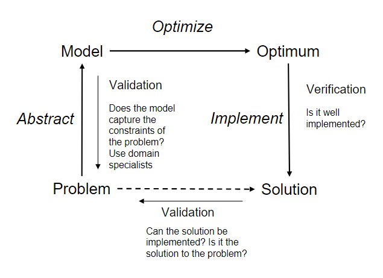
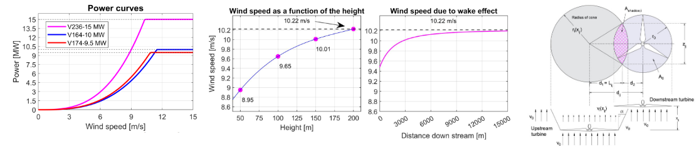
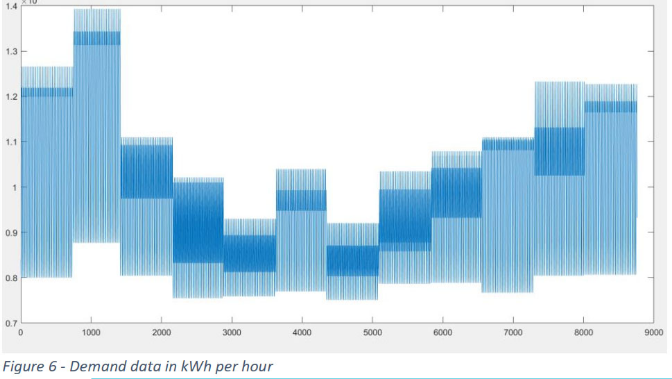
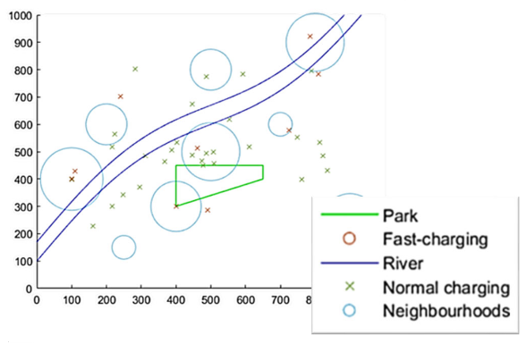
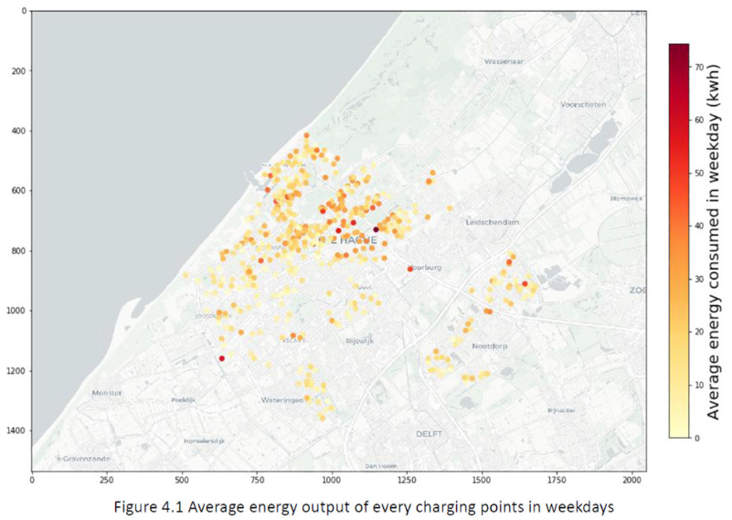
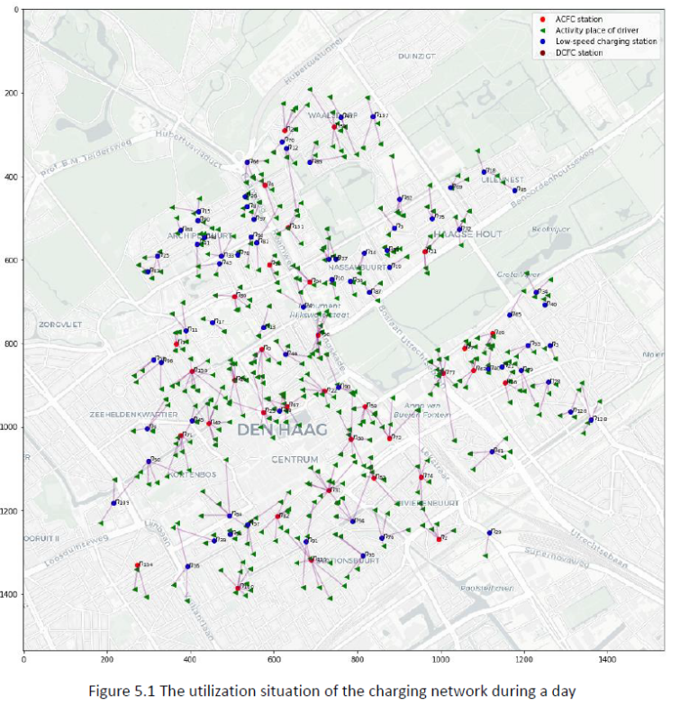
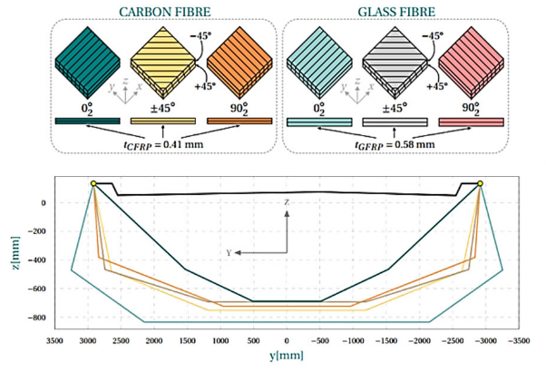
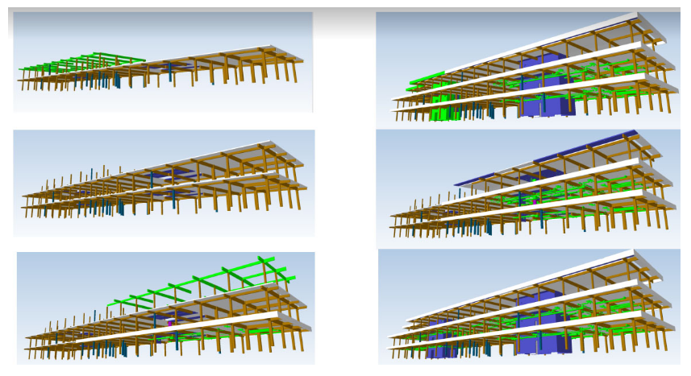
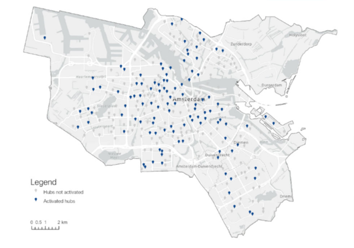
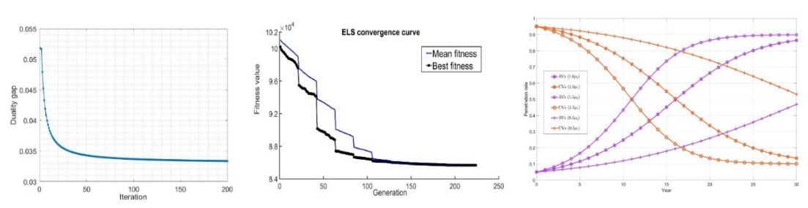

# Optimization basics

## General components of an optimization problem
In general you have the following linear (simplest) structure for a mathematical programming problem. The first equation is the objective function:

$$\underbrace{\text{Max (Min) }Z}_{\text{objective function}}=\underbrace{c_1x_1+c_2x_2+...+c_nx_n}_{\text{objective function coefficients}}$$

this objective function is subject to a set of constraints given by:

$$\begin{cases}a_{11}x_1+a_{12}x_2+...+a_{1n}x_n(\leq,=,\geq)b_1\\a_{21}x_1+a_{22}x_2+...+a_{2n}x_n(\leq,=,\geq)b_2\\...\\ a_{m1}x_1+a_{m2}x_2+...+a_{mn}x_n(\leq,=,\geq)b_m\end{cases}$$

In this case $a_{ij}$ refer to technology coefficients that measure the usage of a resource, $x$ refers to the decision variables, $b_m$ is an independent term, which usually translates as an available resource, $n$ is the number of variables, and $m$ is the number of constraints.

## Optimization vs Simulation

**Optimization**

Some modeling approaches attempt to provide optimal answers for problems (e.g., mathematical programming) or near optimum answers (e.g., heuristic and meta-heuristic methods). That's what this week is all about.

**Simulation**

A simulation model predicts the performance of a system under a specific set of inputs (experimental parameters).In general, with simulation, we are not searching for an optimal solution but for the system’s performance under different scenarios that are selected according to their importance or likelihood.

**Understanding the difference between both**

Imagine the case of planning a bus line through simulation. You have your route defined (the streets where it’s going to go through) and the demand around that route is dependent on the
frequency of the buses and the bus stop distance. You want to simulate the bus operation in order to maximize your profit.

The variables involved are the bus fleet size, $b$, and the number of stops in the line, $s$. They can be bounded to form a range:

* $5 \leq b \leq 15$ -> we have 11 bus fleet dimensions to test in a simulation model;
* $10 \leq s \leq 30$ -> we have 21 possible stops dimensions

Therefore, we have to test a total of $b\cdot s=231$ combinations, which is still a manageable number of combinations to simulate.

But what if we are talking about a route line that was not designed yet? Then, for each combination of fleet and number of stops you would have to test the factorial of the number of stops (all the combinations of stops that form a path), $\frac{(n-1)!}{2}$.

This leads to an impractical number of scenarios to test in simulation! This problem would be better studied using optimization techniques in the so-called network design problems which can be solved, to a certain extent, with mathematical programming as well.

## Optimization: why and how?

The typical workflow of an optimization process looks like the schematic shown below:



### Why optimization?

Many problems require the identification of **the best** (or worst) solution, decision or design.

```{note} Warning!

This is a concept that is usually misused. Stating something like "optimizing the design of a bridge" to refer to the *improvement* of the design does not mean we are aiming for the best design, just for a better one.

```

Optimization techniques have multiple applications as part of other mathematical tools (as LS, MLE, or ML), but also direct applications as optimal structural design, resource distribution, logistics, etc. Let us take a deeper look into some of these examples

### What is included under the concept of optimization?

```{figure} ./figs/concept.png
---
width: 90%
---

```

### Examples of optimization problems

In this section, you can find a few examples of optimization problems with their respective goals.

```{admonition} Example 1 - Optimizing the layout of the offshore wind farms in Norway
:class: tip, dropdown

**Goal**: determine the optimal layout of wind turbines to produce the *highest amount of energy at minimum costs*. Considering different types of turbines, their power curves, physical characteristics, wake effect, etc.

<div style="display: block; justify-content: space-between;">
  
</div>

This example is taken from CME4500 Engineering Systems Optimization, final project by Justus Aulbers, Ola Åsbø & Illias Timori 
​
```

```{admonition} Example 2 - Optimizing the renewable energy configuration for a completely self-sustaining energy system in the Ijsselmeer area in 2050
:class: tip, dropdown

**Goal**: determine the most economic configuration of areas for wind turbines, solar panels, algae, and battery storage to meet the hourly energy demand in the future for a certain area. Considering the fluctuating demand, climatic conditions, etc.

<div style="display: block; justify-content: space-between;">
  
</div>

This example is taken from CME4500 Engineering Systems Optimization, final project​ by Max Driessen & Himanshu Patel ​

```

```{admonition} Example 3 - Optimization of electric vehicles charging station locations
:class: tip, dropdown

**Goal**: identify the optimal distribution of charging stations that maximizes the utility accounting for the population density, existence of other charging stations, and other urban elements (e.g. rivers, parks, etc.)

<div style="display: block; justify-content: space-between;">
  
</div>

This example is taken from CME4500 Engineering Systems Optimization, final project by Tomas Raaphorst & Vitali van Elk 
​​
```

```{admonition} Example 4 - Optimizing the location of new electric vehicle charging stations
:class: tip, dropdown

**Goal**: identify the most economic location of EV charging stations to satisfy the users' requirements.

<div style="display: flex; justify-content: space-between;">
  
  
</div>

This example is taken from the MSc Thesis of Dawei Fu​.

```

```{admonition} Example 5 - Optimizing monocoque FRP bridges
:class: tip, dropdown

**Goal:** identify the optimal geometry and plies layout with consideration of the tradeoff between cost and sustainability. The design must guarantee the structural safety conditions.

<div style="display: block; justify-content: space-between;">
  
</div>

This example is taken from the MSc Thesis of Ola Åsbø

```

```{admonition} Example 6 - Optimal component level construction schedule
:class: tip, dropdown

**Goal:** determine the most efficient process for building components that have physical interdependencies (fulfilling constructive constraints), with consideration of the tradeoff between the cost and construction duration.

<div style="display: block; justify-content: space-between;">
  
</div>

This example is taken from the MSc Thesis of Xinzhi Jiang 
​
```

```{admonition} Example 7 - Optimizing the location of shared mobility hubs
:class: tip, dropdown

**Goal:** identify the optimal locations of mobility hubs that make available several modes, such as shared bikes, shared cars and cargo bikes maximizing accessibility and minimizing costs with consideration of the demand.

<div style="display: block; justify-content: space-between;">
  
</div>

This example is taken from the MSc thesis ​of Stavros Xanthopoulos

```

```{admonition} Example 8 - Designing road networks for automated vehicles
:class: tip, dropdown

**Goal:** identify the best location and time for deploying enhanced roads for automated vehicles, minimizing deployment cost and maximizing efficiency and safety given the uncertain evolution path of automated driving technology and the travelers' mode and route choice behavior.

<div style="display: block; justify-content: space-between;">
  
  
</div>

This example is taken from the PhD thesis ​of Bahman Madadi​

```
