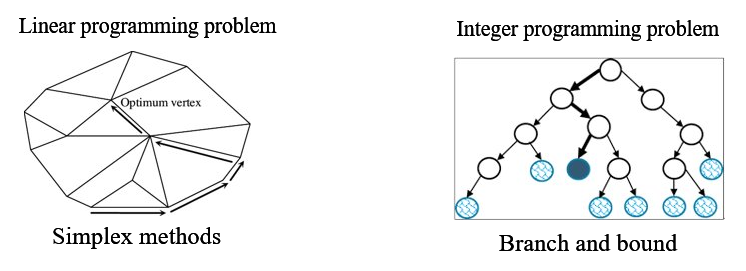
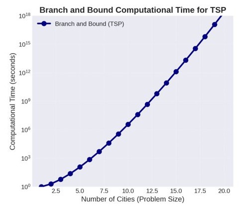
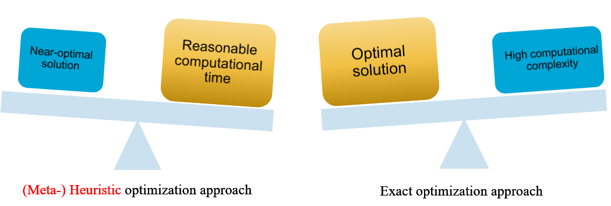
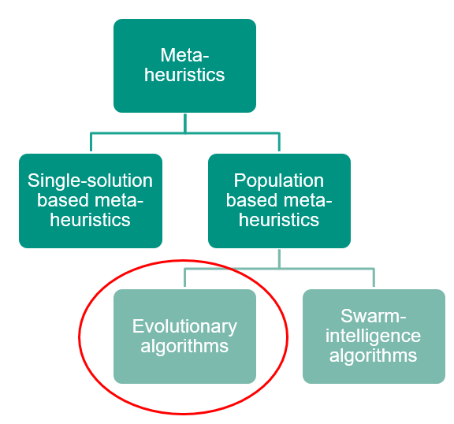
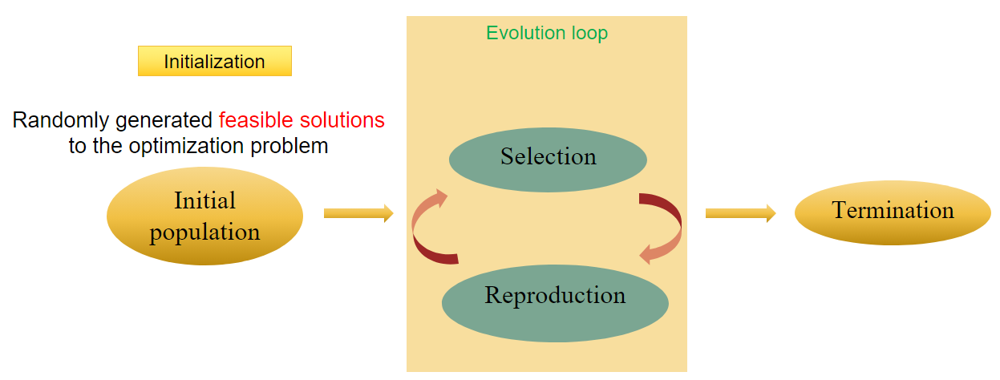
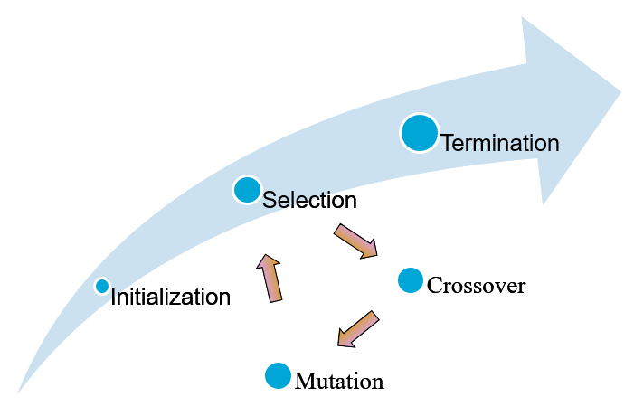
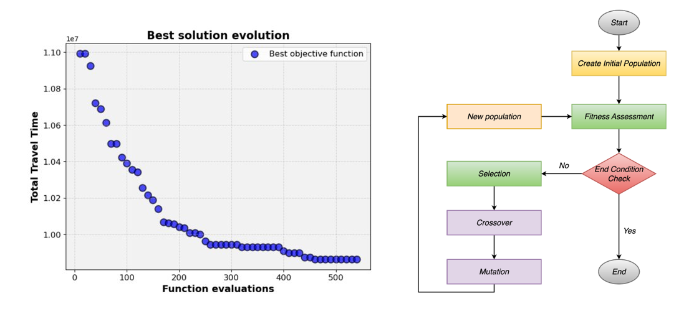
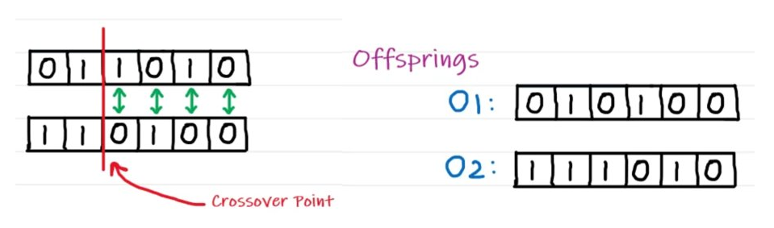
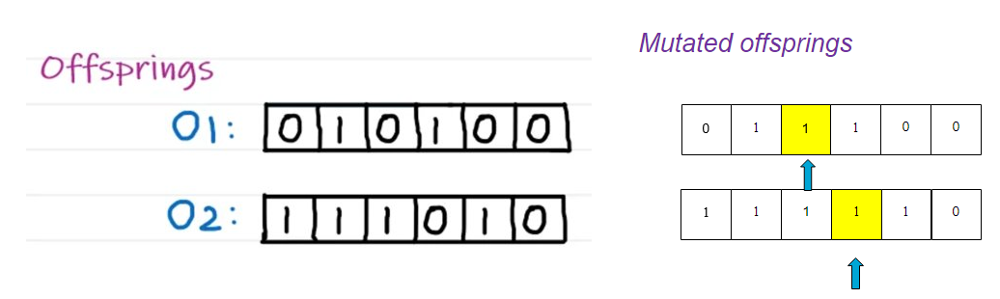
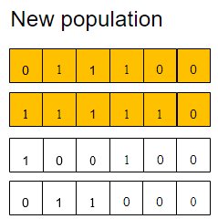

# Genetic Algorithm

## Video

The story is told once in a video. The video below has a one-to-one correspondence with this book

```{admonition} MUDE Exam Information
:class: tip, dropdown
For the exam, you are expected to have a clear understanding of the Genetic Algorithm described and its steps. You do not need to know  how to implement it in code!
```

```{eval-rst}
.. raw:: html

    <iframe width="560" height="315" src="https://www.youtube.com/embed/iDxEgEyjRYE" title="YouTube video player" frameborder="0" allow="accelerometer; autoplay; clipboard-write; encrypted-media; gyroscope; picture-in-picture" allowfullscreen></iframe>
```

## Recap - Optimization Models & Exact optimization approaches

* Linear programming problems and integer programming problems
* Simplex and Branch and Bound



Exact optimization approaches basically guarantees to find the optimal solution to a problem!

### Computation complexity

These methods can be time-consuming and computationally expensive, especially for large, complex problems. Many exact algorithms have exponential time complexity.



Numerous real-life optimization problems in science, engineering, economics, and business are complex and difficult to solve. They cannot be solved in an exact manner within a reasonable amount of time. 

Consequently, the use of meta-heuristic algorithms, a form of approximate techniques, serves as the main alternative for solving such complex optimization problems.

## (Meta-)Heuristic optimization approach

A (meta-)heuristic approach is a procedure that determines near-optimal solutions to an optimization problem.



Metaheuristics represents a family of approximate optimization techniques. They provide “acceptable” solutions in a reasonable time for solving hard and complex problems in science and engineering. Generally, metaheuristics can be classified into Single-solution based meta-heuristics and Population based meta-heuristics. Evolutionary algorithm is a kind of population based meta-heuristics.



### Evolutionary algorithm - a high level structure

Consider an optimization problem to find

$$
\text{min } 10x_1+15x_2
$$

such that:

$$
\begin{cases}x_1+2x_2\geq 2\\ -2x_1+2x_2\geq 1\\ x_1,x_2=0\text{ or }1 \end{cases}
$$

The evolutionary algorithm to solve an optimization problem like the one described above is described by the following scheme:



#### General structure of evolutionary algorithms

Consider now a different problem, to find the value of $x$ that minimizes the function $y=x^2$, where $x\in[-10,10]$.

**Initial population**

We would start by defining an initial population, randomly-generated feasible solutions to this optimization problem. We would get, for example:

$$
\begin{cases}x_1=-3.5\\x_2=-1.5\\x_3=6\\x_4=9.3\\x_5=2.2\end{cases}
$$

**Selection**

The next step in the process is selection. We first need to calculate a fitness value for each individual in the population. In this example, we can define the **fitness function** as $f=x^2$. Following this:

$$
\begin{cases}f(x_1)=12.25\\f(x_2)=2.25\\f(x_3)=36\\f(x_4)=86.49\\f(x_5)=4.84\end{cases}
$$

**Reproduction - crossover**

Next we apply the crossover process, where we choose the two $x$ values with the best fitness function and we produce an offspring:

$$
\begin{cases}x_2=-1.5\\x_5=2.2\end{cases}\implies x=\frac{x_2+x_5}{2}=0.35
$$

**Reproduction - mutation**

We can change the value that we obtained by adding a small random number (which could be positive or negative). If the mutation step is a random number in the range $[-1,1]$, then a possible result of the mutation could be:

$$
x_{\text{mutated offspring}}=0.35-0.05=0.3
$$

Therefore, and replacing the value of the initial population with the worst fitness function, we get our new population given by:

$$
\begin{cases}x_1=-3.5\\x_2=-1.5\\x_3=6\\x_5=2.2\\x_{\text{mo}}=0.3\end{cases}
$$

**Termination**

The algorithm stops after running this cyclic process for a predetermined number of iterations, such as 500 or 5000 generations.



## Genetic algorithm

A genetic algorithm (GA) is a metaheuristic inspired by the process of natural selection that belongs to the larger class of evolutionary algorithms.



### Population Initialization

The process of generating an initial set of potential solutions to a problem - the “population”. Each member of this population is a potential solution, and should be feasible.

**Encoding**

In genetic algorithms, potential solutions to problems are encoded as a series of symbols, usually a string of numbers or characters. This encoding method is similar to how genetic information is stored in DNA in nature

**Chromosome**

In genetic algorithms, a chromosome represents a potential solution. It is a specific instance of encoding!

```{admonition} Example
:class: tip

Suppose we have an optimization problem given by

$\text{max }3x_1+4x_2+3x_3+x_4+5x_5+2x_6$

such that

$\begin{cases}x_1+x_2+x_3\leq 2\\x_4+x_5+x_6\leq 1\\x_1,x_2,x_3,x_4,x_5,x_6=\{0,1\}\end{cases}$

Assuming a potential solution given by $\{x_1,x_2,x_3,x_4,x_5,x_6\}=\{1,1,0,0,0,1\}$. Encoding here is: | 1 | 1 | 0 | 0 | 0 | 1 |. This also represents a specific chromosome.

```

**Random generation**

Random generation of four chromosomes for our example problem might give:

| 0 | 1 | 1 | 0 | 1 | 0 |

| 1 | 1 | 0 | 1 | 0 | 0 |

| 1 | 0 | 0 | 1 | 0 | 0 |

| 0 | 1 | 1 | 0 | 0 | 0 |

showing the values for $\{x_1,x_2,x_3,x_4,x_5,x_6\}$

### Fitness assessment

**Fitness function**

The fitness function should be designed to reflect the objectives of the problem. For example, in an optimization problem, it might measure how close the solution is to a desired outcome.

**Role in genetic algorithms**

* **Selection process:** fitness scores are used in the selection process, where individuals with better scores have a higher chance of being selected for reproduction
* **Guiding the evolution:** by favoring individuals with higher fitness scores, the algorithm “steers” the evolution of the population towards better solutions over successive generations

---

The fitness function is defined as the value of the objective function and, therefore, for the example shown above and using the first random solution generated, we would find a fitness value of 12!

### End condition check

**Maximum number of generations**

The algorithm terminates after a predefined number of generations have been produced

**Resource-based termination**

The algorithm stops after it has used a certain amount of computational resources like CPU time, memory, or a set number of function evaluations.

### Selection methods

**Roulette Wheel Selection (Fitness Proportionate Selection)**

Each individual’s probability of being selected is proportional to its fitness, such that

$$
p_i = \cfrac{f_i}{\sum\limits_{j = 1}^N {{f_j}}}
$$

with

$$
f = 3x_1+4x_2+3x_3+x_4+5x_5+2x_6
$$

In the example shown above, we would have:

| 0 | 1 | 1 | 0 | 1 | 0 |

Fitness value = 12 $\implies$selected probability $\frac{12}{12+8+4+7}=0.387$

| 1 | 1 | 0 | 1 | 0 | 0 |

Fitness value = 8 $\implies$selected probability $\frac{8}{12+8+4+7}=0.258$

| 1 | 0 | 0 | 1 | 0 | 0 |

Fitness value = 4 $\implies$selected probability $\frac{4}{12+8+4+7}=0.129$

| 0 | 1 | 1 | 0 | 0 | 0 |

Fitness value = 7 $\implies$selected probability $\frac{7}{12+8+4+7}=0.226$

### Crossover

First, let us better understand why is crossover done and its importance

* **Preserving good traits:** the goal is to combine the good characteristics of the parent solutions to potentially create even better offsprings
* **Diversity vs. Convergence:** crossover must be managed to maintain genetic diversity in the population to avoid premature convergence
* **Problem-specific adaptation:** sometimes, standard crossover methods are modified or completely new methods are developed to better suit specific problems, especially when the chromosome structure is complex or unique

And now, let us study different crossover methods:

* **Single-point crossover**
    1. Select two parents for mating
        
        | 0 | 1 | 1 | 0 | 1 | 0 |
        
        | 1 | 1 | 0 | 1 | 0 | 0 |

    2. Select a crossover point at random and swap the bits at the right site (let’s say we do it after the first 2 bits in this example)
    3. Then the offsprings are:
        
        | 0 | 1 | 0 | 1 | 0 | 0 |
        
        | 1 | 1 | 1 | 0 | 1 | 0 |

* Two **-point crossover**
    1. Select two parents for mating
        
        | 0 | 1 | 1 | 0 | 1 | 0 |
        
        | 1 | 1 | 0 | 1 | 0 | 0 |

    2. Select two crossover points at random and swap the bits at the middle site (let’s say we do it after the first 2 bits and before the last 2 bits in this example)
    3. Then the offsprings are:
        
        | 0 | 1 | 0 | 1 | 1 | 0 |
        
        | 1 | 1 | 1 | 0 | 0 | 0 |

* Uniform crossover
    1. Select two parents for mating (we will choose the same as shown in the previous examples)
    2. At each bit position of the parents, toss a coin (T=1 will mean to swap the bits and T=0 to not swap them)
    3. Getting [1,0,0,1,1,0] as the final result for the coin tossing, then the offsprings for this method are:
        
        | 1 | 1 | 1 | 1 | 0 | 0 |
        
        | 0 | 1 | 0 | 0 | 1 | 0 |

* Half-uniform crossover
    1. Select two parents for mating (we will choose the same as shown in the previous examples)
    2. Toss a coin and swap the bits only if T=1
    3. Getting [1,x,0,1,1,x] for the final result of the coin tossing, the offsprings for this method are:
        
        | 1 | 1 | 1 | 1 | 0 | 0 |
        
        | 0 | 1 | 0 | 0 | 1 | 0 |

### Mutation: role and importance

**Exploration of solution space:**

Mutation helps to explore new areas of the solution space, potentially finding better solutions that are not in the vicinity of the current population.

**Maintaining diversity:**

By continuously introducing new genetic material, mutation prevents the population from becoming too similar, which can lead to getting stuck in sub-optimal solutions

**Balance with crossover:**

While crossover combines existing genetic material to explore the solution space, mutation introduces completely new genetic material.

---

Different mutation methods can be used, namely:

* **Bit Flip mutation:** for binary representations, this involves flipping bits (changing a 0 to a 1, or vice versa)
* **Swap mutation:** two genes in a chromosome are selected randomly and their values are swapped (this is often used in problems where the chromosome represents a sequence or ordering)

### New population

The newly generated offspring replace some individuals in the original population to form a new generation. The replacement strategy can be either complete replacement, where all old individuals are replaced by new ones, or partial replacement, where some well-performing old individuals are retained.

## Example

As an example, consider we adopt roulette wheel selection, single-point crossover, bit flip mutation, and complete replacement for our algorithm. Considering the optimization problem initially described and an initial population as given above, we start by applying **roulette wheel selection**:

* The chosen ones:
    
    | 0 | 1 | 1 | 0 | 1 | 0 |
    
    | 1 | 1 | 0 | 1 | 0 | 0 |

* The rest of the initial population:
    
    | 1 | 0 | 0 | 1 | 0 | 0 |
    
    | 0 | 1 | 1 | 0 | 0 | 0 |

Applying **single-point crossover:**



After this, we apply the **single-point crossover** to get:



Finally, using complete replacement our new population is given by:

