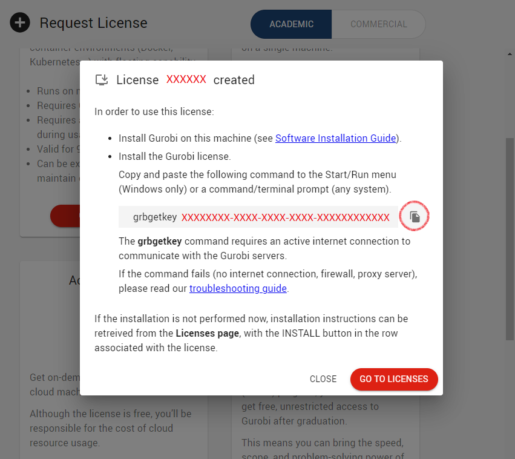
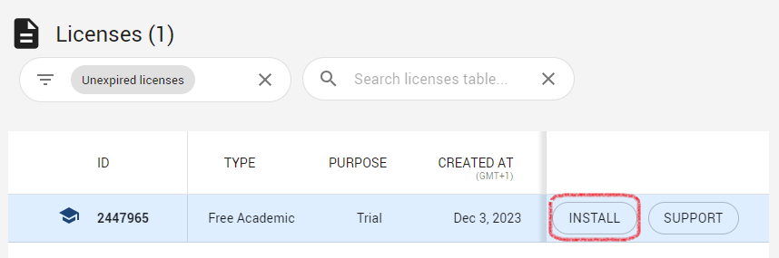

<!-- [deepnote.com](https://deepnote.com/) -->

# Gurobi

Gurobi is an optimizer written in Python. It's not open-source, but an academic license is available. This page shows how to activate the license. General instructions are available on [their support website](https://support.gurobi.com/hc/en-us/articles/14799677517585) as well, if additional information is needed.

## Before Starting

The software is easy to install, but keep in mind:
1. The installer will ask you to restart your computer
2. To use Gurobi you need to have a TU Delft IP address. This means if you are _not_ working on campus, you will have to use a VPN to activate the license, described below.


<!-- {: .label } -->

|**How to get a VPN connection with TU Delft IP Address**
|The software eduVPN is described [here](https://www.tudelft.nl/en/student/my-study-me/study-tools/remote-services). After reading the description, click on the "manual" button and select "Installing eduVPN for students," which will take you to the the [download page](https://tudelft.eduvpn.nl/portal/home).

## Installation Instructions

Please do the following steps:
1. Connect your computer to the TU Delft network by connecting to Eduroam or the TU Delft VPN.
2. Register on the [Gurobi website](https://portal.gurobi.com/iam/register/) as a student. Set up your work as 'academic user', with 'student' as 'academic position'. You will be asked to verify your email address.
.
3. Download and install Gurobi optimizer from the [download page](https://www.gurobi.com/downloads/gurobi-software/) for your operating system.
3. If you are not on the TU Delft campus, this is when you should check to make sure your VPN connection is activated.
4. Visit the [License Request section of your User Portal](https://portal.gurobi.com/iam/licenses/request), find the "Named-User Academic" block and select "GENERATE NOW." Once accepting the agreement, you should be immediately able to copy the key, as shown in the image:

5. We will open a command-line interface to set up the key (it doesn't matter which one you use, for example, the system default, Anaconda prompt or git bash; on **Windows** try `Win`+`R` then type `cmd` then press `enter`; on **Mac** open Terminal). For both platforms, all you should have to do is copy the license key, which will paste the following text: `grbgetkey xxxxxxxx`, where you should see your key instead of the `x`'s.
6. Next, you should see a prompt that looks like this:
    ```
    info : grbgetkey version 11.0.0, build v11.0.0rc2 
    info : Platform is <PLATFORM> - <SPECIFICATIONS>
    info : Contacting Gurobi license server...
    info : License file for license ID XXXXXX was successfully retrieved
    info : License expires at the end of the day on YYYY-MM-DD
    info : Saving license file...

    In which directory would you like to store the Gurobi license key file?
    [hit Enter to store it in LICENSE_PATH/gurobi]:
    ```
7. You will be prompted to confirm the file location; it is strongly recommended that you accept the default location for your system by hitting `Enter`. If you need to store the license file somewhere other than the default location, please see [Where do I place the Gurobi license file (gurobi.lic)?](https://support.gurobi.com/hc/en-us/articles/360013417211) for important details. If successful, the following message will appear:
    ```
    info : License XXXXXX written to file LICENSE_PATH/gurobi.lic
    ```
8. To test the installation, execute `gurobi` in your command-line interface and hit `enter`. Depending on your operating system configuration, you may need to try `gurobi.sh` or `gurobi.bat` as well. If this does not work, there are additional instructions [here](https://support.gurobi.com/hc/en-us/articles/13417565229713), or you can also get help from an instructor.
9. Now you are ready to go!

|If you need to find your license later, after it was generated, you can find it via the User Portal under "[Review your current licenses](https://portal.gurobi.com/iam/licenses/list)." Clicking the "Install" button, as shown below, will bring you to the same view as shown above in Step 4 to copy the license key. 

