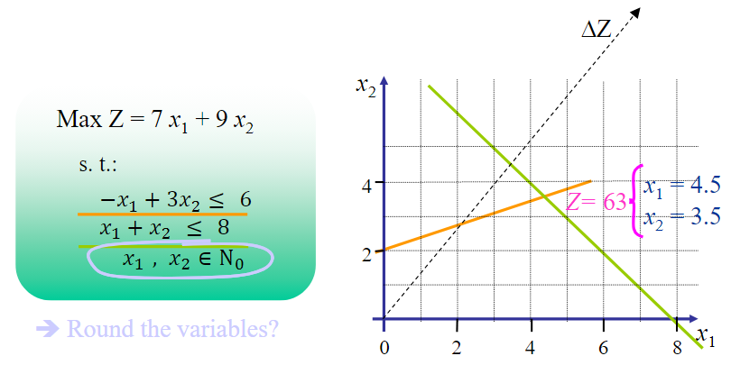
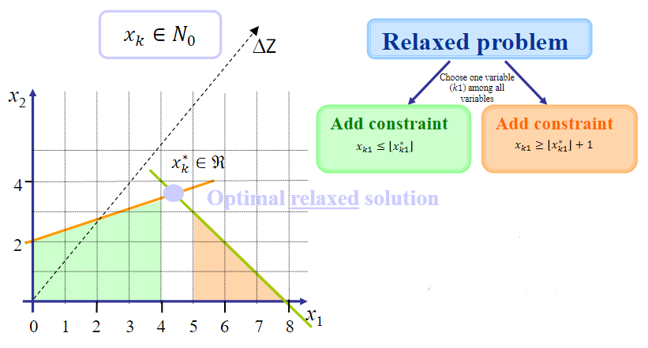
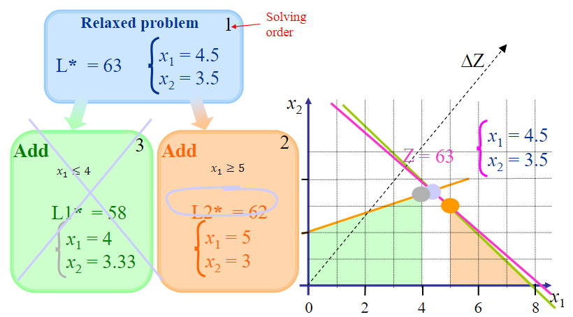
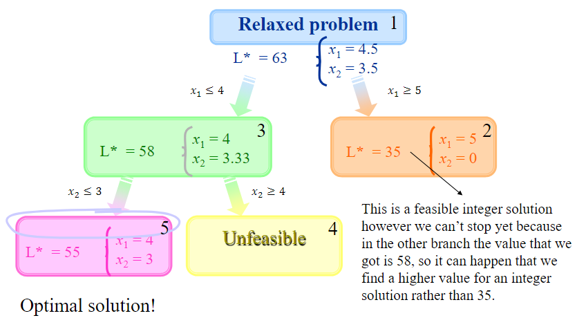
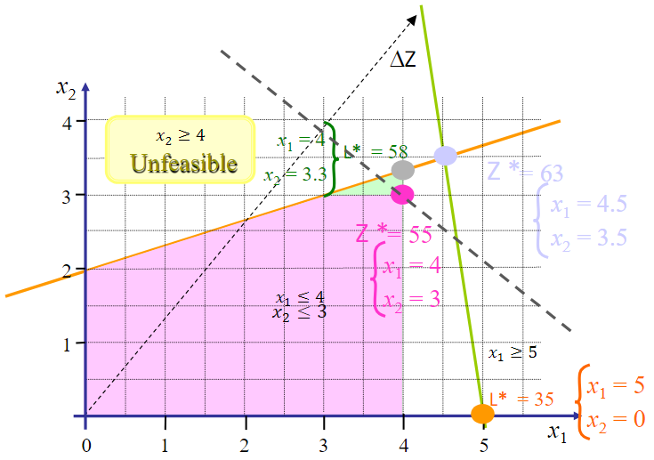
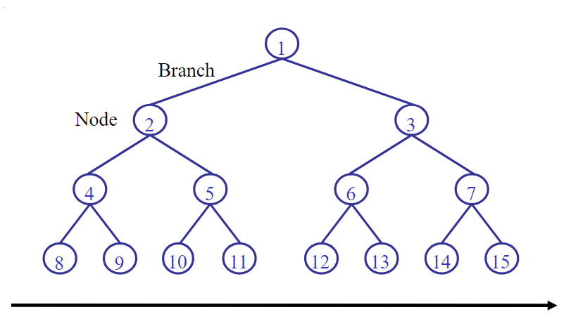
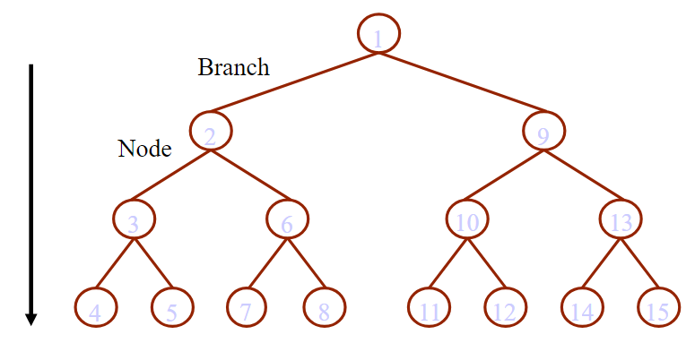
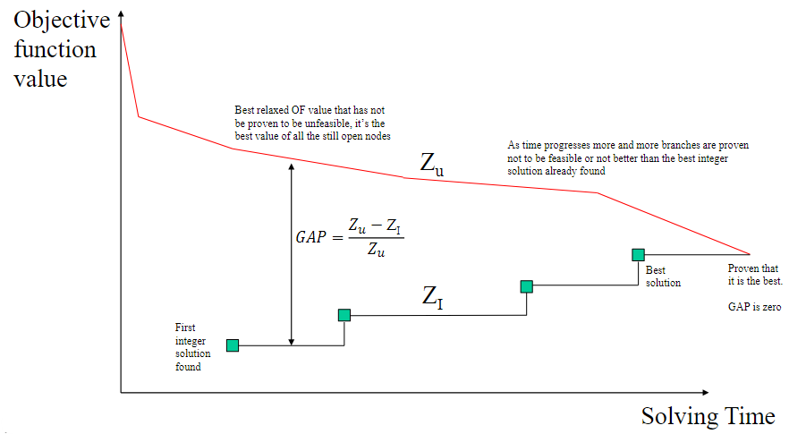
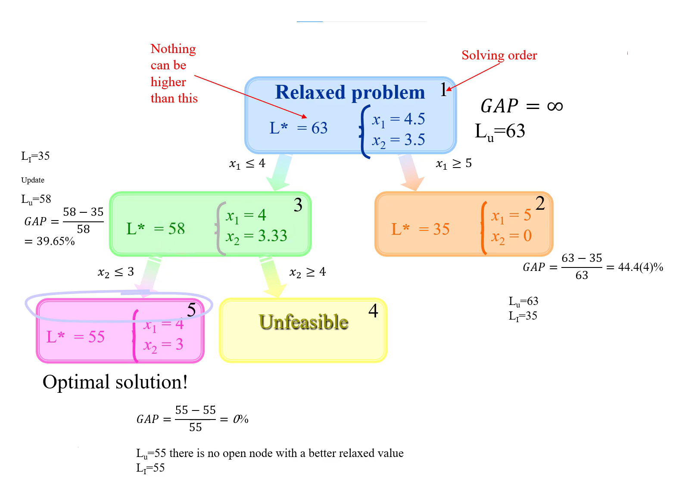

# Integer problems and solving with Branch-and-Bound

There are many linear programming problems in which all or some of the variables can only take integer values:

* the road network design problem in which a link can only exist or not exist
* location problem in which the variable tells if the facility exists in a certain place or not
* vehicle fleet to be allocated to a service
* number of drivers

These problems are called integer programming problems (IP) or mixed integer programming problems (MIP), if there are some continuous variables. Obtaining a solution for these problems can be quite difficult as the simplex method is not prepared for integer variables.

## Integer or binary variables definition

$\mathbb{N}_0$ is the set of natural numbers meaning the integer ones and it includes in this case the zero. You can have:

$$\begin{gather*}\mathbb{N}^0=\mathbb{N}_0=\{1,2,...\}\\ \mathbb{N}^*=\mathbb{N}^+=\mathbb{N}_1=\mathbb{N}_{>0}=\{1,2,...\}\end{gather*}$$

Defining the variable:

$$x\in\mathbb{N}_0$$

for binary variables you define $x$ as:

$$x\in\{0,1\}$$

Consider the following optimization problem:

$$\text{max }Z=7x_1+9x_2$$

such that:

$$\begin{gather}-x_1+3x_2\leq 6\\ x_1+x_2\leq 8\\ x_1,x_2\in\mathbb{N}_0\end{gather}$$

### So how can we solve this?



Rounding with two variables is not such a big problem and we can easily find a feasible integer solution. This solution, however, is not yet proven to be optimal.

---

There are problems in which is not acceptable to round, most notably when the variables are binary (can only take the value 0 or 1). Rounding leads to almost always unfeasible solution, especially when you have lots of variables.

The best well-known method to solve integer programming problems is the **branch-and-bound** method. It is based on the idea of enumerating all the solution points of the feasible region, but methods are used so that a lower number of solutions can be tested.

#### Branch-and-bound

Solve the original **relaxed problem** (i.e. assuming the variables are all continuous positive) so you can obtain fractional values for the variables. Suppose that $x_k\in\mathbb{N}_0$, but in this case you would obtain for the relaxed problem $x_k^*\in\mathbb{R}$.

From this point onwards, the initial problem is decomposed... Adding new constraints to guarantee the integrality of the variables one by one.



Solve the two problems using the SIMPLEX method. For each solution of those two problems do the same step of dividing the problem but now with another variable. The solution search procedure ends when an integer solution is found ($x_k\in\mathbb{N}_0$) and no better objective function can be found.



The optimal solution is the one with $L2^*=62$ since in the other branch the value of the objective function is smaller and with $L2^*=62$, the solution is already an integer like we wanted.

---

Let us take a look into another example. Consider the optimization problem given by:

$$\text{max }Z=7x_1+9x_2$$

such that:

$$\begin{cases}-x_1+3x_2\leq 6\\ 7x_1+x_2\leq 35\\ x_1,x_2\in\mathbb{N}_0\end{cases}$$

Let us take a look into the solving process using the branch-and-bound method:





**Horizontal progression**





#### Gap concept (example for maximization)





### Computational efficiency

* The efficiency of using the branch-and-bound for solving integer problems depends on obtaining a good $Z_I$ in the beginning (high value in the case of a maximization problem and low in the case of a minimization problem). Because this value will be used to close many nodes that have an OF worse than that integer solution

* This depends on the order by which the sub-problems are generated and solved, which in its turn depends on the variable to do the branching

* Unfortunately, there is no general procedure that allows determining the variable that allows this search to go faster

## Some constraints that take advantage of integer/binary variables

At most two of the projects 1, 2, 3, 4 and 5 can be done:

$$x_1+x_2+x_3+x_4+x_5\leq 2$$

If project 1 is done then also project 2 is done:

$$x_2\geq x_1$$

Restrict the variable $x_i$ to have just one of a given set of integers {2,3,5,7} $\to$ let $y_1$,$y_2$,$y_3$,$y_4$ be binary, and add the constraints:

$$\begin{cases}x_i=2y_1+3y_2+5y_3+7y_4\\ y_1+y_2+y_3+y_4=1\end{cases}$$

### Either-or constraints

Satisfy only one of these two constraints depending on something else in the model:

$$\begin{cases}3x_1+5x_2\leq 7\\ 2x_1+2x_2\leq 4\end{cases}$$

Replace with the following two constraints:

$$3x_1+5x_2\leq 7+My\\ 2x_1+2x_2\leq 4+M(1-y)$$

where $y$ is a binary variable and M is sufficiently large. When $y$ is 1 the second constraint is active and the first is relaxed ($\leq$ big number), when $y$ is 0, the inverse happens.

If $x_1$ happens (it has the value 1) then $x_2$ cannot happen and vice-versa. Both can be zero as well meaning both will not happen, as $x_1+x_2\leq 1$.

### Discontinuous variables

If you want to impose that in some situations $x$ can only be defined as:

$$x=0\text{ or } l\leq x\leq u$$

Introduce the binary variable $y$ and add the following constraints:

$$\begin{gather*}x\leq uy\\ x\geq ly\end{gather*}$$

In this way when $y$ is 0, $x$ is zero, and when it is 1 then $x$ is between $u$ and $l$.

### The product of two binary variables

As you know, in linear programming you cannot multiply two variables but this does not mean that you cannot use some constraints to produce that product. The product $x_1x_2$ of two binary variables $x_1$ and $x_2$ can be replaced by additional binary variable $y$ by adding the following constraints:

$$\begin{gather*}y\leq x_1\\ y\leq x_2\\ y\geq x_2-M(1-x_1)\end{gather*}$$

with $M$ sufficiently large. The $y$ variable will be the result of multiplying $x_1$ for $x_2$.

### The product of a binary and a continuous variable

The product $x_1x_2$ of the binary variable $x_1$ and the continuous variable $x_2$ with $0\leq x_2\leq u$ can be replaced by an additional continuous variable $y$ by adding the following constraints:

$$\begin{cases}y\leq ux_1\\ y\leq x_2\\ y\geq x_2-u(1-x_1)\\ y\geq 0\end{cases}$$

$y$ is obviously the continuous variable you want to get.

:::{card} Quiz questions
<iframe src="https://tudelft.h5p.com/content/1292123858535891397/embed" aria-label="2_3_4_1_branch_and_bound" width="1088" height="637" frameborder="0" allowfullscreen="allowfullscreen" allow="autoplay *; geolocation *; microphone *; camera *; midi *; encrypted-media *"></iframe><script src="https://tudelft.h5p.com/js/h5p-resizer.js" charset="UTF-8"></script>
:::

## Supplementary Video

The story is told once again in a video. The video listed below has a one-to-one correspondence with the chapters in this book

```{eval-rst}
.. raw:: html

    <iframe width="560" height="315" src="https://www.youtube.com/embed/ViA1X6X3Rhs" title="YouTube video player" frameborder="0" allow="accelerometer; autoplay; clipboard-write; encrypted-media; gyroscope; picture-in-picture" allowfullscreen></iframe>
```

