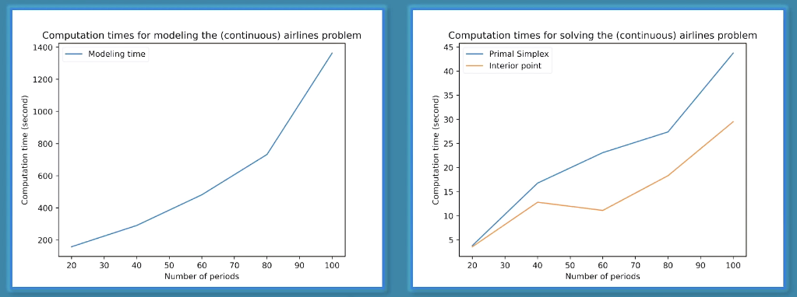
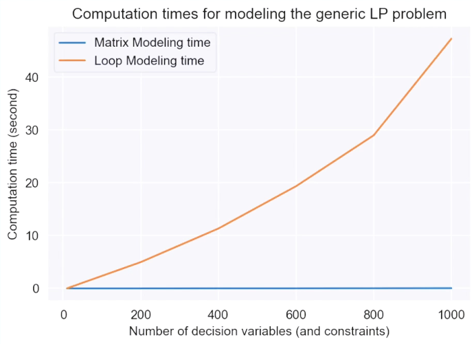
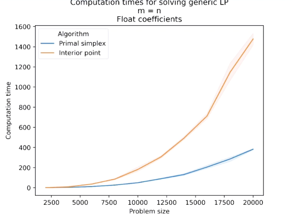
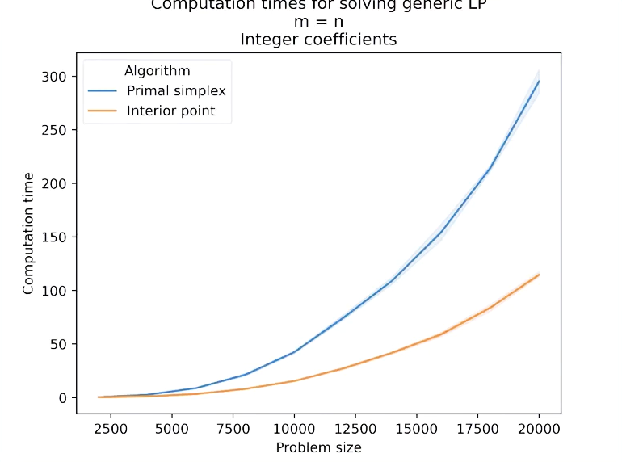
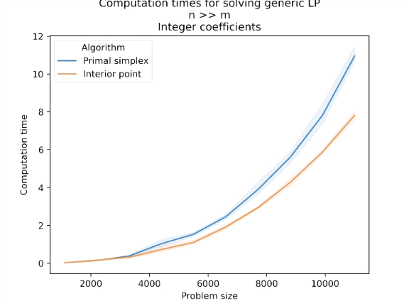

# Performance considerations in LP

```{admonition} MUDE Exam Information
:class: tip, dropdown
The material in this section is provided to give you extra insight into the performance of optimization algorithms. This material is not part of the exam.
```

When working with linear programming, we should give particular attention to the performance of the model being developed. To do so, we need to consider that in three different stages:

* Data pre-processing
* Modelling
* Solving

## Video

The story is told in a video. The video has a one-to-one correspondence with this book

```{eval-rst}
.. raw:: html

    <iframe width="560" height="315" src="https://www.youtube.com/embed/0x7bkzHJZ1I" title="YouTube video player" frameborder="0" allow="accelerometer; autoplay; clipboard-write; encrypted-media; gyroscope; picture-in-picture" allowfullscreen></iframe>
```


## Data pre-processing

There are multiple ways to improve the performance of a certain model when it comes do data pre-processing. Some of the most common steps involve:

* **Missing values:** dealing with missing values, wrong values, outliers, etc. $\implies$ **inputed or dropped**
* **Filtering:** filtering what you do not need from the data (what you do not need is not necessarily useless, though!)
* **Sampling:** sometimes, and specially when working with large datasets, a simple small sample of the data would do the job
* **Transformation:** data manipulation and transformation (this is where you transform raw data into useful information for your models; efficiency often matters in this step)
* **Extraction:** extracting the input for your model in the right form
* **Documentation:** documenting the steps and (when possible) automating processes for future use

Let us take a look into the example of the airlines problem again:

**Missing values:** luckily, in this case, there were no missing values

**Filtering:** many columns of our dataset such as names of origin and destination cities and their population were not relevant for our study, so they can perfectly be eliminated

**Sampling:** we were working with data for 240 months, but we have only used the last 6 months for the first version of the model

**Transformation:** we grouped the data by origin, destination and date, and then we calculated the passenger sum and distance for each group

```{note}

Note that looping through rows of a Pandas dataframe (or any dataframe for that matter) is very inefficient (you can test this yourself!), so we used a less straight forward, but more efficient way of finding passenger sums and distances for each row and month.

```

**Extraction:** we saved the monthly passenger sum (demand) for each route as well as route distances to use in our Gurobi model

```{note}

In this case there was actually no real extraction since we did everything in Python, but if you do data processing and modelling in different platforms, then you have to save your pre-processing results in a format that is readable by the platform you use for modelling.

```

**Documentation:** we have used Jupyter notebooks, so all data pre-processing steps are documented in the notebook. However, you can also create separate modules, functions, classes, etc. depending on your needs.

## Modelling

When considering the modelling aspect, we should take into account two main things during the process of choosing the most adequate model: **accuracy** and **feasibility**. Let us take a deeper look into both of them.

**Accuracy** basically expresses how realistic your representation of the actual phenomenon is. A good example would be to use integer variables for discrete-valued variables (instead of continuous).

**Feasibility** expresses the existence of methods and algorithms to solve your problem for optimality (e.g. when your model is too complex, you might have trouble solving it). When your model is very large, sometimes computation times can reach days or even weeks. Depending on the application, this might make your problem practically *infeasible* to solve, so you might have to simplify your model more than you are willing in order to make it (practically) feasible.

### The need for efficiency

In Gurobi (Python API), building large linear models and compiling them can take longer than solving them, so efficient ways of building models are essential

<div style="display: flex; justify-content: space-between;">
  
</div>

```{note}

Note that building a model in Gurobi-Python means executing the python code that builds the model. Compiling a model means executing the "model.update()" command, which transforms your Python code into a Gurobi model object. If you do not use this command, it is automatically done prior to solving when you execute "model.solve()" command.

```

### A few practical tips

Modelling performance is often platform-specific, but we are going to give a few general guidelines to help you in this process!

* Using NumPy arrays instead of lists and Pandas dataframes
* Using matrix operations instead of loops (Gurobi-specific but roughly applies to almost all platforms)
* Using sparse matrices (computations on matrices with many zero elements can be handled efficiently)
* Parallelization and GPU processing (becoming increasingly available in different platforms)

As an example illustrative of the second tip given in this section, check the graph below that shows the difference of the computation types between matrix and loop modeling in Gurobi-Python:

<div style="display: flex; justify-content: space-between;">
  
</div>

## Solving

The choice of our solution for linear programs with continuous variables depends on multiple factors:

* **Problem size**, i.e. the number of decision variables and constraints
* Decision variables to constraints **ratio** ($n>>m, n<<m, n=m$)
* **Numerical issues** as very small or very large numbers, integers, floats, etc.
* **Density** or sparsity of matrix A, i.e. its percentage of non-zero elements

If we compare the results obtained by the Simplex model (large float coefficients and an A matrix with a 50% percentage of non-zero elements) with the results obtained from interior point (large integer coefficients, and an A matrix with only 5% non-zero elements), both with $m=n$, we find:

<div style="display: flex; justify-content: space-between;">
  
  
</div>

```{note}

* The unit for computation time is seconds
* Problem size is the sum of the number of decision variables with the number of constraints
* Shadows show the confidence intervals for five replications

```

If we see another example, now with $n>>m$ and 40% non-zero elements in matrix A for both cases, and large integer coefficients in the left case and large float coefficients in the right figure, we can see:

<div style="display: flex; justify-content: space-between;">
  
  
</div>

## Problem type

When it comes to the problem type, the first thing that we immediately think is, of course, about the objective function and the constraints we will have to deal in each case. However, for LP problems this **does not matter**. What does matter is the type of the decision variables that we are talking about (discrete, continuous, mixed), as we have seen in the last example!