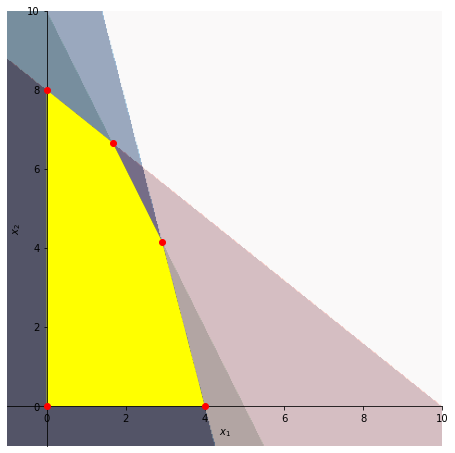
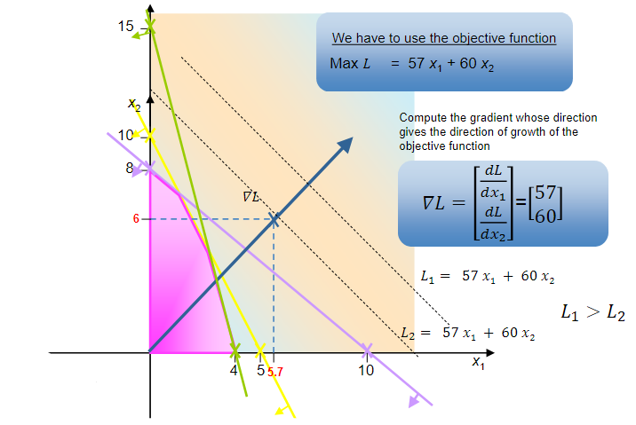

# Worked example - Sand and Clay Extraction Problem

## The problem

A company extracts sand and clay from a site which when sold gives a profit of 57 and 60 monetary units per thousand units of product, respectively. For this extraction, **sand** needs a manpower of **50 men x hours** to extract **1000 units of product** whilst **clay** needs **13 men x hours for 1000 units**.

**4 hours of backhoe** are needed to extract **one thousand units of sand** and **5 hours of backhoe work** per **thousand units of clay**. The number of hours needed of **truck transport** is 8h and 4h, respectively for sand and clay for each 1000 units of product transported.

The company has a work schedule of 40 hours per week for the men but also for the equipment (truck and backhoe). There are 5 men who can be used interchangeably between the transport of the two products. There is only one truck and one backhoe.

**Main questions**: 

* What should be the extraction plan of this company in a week?
* What should their objective be?
* What decisions need to be made?

### LP formulation of the problem

* $x_1$ - **thousands of units of sand** to be produced and transported in **one week**
* $x_2$ - **thousands of units of clay** to be produced and transported in **one week**

Our objective function then will look like (with $L being the profit in monetary units for one week):

$$\text{Max} L = 57x_1+60x_2$$

subject to:

* $8x_1+4x_2\leq 40$: maximum number of hours of the vehicle driving time per week
* $4x_1+5x_2\leq 40$: maximum number of hours of crane work per week
* $50x_1+13x_2\leq 200$: maximum of 5 (men) x 40 hours of driving time available per week per worker
* $x_1,x_2\geq 0$: the production must be positive!

:::{card} Quiz questions
<iframe src="https://tudelft.h5p.com/content/1292120485436114287/embed" aria-label="2_3_2_1_Sand_and_clay" width="1088" height="637" frameborder="0" allowfullscreen="allowfullscreen" allow="autoplay *; geolocation *; microphone *; camera *; midi *; encrypted-media *"></iframe><script src="https://tudelft.h5p.com/js/h5p-resizer.js" charset="UTF-8"></script>
:::

### Solution

The abovementioned constraints define the **feasible region** of the solution space. The feasible region is represented by the yellow polygon on the graph below

<div style="display: block; justify-content: space-between;">
  
</div>

The regions at green, blue, and red correspond to the first three constraints defined in the previous subsection, in the same order. The yellow region is a result of the super position of these three regions alongside $x_1\geq 0$ and $x_2\geq 0$. All the points inside and in the border of the yellow region are **solutions** for our problem!

**How can we find the optimal solution now?**

Our solution space, in this case, is a closed polygon, which is always **convex** in LP problems (it is easily seen in the graph represented above that any line connecting two points inside our solution space is always inside the polygon).

```{admonition} Theorem

The set of feasible solutions is a convex set whose extremes (vertices) correspond to feasible basic solutions. If there is, at least, a feasible solution to the problem, then there is a feasible basic solution to the problem.

If the objective function has a finite maximum (minimum) there is at least an optimal solution and that is a feasible basic solution (one of those vertices).

```

We consider as **basic solutions** any of the red vertices of the yellow region, and any other solution that is inside the highlighted region consists of a **non-basic** solution.

To find the optimal solution, we can start now by computing the gradient whose direction gives us the direction of growth of the objective function, i.e.:

$$\nabla L = \begin{bmatrix}\dfrac{dL}{dx_1}\\\dfrac{dL}{dx_2}\end{bmatrix}=\begin{bmatrix}57\\60\end{bmatrix}$$

<div style="display: block; justify-content: space-between;">
  
</div>

With this, we just need to find the first point inside the feasible region that intersects a region with the slope that is shown. That point will be one of the vertices, and we get:

$$X=\left(\frac{5}{3},\frac{20}{3}\right)\implies L=485$$

If we do the same for the remaining vertices, for example, we confirm that the obtained the value consists in the one maximizing $L$ and, therefore, obeying our objective function:

* $\mu_1=(0,8)\implies L=480$
* $\mu_2=\left(\frac{35}{12},\frac{25}{6}\right)\implies L = 416.5$
* $\mu_3=(4,0)\implies L=228$
* $\mu_4=(0,0)\implies L=0$

:::{card} Quiz questions
<iframe src="https://tudelft.h5p.com/content/1292121213033110307/embed" aria-label="2_3_2_2_graphical_solution_method" width="1088" height="637" frameborder="0" allowfullscreen="allowfullscreen" allow="autoplay *; geolocation *; microphone *; camera *; midi *; encrypted-media *"></iframe><script src="https://tudelft.h5p.com/js/h5p-resizer.js" charset="UTF-8"></script>
:::
