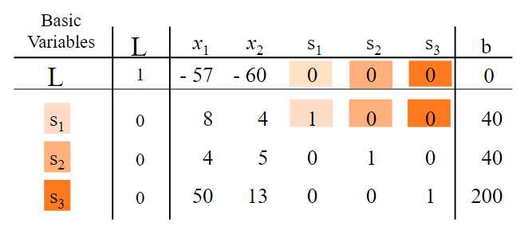
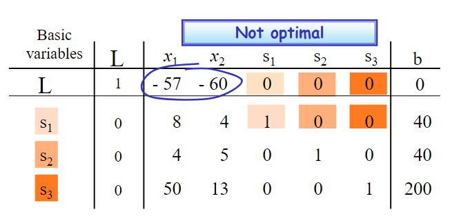
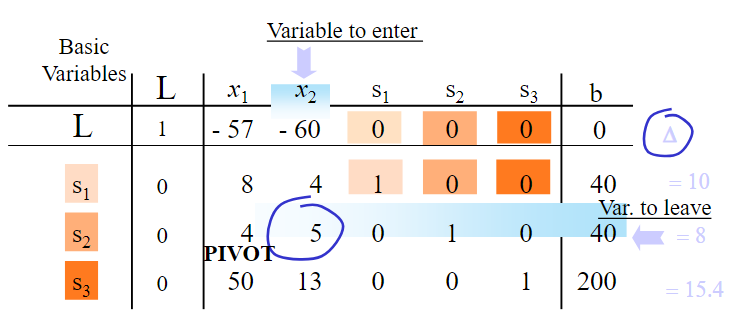
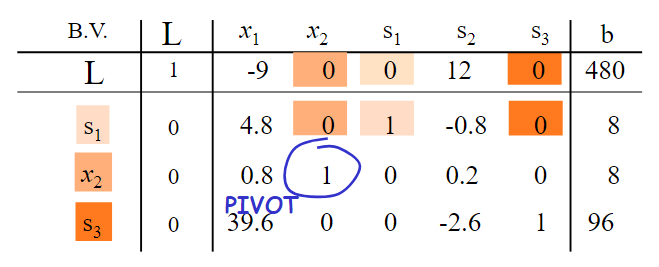
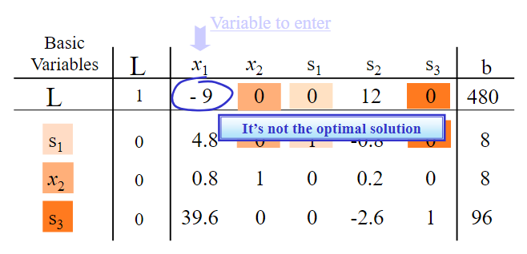
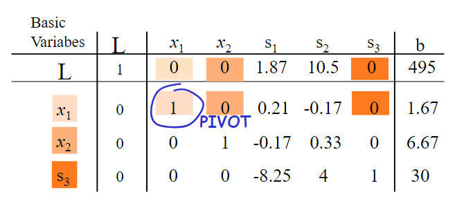
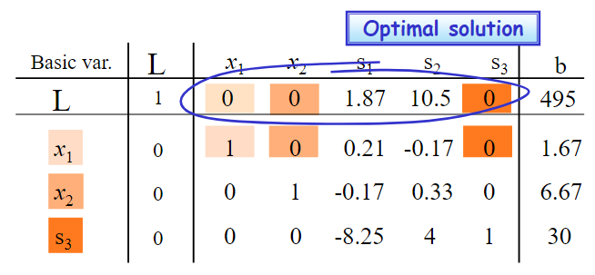

# SIMPLEX method

The SIMPLEX method has been created to automate this search process in a mathematical way. Consider the following optimization problem:

$$\text{Max }L=57x_1+60x_2$$

such that:

$$\begin{cases}8x_1+4x_2\leq 40\\ 4x_1+5x_2\leq 40\\ 50x_1+13x_2\leq 200\\ x_1,x_2\geq 0\end{cases}$$

First, you need the problem in its augmented form, i.e., with the constraints given by:

$$\begin{cases}8x_1+4x_2+s_1=40\\ 4x_1+5x_2+s_2=40\\ 50x_1+13x_2+s_3=200\\ x_1,x_2,s_1,s_2,s_3\geq 0\end{cases}$$

The feasible solution space of the problem is defined by all the constraints. We have 3 equations and 5 variables and, therefore, the solution space is not just one point. There are infinite points but just a finite number of feasible basic solutions (vertices).

A basic solution to this problem will have three variables different from zero (named basic variables), one for each constraint (ignore the domain constraints for this), and two that must be non-zero (non-basic). You will see how these match the vertices of the feasible region polygon.

From the three equations, one obvious apparent basic solution is $s_1=40$, $s_2=40$, $s_3=200$, with $x_1=0$ and $x_2=0$. A basic variable can be recognized in its contraint because it has a positive unitary coefficient in its constraint and it does not appear (has 0 coefficient) in the other constraints.


In order to search for the best solution, we should move from one system of equations to another that is equivalent to the first (it has the same solution space) but in which **another apparent basic solution comes up**.

There are two types of operations to transform the system of equations into another equivalent one:

* Multiply any equation by a positive or negative number
* Add to an equation another one which has been multiplied by any number

Graphically:


The problem is that even though this is a vertex, it is not a feasible solution - note that $s_1$ is negative!

## How many basic solutions are there?

We have **5 variables**, that divide into three basic variables ($x_1$, $x_2, and $s_1$) and two non-basic ($s_2$ and $s_3$). The number of basic variables is always equal to the total number of equations (not including the domain constraints - $x_1>0$ - or the objective function). Therefore, the number of feasible and unfeasible basic solutions is given by:

$$C_n^m=\frac{n!}{m!(n-m)!}$$

where $n$ represents the number of variables and $m$ the total number of constraints. The feasible basic solutions are, therefore, given by:


We need a systematic method (algorithm) that applies changes to the system of equations going from feasible basic solution to feasible basic solutions without leaving the feasible space. This is the so-called **SIMPLEX method** (created by Dantzig in the 1950s).

---

### Augmented form

We start with the augmented form, given (as seen before) by:

$$\text{Max }L-57x_1-60x_2-0s_1-0s_2-0s_3=0$$

subject to the following constraints:

$$\begin{cases}8x_1+4x_2+s_1=40\\ 4x_1+5x_2+s_2=40\\ 50x_1+13x_2+s_3=200\\ x_1,x_2,s_1,s_2,s_3\geq 0\end{cases}$$

```{note}

The objective function must be put in the form of an equation with all the variables on the left-hand side and the independent coefficient on the right.

```

### Setting up the first table



Our current solution right now sets the basic variables $[s_1,s_2,s_3]=[40,40,200]$, and the non-basic variables $[x_1,x_2]=[0,0]$. The value of the objective function in this case is $L=0$.

### Optimality condition of the SIMPLEX method

The **optimality condition** assures that it is not possible to find a better solution.

In a maximization problem, the current basic feasible solution is optimal if all the coefficients of the objective functions are positive. On the other hand, in a minimization problem, the current solution is optimal if all the coefficients of the objective function are negative.



**How to go to the next table of the SIMPLEX method?**

* In a maximization problem, the variable to enter the basis (to become basic) is the one that has the most negative coefficient in the objective funcion
* In a minimization problem, the variable to enter the basis (to become basic) is the one that has the most positive coefficient in the objective function

Therefore, in our problem it will be $x_2$.

**And how to choose the variable to leave the basis?**

The variable to leave the basis is the one whose quotient between the independent coefficient of the constraint (meaning the same line) under the variable that will enter in the basis is the lowest positive number including zero (this does not depend on being a maximization or minimization problem).

```{note}

There are, however, two special cases:

* if the coefficient of the entering basic variable is zero: enter *no limit* in the minimum ratio test column
* if the coefficient of the entering basic variable is negative: enter *no limit* in the minimum ratio test column

```


Changing the system, our table will start looking like:



And our current solution has $[s_1,x_2,s_3]=[8,8,96]$ as basic variables and $[x_1,s_2]=[0,0]$ as non-basic variables. With this scenario, the objective function is now $L=480$. Graphically speaking:


**But is it already the optimal solution?**

The next step will be to check if the solution obtained is the optimal solution and move to the next basic solution if it is not:



Repeating the same procedure again to identify the variables to enter and to leave:


Transforming the table again, we will obtain:



The current solution is now given by $L=495$, which results from having $[x_1,x_2,s_3]=[1.67,6.67,30]$ as basic variables and $[s_1,s_2]=[0,0]$ as non-basic variables. Graphically speaking:


Now we just need to check if the solution we have just obtained is optimal and, in this case, it is!



## Summary

The SIMPLEX method can be simplified and the whole workflow behind it is shown in the scheme below:


:::{card} Quiz questions
<iframe src="https://tudelft.h5p.com/content/1292123849460777397/embed" aria-label="2_3_3_1_simplex_method" width="1088" height="637" frameborder="0" allowfullscreen="allowfullscreen" allow="autoplay *; geolocation *; microphone *; camera *; midi *; encrypted-media *"></iframe><script src="https://tudelft.h5p.com/js/h5p-resizer.js" charset="UTF-8"></script>
:::

## Supplementary Video

The story is told once again in a video. The video listed below has a one-to-one correspondence with the chapters in this book

```{eval-rst}
.. raw:: html

    <iframe width="560" height="315" src="https://www.youtube.com/embed/S_8MsOXu60I" title="YouTube video player" frameborder="0" allow="accelerometer; autoplay; clipboard-write; encrypted-media; gyroscope; picture-in-picture" allowfullscreen></iframe>
```
