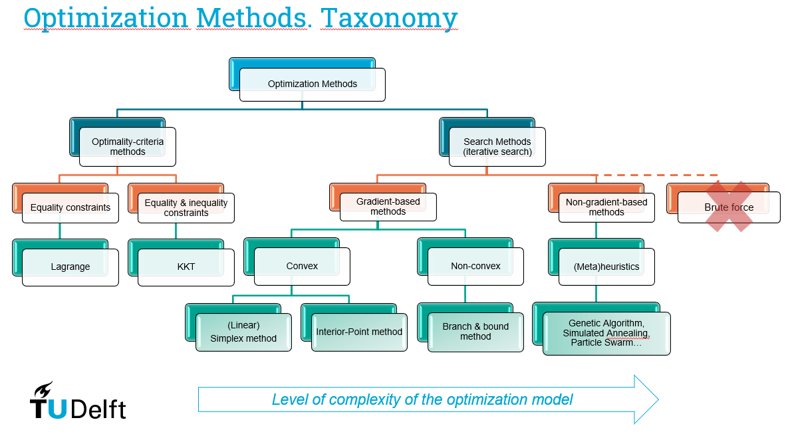
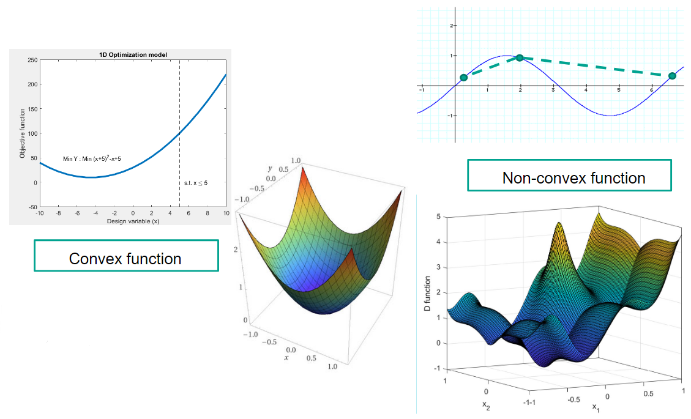

# Taxonomy of optimization models

In this section we will discuss the difference between different types of optimization models:

* Continuous vs Discrete variables
* Single vs Multi-objective
* Convex vs Non-convex problems
* Deterministic vs Stochastic
* Constrained vs Unconstrained problems

Below is an overview of the different types of optimization models and their relationship with each other:

## Continuous vs Discrete variables

The name is self-explanatory for the difference between these two types of variables:

* **Continuous variables:** time, distances, physical properties, etc.
* **Discrete variables:** number of wind turbines, decisions such as doing something or not, type of materials, etc.

Imagine we have a problem to find the optimal wind turbine (WT) farm. In this problem, we have two decision variables:

* $n$, the number os WTs ($10\leq n\leq 50$)
* $d$, the closest distance between two WTs ($15\leq n\leq 100$)

We can clearly see that $n$ is a discrete variable and $d$ is a continuous variable!

## Single vs Multi-objective

It depends on the number of objective functions we need to define to address our problem. Examples 4 and 6 from the last section are good examples of single and multi-objective problems, respectively.

Consider the example presented below of the optimal WT farm. If you define the objective functions to:

* maximize the annual production ($\text{Max}_{n,d} P_{\text{unit}}$)
* minimize the annual maintenance cost ($\text{Min}_{n,d}nC_m$)

These are single objective problems. However, if we consider both objectives at once, we are talking of a multi-objective problem!

$$\text{Min}_{n,d} \{-P_{\text{unit}}; nC_m\}$$

## Constrained vs Unconstrained problems

**Constrained problems:** the solution space is bounded:

* *Feasible region:* only a set of solutions are possible candidates;
* *Unfeasible region:* there is not a possible solution fulfilling all the constraints

**Unconstrained problems:** the solution space is not bounded. All the configurations are possible candidates for being optimal.

Still considering the WT example, if we consider a limited construction budget of 50M euros or a limited annual maintenance cost of 0.7M euros, then we are dealing with a constrained problem. In that case, if the construction or the maintenance costs are higher that the values defined, there is no possible solution!

$$\begin{gather*}nC\leq 50M\\ nC_m\leq 0.7M\end{gather*}$$

## Convex vs Non-convex problems

**Definition:** A convex optimization problem is a problem where all the constraints and the objective are convex functions.

In the WT farm case, even though the constraints defined above are linear (convex), the objective function is not. Then, it is considered a non-convex optimization problem.

## Deterministic vs Stochastic

**Deterministic optimization:** all the parameters of the optimization problem are deterministic. There is not variability in the problem definition.

**Stochastic optimization:** the definition of optimization problem presents variability or uncertainty. The optimal solution of a possible scenario is not necessarily the optimal solution of another possible scenario.

The problem as defined with the constraints above is deterministic. However, in case the construction, $C$, and the maintenance costs, $C_m$, present variability, the problem is stochastic and we find, for example:

$$\begin{gather*}\text{Prob}(nC\leq 50M)\geq 0.9\\ \text{Prob}(nC_m\leq 0.7M)\geq 0.95\end{gather*}$$