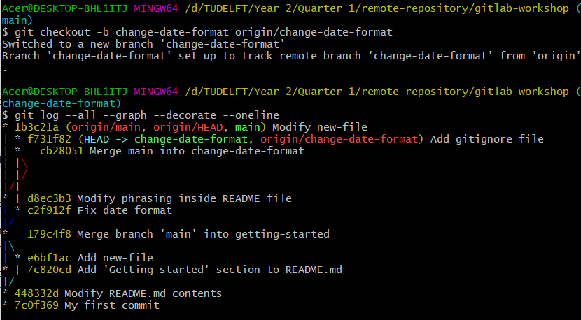
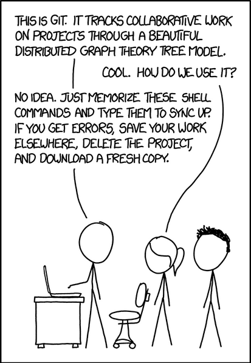

---
author:
- Kiril Vasilev and Riccardo Taormina
date: 2023-09-19
title: |
  Session 2 - Introduction to Version Control and basics of Git\
  Time estimated: 3.5 hours
---

# Introduction

Welcome to our introductory tutorial on version control systems, Git and
GitLab. We will start with teaching you how to use Git via command line
interface and next we will cover the interaction with GitLab. In our ,
you can find an overview of all commonly used commands in this tutorial.
We wish you good luck and hope that you enjoy learning about Git!

Note: some of the sections in this document have "Optional" next to
them. These sections cover bonus material, which is very interesting to
go over, but it is not mandatory.

***We strongly recommend that you complete the steps in this tutorial as
well to familiarise yourself how this tool works instead of simply
reading over the document. In addition, try to type the commands instead
of copy-pasting them, so that you could memorise them and be more
efficient in your work later.***

::: {#what-is-version-control}
## What is Version Control?
:::

While working on personal or university projects, without a doubt you
have come across the following situation: You have finished drafting a
report and believe you are done with it and save the file as
"report.doc". However, later you decide to experiment and make some
changes, but you still want to keep your old working version, so you
make a new file called "report-final.doc". Now imagine that you send the
file to a friend of yours to proofread and make some comments on it and
they send it back. Next, you incorporate their feedback and end up
naming the new one "report-final-2.doc".

What you have been doing is called version control. Version control
systems start with a base version of the document and then record
changes you make each step of the way. You can think of it as a
recording of your progress: you can rewind to start at the base document
and play back each change you made, eventually arriving at your most
recent version, as shown in figure [1](#intro1){reference-type="ref"
reference="intro1"}:

{#intro1}

Once you think of changes as separate from the document itself, you can
then think about "playing back" different sets of changes on the base
document, resulting in different versions of that document. For example,
two users can make independent sets of changes on the same document,
resulting in 2 independent versions (figure
[2](#intro2){reference-type="ref" reference="intro2"}).

{#intro2}

Unless multiple users make changes to the same section of the document -
a conflict - you can incorporate two sets of changes into the same base
document (figure [3](#intro3){reference-type="ref" reference="intro3"}).

{#intro3}

::: {#what-is-git}
## What is Git?
:::

Git is a version control system (VCS), used by software developers (and
not only!) to work on projects in parallel together. It provides
multiple benefits such as tracking changes to files, working side by
side with other people, and the ability to rollback to previous versions
of files without losing track of newer changes.

::: {#what-is-gitlab}
## What is GitLab?
:::

GitLab is a cloud-based version control system built around Git. It
provides a lot more features such as Issues, Merge Requests, CI/CD
pipelines, etc.

# Main concepts and terminology

Here we present a list of the terminology we will use while going over
the tutorial. Do not panic if you do not understand what each of the
following means. Later, we will provide a more elaborate explanation
with examples. Bear in mind that the list below is not exhaustive, and
more terms may show up.

1.  Repository -- Storage, where VCS store their history of changes and
    information about who made them.

2.  Remote (of repository) -- a version control repository stored
    somewhere else and the changes between the two are usually
    synchronized. We will refer to the Gitlab repository as a *remote*.

3.  Commit -- Snapshot of the current state of the project. If a commit
    contains changes to multiple files, all the changes are recorded
    together.

4.  Staging -- preparation of files to be committed. During the staging
    we propose files to be committed.

5.  Branch -- development (time) line. The main development line is
    called \"main\" (previously it was called \"master\" on git).

6.  Cloning -- copying (downloading) an existing project on your laptop.
    Usually, it is done only during the first time of getting the remote
    repository.

7.  Pushing -- uploading new commits (changes) to the remote server.

8.  Pulling -- retrieving new commits from the remote repository.

9.  Fetching -- check for new changes on the remote repository without
    pulling them yet.

10. Conflict -- when changes made by multiple users to the same file are
    incompatible, you can get into a conflict. Helping users resolve
    those conflicts is one of the key advantages of VCS.

11. Tracked (files) -- files that Git knows about -- they are either in
    the staging area or were previously added to the repository.

12. Untracked (files) -- files that Git does not know about -- they are
    likely new files that have not been staged yet.

13. Snapshot -- copy of the current version of the entire repository.

# Basics of Git

::: {#installing-git}
## Installing Git
:::

The steps to install Git and Git bash are shown here
<https://kirilvasilev16.github.io/mude-website/>.

::: {#setting-up-git}
## Setting up Git
:::

Git commands have the structure of `git <verb>  <options>`, where
`<verb>` denotes what action we want to take and `<options>` are the
arguments, which we pass to the command.

Before we start, we first need to locally set up the git environment, so
that when we make changes, we can be identified as the author of those
commits. Open git-bash on your computer and type the following lines in
the command line interface and use your name and email address between
the quotation marks.

Since you will be uploading your progress on a university instance of
Gitlab, it is recommended to use your student email when committing.

``` {frame="single"}
git config --global user.name "Kiril Vasilev"
git config --global user.email "k.v.vasilev-1@student.tudelft.nl"
```

Console example in figure [4](#setup1){reference-type="ref"
reference="setup1"}:

{#setup1}

Note that in the commands above you **do not need** to type the `$`
sign.

::: {#creating-a-repository-from-scratch}
## Creating a repository (from scratch)
:::

Open git bash and go to the desired directory, where you wish to set up
your repository. You can use the commands `cd` to move through
directories and `ls` to list files in the current directory. Have a look
at figure [5](#setup2){reference-type="ref" reference="setup2"}, where
we move to the location where we want to set up our new repository.
Namely, we wish to set up our repository in a new folder called
my-new-repository, which is inside the folders TUDELFT/Year 2/ Quarter
1.

Note that it is not necessary to create a new folder before creating a
new repository. You can make a repository in an existing folder as well.

{#setup2}

Note that the command output above is based on Windows Git-Bash. The
commands will have the same effect on Linux and MacOS, but the
visualisation of changing directories may slightly differ.

Now that we have moved to the location we want, we can initialize the
repository using the command `git init`.

Note that it is **not** necessary to call the command above for every
subdirectory of your project. We only use it once per repository, so you
should only call it on the root folder of your project.

Finally, we will also use the command below to move to the `main` line
of development, where we will be making changes next. By default, git
has started using main as initial branch, however, depending on your git
version/distribution it is possible to have master as default branch.
(figure [6](#setup3){reference-type="ref" reference="setup3"}).

``` {frame="single"}
git checkout -b main
```

Note: the command above can be regarded as executing both git branch
main and git checkout main at the same time. Later in this tutorial, we
will cover what branching means and why it is useful for the development
process.

{#setup3}

You can now begin making new files and working on things inside your
repository locally.

::: {#your-first-commit}
## Your first commit
:::

It is good practice to set up a markdown file README.md for your
projects, where you explain what your repository contains, how to use
it, who created it, how to contribute to it, repository license, etc.
This can be accomplished by running the following command and editing
the file, which was created via notepad or any other text editor that
your operating system has. For instance, nano or vim, which should come
installed with Git Bash. (figure
[7](#first-commit1){reference-type="ref" reference="first-commit1"}).

{#first-commit1}

Let us put the following text inside it:

``` {columns="fullflexible" frame="single"}
# About the project
This is a test project, where we learn how to use the git version control system.

# Usage
The project has no particular usage or any programming files to run.

# Contributors
Kiril Vasilev -  k.v.vasilev-1@student.tudelft.nl
```

You can replace the contributors name and email with yours. Save the
file and run the command `ls` to verify that you have successfully made
a new file as seen in figure [8](#first-commit2){reference-type="ref"
reference="first-commit2"}.

{#first-commit2}

Use the command `cat "README.md"` to show the contents of the file and
verify they are correct (figure [9](#first-commit3){reference-type="ref"
reference="first-commit3"}).

{#first-commit3}

Use the command `git status` to check tracked and untracked files in
current repository (figure [10](#first-commit4){reference-type="ref"
reference="first-commit4"}).

{#first-commit4}

Since we want to commit our new file, we first need to stage it. That is
track it, so that git knows about it and will add it to the repository
in the next commit. Let us call the following command:
`git add "README.md"`. This will track the file. Alternatively, we can
also use `git add *` , which will add all files in the current directory
and all subdirectories to the staging area of the repository.

Figure [11](#first-commit5){reference-type="ref"
reference="first-commit5"} shows the steps we explained, namely we first
make changes to the files. Next, we stage those changes via `git add`
and finally we commit (save) those changes to the repository with
`git commit` command.

{#first-commit5}

We can call `git status` again to check if the file is now being tracked
(figure [12](#first-commit6){reference-type="ref"
reference="first-commit6"}).

<figure id="first-commit6">

<p>. <span id="first-commit6" label="first-commit6"></span></p>
<figcaption>Checking tracked file</figcaption>
</figure>

Finally, we can make our first commit!

Run the command `git commit -m "My first commit"`. Note that you can
have a different commit message simply by changing the text between the
quotations (figure [13](#first-commit7){reference-type="ref"
reference="first-commit7"}).

It is important to have clear commit messages that show what each change
does. A common convention is to have the commit messages in imperative
form following this structure: one line giving a summary of the commit,
one empty line, followed by a paragraph explaining more in depth the
commit. Note that a one-line summary is also sufficient for a commit
message. Therefore, a more appropriate message would be \"Add README.md
file\".

<figure id="first-commit7">

<p>. <span id="first-commit7" label="first-commit7"></span></p>
<figcaption>Committing changes</figcaption>
</figure>

Tip: When writing a commit message, it is often useful to imagine
completing the following sentence: "This commit will ...\". For example,
using the commit message above, we will end up with the sentence: "This
commit will add README.md file".

Congratulations! You have now completed your first commit of changes via
git. Calling `git status` will show us that there are no new changes,
and everything is up to date (figure
[14](#first-commit8){reference-type="ref" reference="first-commit8"}).

<figure id="first-commit8">

<p>. <span id="first-commit8" label="first-commit8"></span></p>
<figcaption>Check for new changes</figcaption>
</figure>

::: {#comparing-commits-git-log-and-git-diff}
## Comparing commits -- git log and git diff
:::

As we have previously mentioned, one of the key advantages to Git is
that it allows you to track changes and see what has been changed, when
and by whom via commits.

Run the command `git log` to get that summary (figure
[15](#compare1){reference-type="ref" reference="compare1"}).

{#compare1}

We will now modify our README.md file by adding a line at the end of the
file, specifying the date it was last modified and changing the "About
the project" section:

``` {columns="fullflexible" frame="single"}
# About the project
This is a test project, where we learn how to use the git version control system.

# Usage
The project has no particular usage or any programming files to run.

# Contributors
Kiril Vasilev - k.v.vasilev-1@student.tudelft.nl

Last modification: 30.04.2022
```

We stage the file and commit the changes (figure
[16](#compare2){reference-type="ref" reference="compare2"}).

{#compare2}

Running `git log` now shows us the two commits we have made (figure
[17](#compare3){reference-type="ref" reference="compare3"}).

{#compare3}

It is important to note that every commit is associated with a unique
identifier. For example, our first commit has the identifier
`7c0f3694749bc736960619b27ccfb43b64da1191` and our second commit has the
identifier `448332d55ae438b3faa50b119290f536e161fd88`.

We can call the command `git diff 448332d 7c0f369` to show the
differences between the two commits in terms of changes of files. Note
that, the first 7 characters of the commit id are enough to identify it
in commands (figure [18](#compare4){reference-type="ref"
reference="compare4"}):

{#compare4}

The new additions are shown by a leading + and deletions by leading ---
to their respective row.

Note that swapping the commit identifiers also swaps the way changes are
displayed (figure [19](#compare5){reference-type="ref"
reference="compare5"}).

{#compare5}

# Branching and merging

::: {#what-are-branches}
## What are branches
:::

So far, we have only been making commits using the `main` branch,
however, in practice, you will work on a separate branch, whose progress
you will later merge with `main`.

Commits in git have graph structure, where every node is a commit and
edges represent the transition (flow) between commits. Branches can be
thought of as pointers to commits, whereas HEAD (something you saw when
we called `git log`) points to the current commit that we are at. When
you switch between branches, you can think of HEAD as the most recent
commit on that branch. For example, the most recent commit on branch
`main` is "Modify README.md contents".

The graph in [20](#branch1){reference-type="ref" reference="branch1"}
below displays the current commit history we have.

{#branch1}

The main advantage of version control is that it allows developers to
work together in parallel. During projects you will be working on
"feature" branches and separating the work to review and merge it later.
A common graphical structure of commits is shown below, where we have
developers working on 3 separate branches and merging their work when
necessary. This separation offers flexibility, parallelization of work
and offers more control over the development process (figure
[21](#branch2){reference-type="ref" reference="branch2"}).

{#branch2}

::: {#creating-a-branch}
## Creating a branch
:::

First let us check on what branch we are currently at. Call the command
`git branch` (figure [22](#branch3){reference-type="ref"
reference="branch3"}). The green text shows what branch we are currently
at.

{#branch3}

Remember how at the beginning of this tutorial we created branch main
and checked-out to it? Let us create a new branch from main, which we
will call getting-started. Call the command git branch
"getting-started".

We can move to the newly created branch via
`git checkout getting-started`. Call `git branch` again to verify that
you have moved to a new branch (figure
[23](#branch4){reference-type="ref" reference="branch4"}).

{#branch4}

Let us modify our README.md file again and add a '\"Getting started\"
section to it:

``` {columns="fullflexible" frame="single"}
# About the project
This is a project, in which we learn how to use the git version control system.

# Getting started
If you want to follow this tutorial, make sure you have git installed on your computer.

# Usage
The project has no particular usage or any programming files to run.

# Contributors
Kiril Vasilev - k.v.vasilev-1@student.tudelft.nl

Last modification: 30.04.2022
```

We will commit the new changes (figure
[24](#branch5){reference-type="ref" reference="branch5"}).

{#branch5}

Note: if you use `git add *`, you can stage all tracked files
simultaneously. Be careful that you do not stage more files than you
wish to!

::: {#merging-branches}
## Merging branches
:::

To show how to merge branches, let us return to our main branch and
create a new empty file called "new-file.txt". Next, we will create a
new commit for it and return to `getting-started` branch (Figure
[25](#branch6){reference-type="ref" reference="branch6"}).

Note that when we switch to `main`, the README.md file does not contain
the changes we made on the other branch.

Furthermore, the command `notepad new-file.txt` may not work for you if
you are using Linux or MacOS. Instead of executing this command, open
any texteditor application and create an empty file with the name
`new-file.txt`.

{#branch6}

We now have a commit, which is ahead of the branch `getting-started`.
Call the following command to visualize the current repository graph
(figure [26](#branch7){reference-type="ref" reference="branch7"}):

``` {frame="single"}
git log --all --graph --decorate --oneline
```

{#branch7}

Before merging our progress from `getting-started`, it is advisable to
merge `main` into it first. This is done because we regard `main` branch
as the "face" of our project. When somebody is looking at our
repository, they are likely to check the things on `main` first.
Moreover, if there are any bugs from merging, it is better to resolve
them on our separate branch. Sometimes it happens that after merging
your progress to `main` branch, the code on `main` branch is no longer
working correctly.

Therefore, we will first checkout to `getting-started`. Note that the
new file we made is no longer visible. We can merge the branch main into
`getting-started` by calling the command `git merge main`. As a result,
we can get all the progress from that branch to `getting-started`. Upon
merging, this will open a text editor (vim is shown in figure
[27](#branch8){reference-type="ref" reference="branch8"}), through which
you can edit your commit message.

Press i to enter "insert mode" and change the message. Press ESC to exit
"insert mode". Finally, press `:x` to exit the vim environment. You may
find those steps a bit difficult, so we recommend that you press `:` and
then `x` to finish immediately the merge without changing the message.
In case you get stuck, follow the guide in the following link:
[https://phoenixnap.com/kb/how-to-exit-vim]( https://phoenixnap.com/kb/how-to-exit-vim)

{#branch8}

We can now inspect the graph again with the new changes. The progress of
the other branch (`main`) has been moved to `getting-started` as seen in
figure [28](#branch9){reference-type="ref" reference="branch9"}.

{#branch9}

We will now return to `main` and merge `getting-started` into it:

{#branch10}

Note that this time we are not prompted to enter a commit message for
our merge. Since git is a version control system and sees that there are
no new changes, it will simply move the pointer of branch `main` to the
same commit the branch `getting-started` points:

<figure id="branch11">
<p> caption<span>Commits
graph showing a merge</span> <span id="branch11"
label="branch11"></span></p>
</figure>

::: {#deleting-branches}
## Deleting branches
:::

Branch `getting-started` has lived its use, so we can delete it as we do
not plan on making new changes to it. This will not remove any of the
commits made on it. It will only remove the pointer itself. Use
`git branch -d getting-started` to delete the branch (figure
[31](#branch12){reference-type="ref" reference="branch12"}).

{#branch12}

::: {#creating-a-branch-from-an-arbitrary-commit}
## Creating a branch from an arbitrary commit (Optional) {#creating-a-branch-from-an-arbitrary-commit}
:::

It is also possible to branch out from a past commit. This can be done
by checking out to existing commit (figure
[32](#branch13){reference-type="ref" reference="branch13"}). This
operation will create a so called "detached" HEAD. Here we checkout on
commit with id `c2f912f`. Note that the id will be different on your
machine. Therefore, replace this id with the id of the commit on your
machine, which relates to "Fix date format" commit.

{#branch13}

Next, we can create a new branch from there. Alternatively, one can also
follow the instructions provided by git in figure
[33](#branch14){reference-type="ref" reference="branch14"}.

{#branch14}

In figure [33](#branch14){reference-type="ref" reference="branch14"},
you can now see that we have successfully created a new branch from the
current commit. We will discuss in the coming sections of this document
what the text in red and green mean, so do not be surprised that you are
seeing this now.

# Merge conflicts

Merge conflicts arise when people on separate branches modify the same
parts of one (or multiple) files. Since git does not know how to handle
that and whose changes to consider, it prompts the user to decide
instead (figure [34](#mconflict1){reference-type="ref"
reference="mconflict1"}).

{#mconflict1}

Let us create a merge conflict ourselves:

We will start by making a new branch `change-date-format`. We will
checkout to it, modify the date format and make a commit as show in
figure [35](#mconflict2){reference-type="ref" reference="mconflict2"}.

{#mconflict2}

Next, we will return to `main` branch. We will edit the same line of the
README.md and then checkout back to `change-date-format` branch (figure
[36](#mconflict3){reference-type="ref" reference="mconflict3"}).

In figure [37](#mconflict4){reference-type="ref" reference="mconflict4"}
there is also a graph visualization.

{#mconflict3}

{#mconflict4}

Finally, we will merge `main` into `change-date-format` and get a merge
conflict as seen in figure [38](#mconflict5){reference-type="ref"
reference="mconflict5"}, because we modify the same parts of the file.

{#mconflict5}

The changes on the current branch are preceded by \<\<\<\<\<\<\< HEAD,
while the changes from `main` branch are preceded by ======= and
followed by \>\>\>\>\>\>\>main. In order to fix this conflict, we need
to open the file README.md with some texteditor app and fix the conflict
ourselves. That is, edit out the things we do not need: open a text
editor and remove the parts of the file we do not need. When done, we
just need to make a new commit. Note that the current branch is now in
stage "MERGING". We have decided to take the best out of the 2 branches
and merge their changes.

{#mconflict6}

Thus, we have succeeded in dealing with a merge conflict! The graph in
figure [39](#mconflict6){reference-type="ref" reference="mconflict6"}
displays how the 2 branches have now been merged.

# Tracking changes

::: {#git-log}
## Git log
:::

We have previously mentioned the command `git log`, which gives a list
of all commits (figure [40](#track1){reference-type="ref"
reference="track1"}).

{#track1}

::: {#git-checkout-recover-old-versions-of-a-file}
## Git checkout -- recover old versions of a file (Optional) {#git-checkout-recover-old-versions-of-a-file}
:::

Suppose that we are unhappy with our changes on README.md and wish to
return to a previous version, namely the one in commit 448332d. We could
use the following format to achieve this:

    git checkout 448332d README.md

{#track2}

Notice in figure [41](#track2){reference-type="ref" reference="track2"}
that because we included file name in the checkout command we have
returned to a previous version of the file, however, we have not moved
in the commit timeline, and we remain on our previous position in the
graph.

Notice that the file has new changes which are already included in the
repository as a staged commit (to see the changes use
`git diff --cached`). These changes thus appear as 'new' changes but are
in fact based on the older version of the same file. If we want to keep
this version, we can simply make a commit.

::: {#git-checkout-cancelling-staged-and-unstaged-changes}
## Git checkout -- cancelling staged and unstaged changes (Optional) {#git-checkout-cancelling-staged-and-unstaged-changes}
:::

Suppose that we no longer deem them necessary and wish to cancel all of
them for README.md file. We can run the following command to delete our
changes and restore the file contents to its most recent commit -- the
commit HEAD points to:

``` {frame="single"}
git checkout HEAD README.md
```

{#track3}

As previously mentioned, we do not move in the commit timeline since we
have neither staged our changes nor moved in branches (figure
[42](#track3){reference-type="ref" reference="track3"}).

::: {#git-blame}
## Git blame (Optional) {#git-blame}
:::

Another way to track who modified a specific file is via the command
`git blame <file>`, where in `<file>` you put the file name and
extension that you want to check. This way, you will get line-by-line
information of who modified the line last, when and in which commit
(figure [43](#track4){reference-type="ref" reference="track4"}).

{#track4}

# Reverting changes

While working you may also end up in a situation where you make some
changes and commit them, but you are no longer satisfied with them and
wish to revert them. Here we will present a different command than the
one used in .

This can be done via the following command, where `<commit_id>` should
be the id of the commit's changes, you wish to revert:

    git revert <commit_id>

Pay attention to the fact that reverting commits that constitute a merge
is more difficult than reverting normal commits, because it is necessary
to add more arguments to the command above: you need to specify when
reverting to the changes, to which parent commit you wish to revert.
This situation is shown in the image [44](#revert1){reference-type="ref"
reference="revert1"}.

{#revert1}

When executing the `git log` command with argument -1, we can get the
most recent commit. Since that commit is a merge commit, it has 2 parent
commits: `c2f912f` and `d8ec3b3`. Therefore, we can choose to which
parent commit to revert to by passing an argument -`m 1` to the
`git revert` command (we decided to revert to the first commit
`c2f912f`).

When typing the command above a text editor window will open to modify
the commit message. If you wish to make no changes to the message, just
write `:x` to close it (figure [45](#revert2){reference-type="ref"
reference="revert2"}).

{#revert2}

Since git is a version control system, when reverting changes, we are
making a new commit for that. Run the command for graph visualization to
verify this.

# Resetting changes/branches

Reverting changes does not alter the timeline of previous commits on a
particular branch --- it simply creates a new commit. Resetting, on the
other hand, does alter the timeline. Resetting commits requires extra
care as you have the power to reset the entire repository and the power
to alter the commit history without leaving a clear record of what the
changes were.

`git reset` command comes with 3 types of arguments that you can pass to
it:

`--soft` -- equivalent to uncommiting the changes. This way the changes
to the file(s) will not be deleted and will remain staged. Hence,
running `git commit` afterwards can let us commit all the changes
immediately (and thereby undoing the soft reset if we made no additional
changes).

`--mixed` -- equivalent to uncommiting and unstaging the changes.
Therefore, contrary to `--soft`, we need to first stage changes and then
commit them (if we wish).

`--hard` -- equivalent to uncommiting, unstaging and deleting all
changes. This is the most dangerous of the 3 options as it can
completely alter the commit history and leaves no record of previous
changes to the file(s).

In order to show its power, we will reset the revert we did in the
previous section and leave no trace of it happening. Note that we also
pass as an argument the commit we are resetting to (figure
[46](#revert3){reference-type="ref" reference="revert3"}).

{#revert3}

# Stashing changes (Optional) {#stashing-changes}

Suppose you are working on something which is not ready yet and a friend
of yours asks to check his branch and what he has done there. However,
if you switch branches, you will either carry over your changes or cause
a conflict and git will not allow the checkout. In this situation, it is
best to stash your changes, that is save them without staging or
committing them, and return to them later.

This is possible using the command `git stash save <name>`, where
`<name>` depicts the name, you give to your stashed changes. Let us make
some changes to our README.md file and stash them. Note that when you
stash your changes, you remove them and store them for later use (figure
[47](#stash1){reference-type="ref" reference="stash1"}).

{#stash1}

We can use the command `git stash list` to get a list of all stashes.
Notice that every stash is associated with an id next to it, which is
modified every time we save or pop a stash.

We will make a few more changes to the file and stash them again. The
list of stashes will grow as a result as seen in figure
[48](#stash2){reference-type="ref" reference="stash2"}.

{#stash2}

We can now safely move to other branches and when ready return to the
current one and unstash the changes. This is possible via this command:
`git stash pop <index>`, where `<index>` is the index of the stash we
want to unstash. We have decided to unstash changes on index 1. Popping
the stash will effectively remove it from the list of stashes (figure
[49](#stash3){reference-type="ref" reference="stash3"}).

{#stash3}

We may also choose to delete a stash without using it. Using the
following command to achieve this: `git stash drop <index>` (figure
[50](#stash4){reference-type="ref" reference="stash4"}).

{#stash4}

# GitIgnore

Sometimes it happens that you wish to have some files in your repository
that you do not want to share with others (do not want to ever commit
and stage). For example, database-related files or some cache files left
by the applications you are using to develop your projects. The best way
to ignore those files is to instruct git to ignore them for you. Hence,
if git knows that it should ignore a given file, it will no longer
suggest you to stage/commit changes to that file.

Another example of files you should not commit are the `.DS_Store`
files, which are only generated on MacOS platforms.

Suppose we want to ignore all files of type png. Suppose that we also
wish to ignore a folder and all its contents called data, which we will
create now. In order to do so, we need to create a new file called
.gitgnore. Notice that the file has no name and has extension gitignore
(normally we can use `ls` to list files (figure
[51](#ignore1){reference-type="ref" reference="ignore1"}), but since
those beginning with a '.' are generally hidden we pass the argument --a
to list all files - figure [52](#ignore2){reference-type="ref"
reference="ignore2"}).

{#ignore1}

{#ignore2}

To instruct git to ignore that file and everything inside that folder,
we must modify the contents of our gitignore file to contain the
following (where '/' indicates all files in the directory 'data' and the
'\*' symbol is a wildcard to ignore all files with extension '.png').
Note that you can open the gitignore file as a normal text file to
modify it (using a text editor app) (figure
[53](#ignore3){reference-type="ref" reference="ignore3"}).

``` {frame="single"}
data/
*.png
```

{#ignore3}

We would first need to commit our gitignore file to come into effect and
ignore files and directories (figure [54](#ignore4){reference-type="ref"
reference="ignore4"}).

{#ignore4}

The changes are no longer tracked (the images and files in the data
folder cannot be staged). This can be verified by using `git status`
(figure [55](#ignore5){reference-type="ref" reference="ignore5"}).

{#ignore5}

Another advantage you get is that git will not let you stage a file,
which you have specifically set to be ignored by git (figure
[56](#ignore6){reference-type="ref" reference="ignore6"}).

{#ignore6}

Depending on the projects you work on, there already exist pre-made
templates for gitignore files that you can make use of. Just make sure
that you pick a gitignore file that matches the language you are working
on and/or the IDE (integrated development environment) you are using.

# Interactive commits (Optional) {#interactive-commits}

So far when we wish to commit changes to a file, we were only able to
commit all of them. However, sometimes, we may wish to commit only some
of the changes. This can be done by passing an argument --p to your
`git add` command (figure [57](#interactive1){reference-type="ref"
reference="interactive1"}).

{#interactive1}

You will get an overview of all the changes in your file and git will
ask you at every step what you wish to do. Use ? (figure
[58](#interactive2){reference-type="ref" reference="interactive2"}) to
get an explanation of what each option does. A hunk denotes a block of
changes (such as the one in the image above). Git allows you to split
the hunk into smaller hunks until a hunk becomes as small as 1 change.

{#interactive2}

We have decided to split the hunk into smaller hunks and stage only the
second, fourth and fifth hunks and leave out the first and third (figure
[59](#interactive3){reference-type="ref" reference="interactive3"}).

{#interactive3}

We can verify that we have successfully achieved this by calling
`git diff --staged` to compare the HEAD with the staged files -- only
second, fourth and fifth changes were staged (figure
[60](#interactive4){reference-type="ref" reference="interactive4"}).

{#interactive4}

Of course, since those changes contain mistakes (extra s at the end of 3
sentences), we can reset them. We use the `--mixed` argument to unstage
the changes, but not delete them (figure
[61](#interactive5){reference-type="ref" reference="interactive5"}).

{#interactive5}

You can also commit part of the staged changes (the same way as we did
with staging only selected lines) by passing the --p parameter to
`git commit` command.

# Common mistakes using Git

While working you may end up making one of the following mistakes, so
make sure you double check you are executing the correct commands and
that you know what you wish to do:

-   Merging from the wrong branch

-   Committing on the wrong branch

-   Resetting more than you wanted

-   Committing the wrong file or changes

-   Giving a wrong branch name

-   Writing a commit message with a mistake in it

-   Deleting the wrong branch

-   Et cetera.

# Interacting with a remote repository

As you might have noticed we have only interacted with a local
repository up to now, without any possibility of collaboration with
other people. In order to do so, we require a remote repository that is
hosted somewhere. For example, on GitLab/GitHub/BitBucket instance.
Lucky enough, TU Delft has its own instance of GitLab, where we can make
repositories.

**Note: You can only make a repository if you are inside our group --
MUDE. Without being inside it, you are not able to create repositories
on your own!**

::: {#creating-a-remote-repository}
## Creating a remote repository
:::

Let us first begin by making a new remote repository on GitLab. We are
given the opportunity to either create a new blank repository or create
a repository from an existing project template or import an existing
repository from another project (figure
[62](#remote1){reference-type="ref" reference="remote1"}).

{#remote1}

We will start off by making a blank repository. Enter the necessary
details such as project name and unselect the checkbox "Initialize
repository with a README", since it is better to create the README file
ourselves (figure [63](#remote2){reference-type="ref"
reference="remote2"}).

{#remote2}

Upon creating the repository, GitLab gives us a set of instructions to
follow depending on what we would like to do (figure
[64](#remote3){reference-type="ref" reference="remote3"}).

{#remote3}

That was it! We have successfully created our own remote repository!

::: {#setting-up-ssh-agent}
## Setting up SSH agent
:::

{#ssh1}

**Note: you only need to setup SSH key once. You do not need to set it
up for every repository!**

Note: if you are unable to setup SSH key, do not worry. You can continue
pushing to a remote repository, but you will be required to enter your
NetID and password for every interaction.

After creating the repository, you may have noticed that this message
box appears on top of the webpage (figure
[65](#ssh1){reference-type="ref" reference="ssh1"}). The reason for this
is that we need to follow a few more steps before we can interact with
our remote repository. Press the button "Add SSH key" and open again
your git bash terminal.

In short SSH keys are an easy way to authenticate yourself when
interacting with a remote repository. They will remove the need to use
your NetID and password for every commit. SSH keys consist of 2 parts --
public and private part. The private key can be viewed as your password.
The public key is the one you can share with others without worrying
about anything. Make sure you upload your public key later.

Let us begin by generating an SSH key. The official GitLab documentation
already contains a nice tutorial for setting up your SSH key, which can
be found here: <https://docs.gitlab.com/ee/user/ssh.html> (figure
[66](#ssh2){reference-type="ref" reference="ssh2"}).

{#ssh2}

We will follow the steps and do the same (figure
[67](#ssh3){reference-type="ref" reference="ssh3"}).

{#ssh3}

Locate the folder `/c/Users/<your username>/.ssh/` and copy the contents
of the file `id_ed25519.pub` and paste them in the textbox named Key
(figure [68](#ssh4){reference-type="ref" reference="ssh4"}). Setting
title and expiration date is optional. Beware that the folder above is
for windows only. In case you use GNU/Linux or Mac, the folder, where
the keys are stored, will be different. On Mac it would be
`/Users/<username>/.ssh` and on Linux, it should be
`/home/<username>/.ssh`, where `<username>` is the username of your OS
profile:

{#ssh4}

You can test if your connection is successful by running
`ssh -vT git@gitlab.tudelft.nl`.

You will likely get a huge output, but at its end you should see a
message like this (figure [69](#ssh5){reference-type="ref"
reference="ssh5"}), where you are greeted by GitLab. The message should
also contain your NetID.

{#ssh5}

If you do not get greeted by GitLab, you will most likely receive
"Connection timeout". This would mean that you have not set up your SSH
key correctly. Ensure that you upload the public part of your key on
GitLab.

::: {#pushing-to-a-repository}
## Pushing to a repository
:::

Now that we have set up our SSH key, we are finally ready to push the
repository we have been working on for the past couple of hours. We will
follow the instructions provided by GitLab to push our existing
repository. The first command will associate the current repository with
the remote one and the second command will upload all our changes to the
remote repository (figure [70](#push1){reference-type="ref"
reference="push1"}).

``` {frame="single"}
git remote add origin git@gitlab.tudelft.nl:mude/gitlab-workshop.git

git push -u origin --all
```

Make sure you copy paste the commands above from your own remote
repository on GitLab (figure [70](#push1){reference-type="ref"
reference="push1"})!

{#push1}

Open the GitLab page of your repository and refresh the page. You should
now see it there (figure [71](#push2){reference-type="ref"
reference="push2"}).

{#push2}

Now we have pushed (uploaded) all our commits to the online repository.

{#push3}

Figure [72](#push3){reference-type="ref" reference="push3"} shows an
extra step, which we have not discussed before, namely `git push`. This
command allows us to push local changes to a remote repository. To show
this, let us edit our \"new-file.txt\" file and add a single line, stage
the changes, commit them and finally push them (figure
[73](#push4){reference-type="ref" reference="push4"}).

{#push4}

On the GitLab webpage, we can verify the change has been pushed (figure
[74](#push5){reference-type="ref" reference="push5"}).

{#push5}

::: {#force-pushing-changes-dangerous}
## Force pushing changes (Dangerous)
:::

Remember we saw that it is possible to reset commits. If your commit
history does not match that of the remote repository, you will be unable
to push changes. Sometimes it is necessary to overwrite your remote
repository and delete things that used to exist. We strongly recommend
that you take extra care when doing this, because it is possible for you
to lose your progress. Moreover, force pushing can mess up other
people's work and cause a lot of trouble. Therefore, a better
alternative as we discussed previously is reverting commits.

The command for force pushing commits on a specific branch is (replace
`<branch_name>` with the name of your branch):

``` {frame="single"}
git push origin <branch_name> --force 
```

::: {#fetchingpulling-from-a-repository}
## Fetching/Pulling from a repository
:::

When working with other people, it may happen that someone else has
pushed something to the remote repository without your knowledge. In
that case, you will need to pull their changes. For the sake of this
exercise, to show how pulling/fetching works, we will first hard reset
our branch 1 commit back to simulate this (figure
[75](#push6){reference-type="ref" reference="push6"}).

{#push6}

Notice that we were at main branch and that passed a parameter `HEAD~1`
when resetting the branch 1 commit back. This argument tells git to
reset to 1 commit behind HEAD. If we wanted to reset 2 commits behind
HEAD, we could have used `HEAD~2`.

Furthermore, notice that remote branches are denoted with red text and
are preceded by origin text, while local branches are colored green.

There is a major distinction between fetching and pulling changes.
Fetching will download all the changes locally but will not merge them
yet. Therefore, fetching is useful to check the progress from the remote
repository. Pulling on the other hand, will fetch and attempt to merge
the changes to the local repository. If there is a conflict, git will
alert the user and let them deal with the conflict.

Moreover, before committing and pushing changes, it is highly
recommended to first check if anyone has committed on the remote
repository before doing so. Otherwise, you will be unable to push to the
remote, because it has a different commit history compared to the local.

Use `git fetch` to fetch changes and `git pull` to pull changes from
remote repository (figure [76](#push7){reference-type="ref"
reference="push7"}).

{#push7}

::: {#cloning-existing-repository}
## Cloning existing repository
:::

Suppose that we had no local repository and we wanted to work on the
remote repository (which we created ourselves). In order to do this, we
need to clone the remote repository before we can start working on it.

Open the GitLab webpage of your repository and press \"Clone\" and copy
the \"Clone with SSH\" textbox. You can also clone using HTTPS, but that
may require you to write your NetID and password every time you push or
pull changes from the remote repository (figure
[77](#clone1){reference-type="ref" reference="clone1"}).

{#clone1}

Next make a new folder, where you wish to place the repository (figure
[78](#clone2){reference-type="ref" reference="clone2"}).

Note that it is not mandatory to create a new folder. You can clone a
repository in an existing folder as well.

{#clone2}

Next, run the `git clone` command and provide it with the SSH link you
copied (figure [79](#clone3){reference-type="ref" reference="clone3"}).

{#clone3}

{#clone4}

We can observe that we have successfully cloned the repository (figure
[80](#clone4){reference-type="ref" reference="clone4"}).

Notice that we have no local branch for `change-date-format`. To make
one, we need to run the following command (figure
[81](#clone5){reference-type="ref" reference="clone5"}):

``` {frame="single"}
git checkout -b change-date-format origin/change-date-format
```

{#clone5}

As the output by git suggests, now the local and remote branches are
tied together. Therefore, if we make commits on our local version of the
branch and push them to the remote repository, git will know to which
branch to append those changes.

# GitLab videos

On top of this tutorial, there are 2 videos, which show the Basics and
Advanced parts (optional) of using GitLab.

-   GitLab basics: <https://youtu.be/H23G1582d1o>

-   GitLab Advanced (optional): <https://youtu.be/B7syxptEnZ0>. Note
    that in the advanced part of the GitLab tutorial, we present how
    Merge Requests are made and handled. The steps to achieve this are
    very similar to the steps you took during the PEP8 peer-review
    assignment.

# Aliasing commands (Optional)

This section of the workshop is optional.

You may be feeling fed up with writing this long command to visualize
the commit graph. This can easily be fixed by introducing an alias for
it. Namely, you can set up an alias called graph for it. Hence, you can
replace the long command with a shorter one called git graph:

``` {frame="single"}
git config --global alias.graph "log --all --graph --decorate --oneline" 
```

Try using `git graph` afterwards to verify it worked (figure
[82](#alias1){reference-type="ref" reference="alias1"}).

{#alias1}

If you wish to remove an alias, simply execute the following:

``` {frame="single"}
git config --global --unset alias.graph 
```

{#alias2}

::: {#conclusion}
# Conclusion {#ch-conclusion}
:::

At first glance, Git has a steep learning curve and requires a lot of
knowledge and time to spend learning and practicing. However, knowing
how to use Git will pay off in the future! We hope that you found this
tutorial useful. Make sure you return to it occasionally when you are in
doubt about something. Remember that you can always Google things to
learn more. What is more, this tutorial is not exhaustive, but covers
the required basics of Git, which should be sufficient for you to work
in group projects.

Finally, in case something goes wrong, remember to follow the
instructions in figure [84](#conclusion){reference-type="ref"
reference="conclusion"} ;)

{#conclusion}

# References and used resources

While creating this tutorial, we made use of the following external
sources:

-   <http://swcarpentry.github.io/git-novice/>

-   <https://coderefinery.github.io/git-intro/>

-   <https://coderefinery.github.io/github-without-command-line/>

-   <https://coderefinery.github.io/git-collaborative/>

# Appendices

In the appendices you can find commonly used Git and Bash commands. You
may notice that we surround some of them with quotations (") . These are
only necessary when the argument you are passing on contains
whitespaces. For example, this is usually the case in commit messages.
However, if you have no spaces in your arguments, you can omit the
quotations.

::: {#appendices-a}
## Appendix A: Commonly used Git commands {#appendices-a}
:::

Table with commonly used Git commands:

  **Explanation of git command**                                      **Git command**                            **Example**
  ------------------------------------------------------------------- ------------------------------------------ ---------------------------------------------------------------
  Initialise repository                                               git init                                   git init
  Add files to the staging area                                       git add                                    git add "README.md"
  Commit changes                                                      git commit                                 git commit --m "Add README.md file"
  Merge the changes from one branch to another                        git merge                                  git merge "development"
  Get a list of all commits                                           git log                                    git log
  Get an overview of who was the last one to modify lines in a file   git blame                                  git blame README.md
  Show difference between commits (and/or files)                      git diff                                   git diff 1234567 7654321
  Create a branch                                                     git branch                                 git branch feature1
  Move to another branch                                              git checkout                               git checkout feature1
  Revert a commit                                                     git revert                                 git revert 1234567
  Store changes (without committing or staging)                       git stash                                  git stash save "my-stash"
  Uncommit and unstage changes on a branch                            git reset --mixed                          git reset --mixed development
  Push changes to a remote repository                                 git push                                   git push
  Fetch and merge changes from a remote repository                    git pull                                   git pull
  Fetch changes from a remote repository                              git fetch                                  git fetch
  Clone a remote repository                                           git clone                                  git clone git@gitlab.ewi.tudelft/myrepository.git
  Associate current repository with remote one                        git remote                                 git remote add origin git@gitlab.ewi.tudelft/myrepository.git
  List staged/unstaged/untracked files                                git status                                 git status
  Set email used for commits                                          git config --global user.email \<email\>   git config --global user.email myemail@tudelft.nl
  Recover old versions of a file                                      git checkout                               git checkout 1234567 README.md

::: {#appendices-b}
## Appendix B: Commonly used bash commands {#appendices-b}
:::

Table with commonly used bash commands:

  **Explanation of bash command**                                                                                                                                       **Bash command**   **Example**
  --------------------------------------------------------------------------------------------------------------------------------------------------------------------- ------------------ -----------------
  List files/folders in current directory including hidden ones                                                                                                         ls --a             ls -a
  Create an empty file                                                                                                                                                  touch              touch README.md
  Create an empty directory                                                                                                                                             mkdir              mkdir "util"
  Enter a folder inside a directory                                                                                                                                     cd                 cd util
  Leave a directory                                                                                                                                                     cd                 cd ../
  Remove a folder                                                                                                                                                       rmdir              rmdir util
  View the contents of a file                                                                                                                                           cat                cat README.md
  Clear the terminal contents                                                                                                                                           clear              clear
  Move a file or directory to a different location. Note that the first argument is location of folder/file to move and the second argument is the new location of it   mv                 mv /c/util /d/
