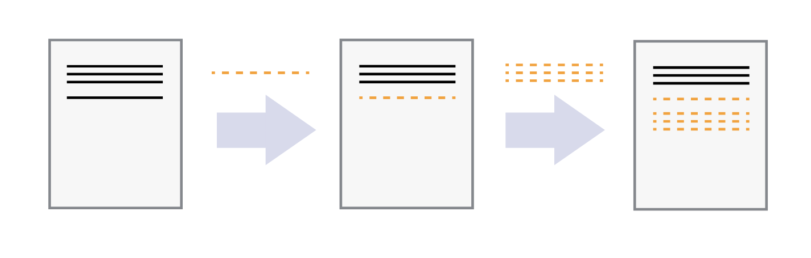

# Introduction to Version Control and basics of Git

<!-- This git tutorial was originally modified from Kiril and Riccardo's version from 2022-23. It was converted from LaTeX to md with Pandoc. Original PDF is included for reference. -->

Welcome to our introductory tutorial on version control systems, Git and
GitLab. We will start with teaching you how to use Git via command line
interface and next we will cover the interaction with GitLab. In our ,
you can find an overview of all commonly used commands in this tutorial.
We wish you good luck and hope that you enjoy learning about Git!

Note: some of the sections in this document have "Optional" next to
them. These sections cover bonus material, which is very interesting to
go over, but it is not mandatory.

***We strongly recommend that you complete the steps in this tutorial as
well to familiarise yourself how this tool works instead of simply
reading over the document. In addition, try to type the commands instead
of copy-pasting them, so that you could memorise them and be more
efficient in your work later.***

authors: Kiril Vasilev, Riccardo Taormina, Robert Lanzafame.

## What is Version Control?

While working on personal or university projects, without a doubt you
have come across the following situation: You have finished drafting a
report and believe you are done with it and save the file as
"report.doc". However, later you decide to experiment and make some
changes, but you still want to keep your old working version, so you
make a new file called "report-final.doc". Now imagine that you send the
file to a friend of yours to proofread and make some comments on it and
they send it back. Next, you incorporate their feedback and end up
naming the new one "report-final-2.doc".

What you have been doing is called version control. Version control
systems start with a base version of the document and then record
changes you make each step of the way. You can think of it as a
recording of your progress: you can rewind to start at the base document
and play back each change you made, eventually arriving at your most
recent version, as shown in figure [1](#intro1){reference-type="ref"
reference="intro1"}:

Once you think of changes as separate from the document itself, you can
then think about "playing back" different sets of changes on the base
document, resulting in different versions of that document. For example,
two users can make independent sets of changes on the same document,
resulting in 2 independent versions (figure
[2](#intro2){reference-type="ref" reference="intro2"}).

Unless multiple users make changes to the same section of the document -
a conflict - you can incorporate two sets of changes into the same base
document (figure [3](#intro3){reference-type="ref" reference="intro3"}).

## What is Git?

Git is a version control system (VCS), used by software developers (and
not only!) to work on projects in parallel together. It provides
multiple benefits such as tracking changes to files, working side by
side with other people, and the ability to rollback to previous versions
of files without losing track of newer changes.

## What is GitLab?

GitLab is a cloud-based version control system built around Git. It
provides a lot more features such as Issues, Merge Requests, CI/CD
pipelines, etc.

# Main concepts and terminology

Here we present a list of the terminology we will use while going over
the tutorial. Do not panic if you do not understand what each of the
following means. Later, we will provide a more elaborate explanation
with examples. Bear in mind that the list below is not exhaustive, and
more terms may show up.

1.  Repository -- Storage, where VCS store their history of changes and
    information about who made them.

2.  Remote (of repository) -- a version control repository stored
    somewhere else and the changes between the two are usually
    synchronized. We will refer to the Gitlab repository as a *remote*.

3.  Commit -- Snapshot of the current state of the project. If a commit
    contains changes to multiple files, all the changes are recorded
    together.

4.  Staging -- preparation of files to be committed. During the staging
    we propose files to be committed.

5.  Branch -- development (time) line. The main development line is
    called \"main\" (previously it was called \"master\" on git).

6.  Cloning -- copying (downloading) an existing project on your laptop.
    Usually, it is done only during the first time of getting the remote
    repository.

7.  Pushing -- uploading new commits (changes) to the remote server.

8.  Pulling -- retrieving new commits from the remote repository.

9.  Fetching -- check for new changes on the remote repository without
    pulling them yet.

10. Conflict -- when changes made by multiple users to the same file are
    incompatible, you can get into a conflict. Helping users resolve
    those conflicts is one of the key advantages of VCS.

11. Tracked (files) -- files that Git knows about -- they are either in
    the staging area or were previously added to the repository.

12. Untracked (files) -- files that Git does not know about -- they are
    likely new files that have not been staged yet.

13. Snapshot -- copy of the current version of the entire repository.

