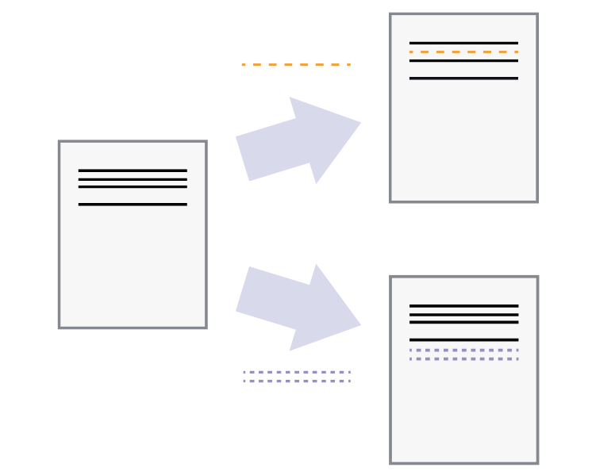
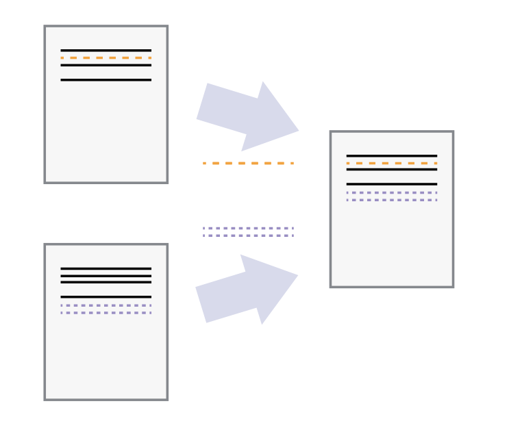

# Version Control

<!-- This git tutorial was originally modified from Kiril and Riccardo's version from 2022-23. It was converted from LaTeX to md with Pandoc. Original PDF is included for reference. -->

In a nutshell, **version control** is a process that is concerned with the management and recording of files on your computer. These tools are primarily focused on text-based files, although for convenience we will also apply them to binary files such as PDF or raster images. While you may be used to backup software such as OneDrive, Dropbox, etc, version control software works a bit differently because of the focus on the text-based content. The chapters in this textbook will give you the information you need to take advantage of a version control software, git, for the programming projects you will work on during your MSc program.

authors: Kiril Vasilev, Riccardo Taormina, Robert Lanzafame.

## What is Version Control?


While working on personal or university projects, without a doubt you
have come across the following situation: You have finished drafting a
report and believe you are done with it and save the file as
"report.doc". However, later you decide to experiment and make some
changes, but you still want to keep your old working version, so you
make a new file called "report-final.doc". Now imagine that you send the
file to a friend of yours to proofread and make some comments on it and
they send it back. Next, you incorporate their feedback and end up
naming the new one "report-final-2.doc".

What you have been doing is called version control. Version control
systems start with a base version of the document and then record
changes you make each step of the way. You can think of it as a
recording of your progress: you can rewind to start at the base document
and play back each change you made, eventually arriving at your most
recent version, as shown in figure {numref}`intro1`:

```{figure} images/intro1.png
---
height: 150px
name: intro1
---
Consecutive file changes
```

Once you think of changes as separate from the document itself, you can
then think about "playing back" different sets of changes on the base
document, resulting in different versions of that document. For example,
two users can make independent sets of changes on the same document,
resulting in 2 independent versions (figure
[2](#intro2){reference-type="ref" reference="intro2"}).



Unless multiple users make changes to the same section of the document -
a conflict - you can incorporate two sets of changes into the same base
document (figure [3](#intro3){reference-type="ref" reference="intro3"}).




