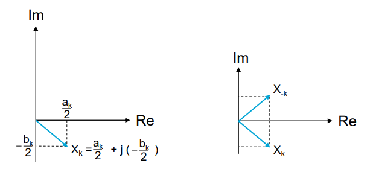
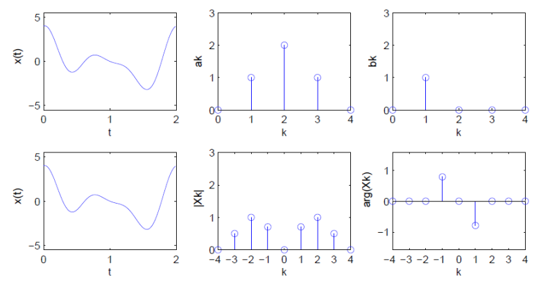

# Complex Fourier Series

## A quick recap

From the previous chapter, we have found that any periodic signal can be written into series of harmonically related sinusoids:

$$x(t)=a_0+\sum_{k=1}^{\infty}a_k\cos(k\omega_0 t)+\sum_{k=1}^{\infty}b_k\sin(k\omega_0 t), \hspace{10px}\text{with }\omega_0=\frac{2\pi}{T_0}$$

where the coefficients can be found as:

$$\begin{gather*}a_0=\frac{1}{T_0}\int_{T_0}x(t)dt\\ a_k = \frac{2}{T_0}\int_{T_0}x(t)\cos(k\omega_0 t)dt, \hspace{10px}\text{with } k\in\mathbb{N}^+\\ b_k = \frac{2}{T_0}\int_{T_0}x(t)\sin(k\omega_0 t)dt, \hspace{10px}\text{with } k\in\mathbb{N}^+\end{gather*}$$

Now the same signal decomposition, but in a different form using complex algebra as commonly done in spectral analysis of signals, will be used.

---

### Complex Algebra

$j$: imaginary unit (or number) such that $j^2=-1$
$e$: Euler's number (base of the natural logarithm), $e\approx 2.71$

**Euler's formula:**

$$\begin{gather*}e^{j\theta}=\cos\theta+j\sin\theta\\ e^{-j\theta}=\cos\theta-j\sin\theta\end{gather*}$$

and, therewith:

$$\begin{gather*}e^{j\theta}+e^{-j\theta}=2\cos\theta\implies\cos\theta=\frac{1}{2}(e^{j\theta}+e^{-j\theta})\\ e^{j\theta}-e^{-j\theta}=2j\sin\theta\implies\sin\theta=\frac{1}{2j}(e^{j\theta}-e^{-j\theta})\end{gather*}$$

## Complex Fourier Series

$$x(t)=\sum_{k=-\infty}^{\infty}X_ke^{jk\omega_0 t}$$

First equation is known as **synthesis** equation of Fourier Series, as in contructs the signal using complex exponential basis functions

$$X_k=\frac{1}{T_0}\int_{T_0}x(t)e^{-jk\omega_0 t}dt, \hspace{10px}k\in\mathbb{Z}$$

Second equation is known as analysis equation of Fourier Series, as it allows us to analyse how signal can be represented by complex exponential basis functions (where index $k$ refers to frequency $k\omega_0$).

### Derivation

Start by substituting the complex exponential forms of both $\cos(k\omega_0 t)$ and $\sin(k\omega_0 t)$ into trigonometric series:

$$\begin{align}x(t)&=a_0+\sum_{k=1}^{\infty}a_k\textcolor{red}{\frac{1}{2}(e^{jk\omega_0 t}+e^{-jk\omega_0 t})}+\sum_{k=1}^{\infty}b_k\textcolor{green}{\frac{1}{2j}(e^{jk\omega_0 t}-e^{-jk\omega_0 t})}=\\&=a_0+\sum_{k=1}^{\infty}\underbrace{\frac{1}{2}(a_k-jb_k)}_{X_k}e^{jk\omega_0 t}+\sum_{k=1}^{\infty}\underbrace{\frac{1}{2}(a_k+jb_k)}_{X_{-k}}e^{-jk\omega_0 t}=\\&=a_0+\sum_{k=1}^{\infty}X_ke^{jk\omega_0 t}+\sum_{k=1}^{\infty}X_{-k}e^{-jk\omega_0 t}\end{align}$$

If we replace the last term index $-k$ for $k$ then we get:

$$x(t)=a_0+\sum_{k=1}^{\infty}X_ke^{jk\omega_0 t}+\sum_{k=-1}^{-\infty}X_ke^{jk\omega_0 t}$$

As when $k=0$ we have $X_k=X_0=a_0$ and $e^{jk\omega_0 t}=e^{j0\omega_0 t}=1$, then we can compact everything and write

$$x(t)=\sum_{k=-\infty}^{\infty}X_ke^{jk\omega_0 t}$$

where

$$X_k=\frac{1}{T_0}\int_{T_0}x(t)e^{-jk\omega_0 t}dt, \hspace{10px}k\in\mathbb{Z}$$

### Coefficients

Real and complex Fourier series coefficients are related by:

$$X_k=\begin{cases}\frac{1}{2}(a_k-jb_k),\hspace{5px}k>0\\ \frac{1}{2}(a_{-k}+jb_{-k}),\hspace{5px}k<0\end{cases}$$

so

$$\begin{gather*}X_1=\frac{1}{2}(a_1-jb_1), X_2=\frac{1}{2}(a_2-jb_2)\\ X_{-1}=\frac{1}{2}(a_1+jb_1), X_{-2}=\frac{1}{2}(a_2+jb_2)\end{gather*}$$

And we clearly see that $X_k=X^*_{-k}$, with $*$ denoting the complex conjugate. The visual representation of $X_k$ and $X_{-k} will be, therefore:

We have $a_k=2\text{Re}(X_k)$ and $b_k=-2\text{Im}(X_k)$ for $k>0$

Visualising complex coefficients $X_k$ as vectors in **complex plane**: *magnitude*, or modulus (amplitude), and *argument*, or phase. We can write the coefficients in **polar** (or phasor) form:

$$X_k = |X_k|e^{j\theta_k}, \hspace{10px}\text{with } \theta_k=\angle X_k=\text{arg}(X_k) \hspace{10px}\text{for }-\infty<k<\infty (k\in\mathbb{Z})$$

and we find:

* **Magnitude** $|X_k|=\frac{1}{2}\sqrt{a_k^2+b_k^2}$, k>0
* **Argument** $\theta_k=\arctan\left(-\frac{b_k}{a_k}\right)$, k>0

Note that for real signals $|X_k|=|X_{-k}|$ and $\theta_k=-\theta_{-k}$

## Line Spectra

The complex exponential Fourier series coefficients

$$X_k=\frac{1}{T_0}\int_{T_0}x(t)e^{-jk\omega_0 t}dt, \hspace{10px}k\in\mathbb{Z}$$

* shows **amplitudes** of all phasors involved, through modulus of complex exponential coefficients $|X_k|$ versus frequency $kf_0$, yields **amplitude spectrum** (actually magnitude spectrum)
* shows **phases** of all phasors, through argument of the complex exponential coefficients $\theta_k$ versus frequency $kf_0$, yields **phase spectrum**

### Example

Consider the following signal, with period $T_0=2s$, so $f_0=0.5$ Hz, composed of three cosines and one sine:

$$x(t)=\cos(2\pi f_0t)+2\cos(2\pi 2f_0t)+\cos(2\pi 3f_0t)+\sin(2\pi f_0t)$$

Real and complex Fourier coefficients are shown below

### Summary

The complex exponential Fourier series is given by

$$x(t)=\sum_{k=-\infty}^{\infty}X_ke^{jk\omega_0 t}$$

with coefficients

$$X_k=\frac{1}{T_0}\int_{T_0}x(t)e^{-jk\omega_0 t}dt, \hspace{10px}k\in\mathbb{Z}$$

The complex coefficients can be written in **polar form**: $X_k=|X_k|e^{j\theta_k}$

$$\text{with } \theta_k=\angle X_k=\text{arg}(X_k) \hspace{10px}\text{for }-\infty<k<\infty (k\in\mathbb{Z})$$

then, for real signals:

* magnitude: $|X_k|=|X_{-k}|$, **even** function of $k$ (and hence frequency $kf_0$) forming **amplitude spectrum**
* argument (or phase): $\theta_k=-\theta_{-k}$, **odd** function of $k$, forming **phase spectrum**

$\implies$ periodic signal written in terms of sum of cosines and sines, together (pairwise) represented in complex exponentials