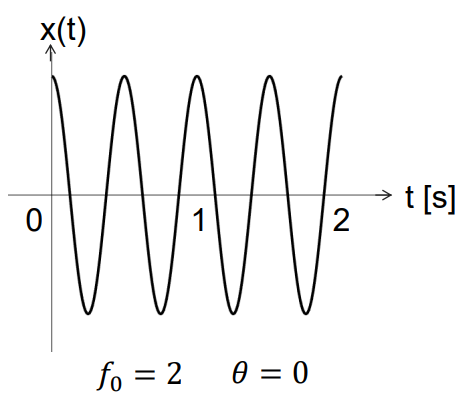
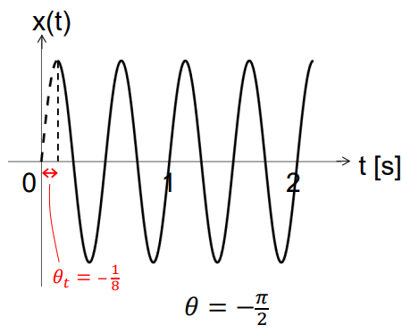
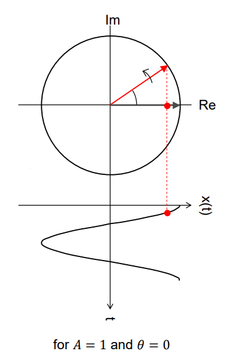

# Real Fourier Series

**Main objective:** our goal in this chapter is to be able to express a periodic signal $x(t)$ as a sum of harmonically related cosines and sines

$$x(t)=a_0+\sum_{k=1}^{\infty}a_k\cos(k\omega_0 t)+\sum_{k=1}^{\infty}b_k\sin(k\omega_0 t)$$

## Periodic functions (a recap)

*Example:* $x(t)=A\cos(2\pi f_0t+\theta)$



It is easy to see that, in this case we will have:

* Amplitude $A$ (e.g. V, m, m s$^{-2}$)
* Frequency $f_0$ [Hz]
    * Angular frequency $\omega_0 = 2\pi f_0$ [rad/s]
    * Period $T_0 = \frac{1}{f_0} = \frac{2\pi}{\omega_0}$ [s]
* Phase $\theta$ [rad]

With this, the **time delay**, $\theta_t$ [s], caused by the phase can be computed as

$$\theta_t = \frac{\theta}{2\pi f_0}$$

as $x(t)=A\cos(2\pi f_0(t+\theta_t))$



---

Cosine and sine can be thought of as originating from an object travelling over a circle; the object is *rotating* at angular frequency $\omega_0$. The unit circle is interpreted as being in the complex plane, with Euler's formula:

$$\tilde{x}(t)=e^{j\omega_0 t}=\cos(\omega_0 t)+j\sin(\omega_0 t)$$

The position of the object is described by the complex number $\tilde{x}(t)$, which is illustrated by the red vector in the figure below. We can also easily state that:

* $\text{Re}(\tilde{x}(t))=\cos(\omega_0 t)$ (illustrated by the red dot in the figure)
* $\text{Im}(\tilde{x}(t))=\sin(\omega_0 t)$



---

A deterministic function/signal is **periodic** if

$$x(t+T_0)=x(t), \hspace{10px} \text{for } -\infty<t<\infty$$

where $T_0$ is the **period** of the signal. The smallest value of $T_0$ that satisfies the above equation is the so-called **fundamental period**. And, finally, if the equation is not satisfied for any value of $T_0$ then the signal is **aperiodic**.

---

We consider signals in single dimension, typically time $t$ (independent variable), hence $x(t)$. Instead we can have $x(r)$, with $r$ (1D) position coordinate, or even multi-variate position vector $\textbf{r}$ (the Earth's surface or the sea surface with waves can be considered as 2D examples).

## Fourier Series

**Motivation:** Can we express any periodic function/signal, e.g. square wave, as a sum of just cosines and sines with different frequencies?

Apparently, there exists the possibility of building up arbitrary periodic signal from **sums of harmonically related sinusoidal terms**. Therefore:

> Given a specific periodic signal, how do we find its trigonometric series representation?

It will be shown that the resulting series, **unique** for each periodic signal, is called the **trigonometric Fourier series** of that signal, sometimes also real Fourier series, or trigonometric polynomial, i.e. sum of cosines and sines, all with zero phase.

```{admonition} A bit of history - Fourier biography
:class: tip, dropdown

Jean Baptiste Joseph Fourier (1768-1830) was a French mathematician and physicist.

He went with Napoleon to Egypt, then returned to France to become préfect of Isère, and there, in his spare time, he worked on the mathematical descriptions of heat transfer and vibrations.

In 1822 he presented his main work on heat flow, in which he claims that any function of a variable, whether continuous or discontinuous, can be expanded in a series of sines of multiples of the variable.

Though this result is not fully correct, Fourier’s observation that some discontinuous functions are the sum of infinite series was a breakthrough. The Fourier series and Fourier transform have been named in his honour.
```

The general form of the real trigonometric Fourier Series is

$$
x(t) = a_0+a_1\cos(\omega_0 t)+a_2\cos(2\omega_0 t)+\dots+b_1\sin(\omega_0 t)+b_2\sin(2\omega_0 t)\dots
$$

or, in a more compact form:

$$x(t) = a_0 + \sum_{k=1}^{\infty}a_k\cos(k\omega_0 t)+\sum_{k=1}^{\infty}b_k\sin(k\omega_0 t), \hspace{10px} \omega_0=\frac{2\pi}{T_0}$$

with **integer** values for $k$. Note that as the right-hand side is a sum of *harmonically-related* sinusoids, so must be the left-hand side (i.e. it must be periodic). Now our goal is to find the coefficients $a_0$, $a_k$ and $b_k$ such that $x(t)$ is represented (or approximated) best.

:::{card} Derivation

```{admonition} MUDE Exam Information
:class: tip, dropdown
This derivation is provided for additional insight and will not be part of the exam.
```

We start with $a_0$. Integrate all terms over one period:

$$\int_{T_0}x(t)dt = \int_{T_0}a_0dt+\int_{T_0}a_1\cos(\omega_0 t)dt+...+\int_{T_0}b_1\sin(\omega_0 t)dt+...$$

When integrating sine or cosine over one period, the same area appears above and below the $t$ axis. The same holds for any $\cos(k\omega_0 t)$ or $\sin(k\omega_0 t)$. So, all terms on right-hand side, except for the first one, are zero. This yields:

$$\int_{T_0}x(t)dt=a_0T_0$$

So:

$$a_0=\frac{1}{T_0}\int_{T_0}x(t)dt$$

Hence, $a_0$ is the **average value of the signal**. It can also be interpreted as cosine with zero frequency.

---

Next, for the $a_k$ coefficients, these can be found by multiplying both sides of the equation with $\cos(m\omega_0 t)$ and integrating over $T_0$:

$$\int_{T_0}x(t)\cos(m\omega_0 t)dt=a_0\int_{T_0}\cos(m\omega_0 t)dt+\int_{T_0}\left(\sum_{k=1}^{\infty}a_k\cos(k\omega_0 t)\right)\cos(m\omega_0 t)dt + \int_{T_0}\left(\sum_{k=1}^{\infty}b_k\sin(k\omega_0 t)\right)\cos(m\omega_0 t)dt$$

First term is zero, as we are again integrating cosine over multiple of periods. Next, we move $\cos(m\omega_0 t)$ inside summation and integrate term by term.

$$\int_{T_0}x(t)\cos(m\omega_0 t)dt = \sum_{k=1}^{\infty}a_k\int_{T_0}\cos(k\omega_0 t)\cos(m\omega_0 t)dt + \sum_{k=1}^{\infty}b_k\int_{T_0}\sin(k\omega_0 t)\cos(m\omega_0 t)dt$$

Essentially, we switch order of summation and integration. Now, we use **orthogonality** of integrals involving products of sines and cosines:

$$\begin{gather*}\int_{T_0}\cos(k\omega_0 t)\cos(m\omega_0 t)dt = \begin{cases}0:k\neq m\\ T_0/2: k=m\neq 0\end{cases}\\\int_{T_0}\sin(k\omega_0 t)\sin(m\omega_0 t)dt = \begin{cases}0:k\neq m\\ T_0/2: k=m\neq 0\end{cases}\\\int_{T_0}\sin(k\omega_0 t)\cos(m\omega_0 t)dt = 0, \hspace{10px} \text{for all } k,m\end{gather*}$$

These hold for integer values of $k$ and $m$, and $T_0$ corresponding to $\omega_0$

```{note}
The above integrals are quite easily proven by using trigonometric identities, such as

$$\sin{u}\sin{v}=\frac{1}{2}\cos{(u-v)}-\frac{1}{2}\cos{(u+v)}$$
```

Applying these properties, we see that all terms in second series are equal to 0 for all $k$. In the first series, only the term for which $k=m$ is non-zero. So:

$$
\begin{align} & \int_{T_0}x(t)\cos(m\omega_0 t)dt = \int_{T_0}x(t)\cos(k\omega_0 t)dt = \\ &\sum_{k=1}^{\infty}a_k\int_{T_0}\cos(k\omega_0 t)\cos(m\omega_0 t)dt + \sum_{k=1}^{\infty}b_k\int_{T_0}\sin(k\omega_0 t)\cos(m\omega_0 t)dt = \frac{a_k T_0}{2} \end{align}
$$

So, finally:

$$a_k = \frac{2}{T_0}\int_{T_0}x(t)\cos(k\omega_0 t)dt, \hspace{10px}\text{with } k\in\mathbb{N}^+$$

In a similar manner, we can find the coefficients $b_k$ by multiplying series with $\sin(m\omega_0 t)$, integrating over $T_0$ and using orthogonality properties. We therefore obtain:

$$b_k = \frac{2}{T_0}\int_{T_0}x(t)\sin(k\omega_0 t)dt, \hspace{10px}\text{with } k\in\mathbb{N}^+$$

:::

### Summary

Any periodic signal can be written into series of harmonically related sinusoids:

$$x(t)=a_0+\sum_{k=1}^{\infty}a_k\cos(k\omega_0 t)+\sum_{k=1}^{\infty}b_k\sin(k\omega_0 t), \hspace{10px}\text{with }\omega_0=\frac{2\pi}{T_0}$$

where the coefficients can be found as:

$$\begin{gather*}a_0=\frac{1}{T_0}\int_{T_0}x(t)dt\\ a_k = \frac{2}{T_0}\int_{T_0}x(t)\cos(k\omega_0 t)dt, \hspace{10px}\text{with } k\in\mathbb{N}^+\\ b_k = \frac{2}{T_0}\int_{T_0}x(t)\sin(k\omega_0 t)dt, \hspace{10px}\text{with } k\in\mathbb{N}^+\end{gather*}$$