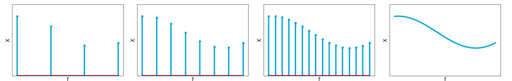
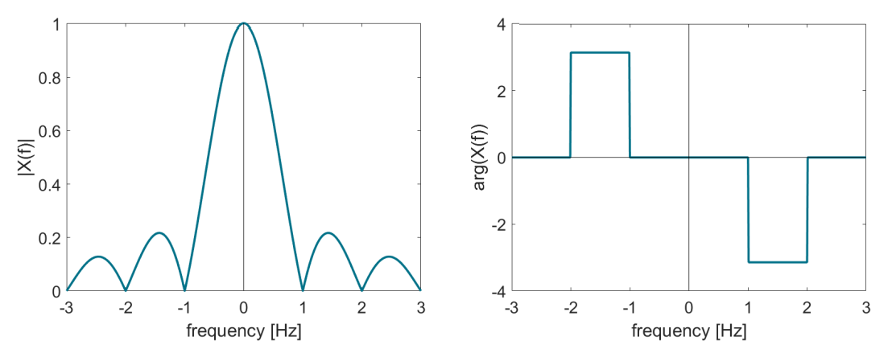

# Fourier Transform

## Before starting...

Let us start by taking a look into the results found in the previous chapter. We have defined the complex exponential Fourier series by

$$x(t)=\sum_{k=-\infty}^{\infty}X_ke^{jk\omega_0 t}$$

with $\omega_0=2\pi f_0$ and $k\in\mathbb{Z}$ and complex coefficients found as

$$X_k=\frac{1}{T_0}\int_{-\frac{T_0}{2}}^{\frac{T_0}{2}}x(t)e^{-jk\omega_0 t}dt, \hspace{10px}k\in\mathbb{Z}$$

## Fourier Transform

When the period $T_0$ increases, the frequencies belonging to the Fourier series coefficients ($kf_0$) lie closer and closer together as $f_0=1/T_0$ decreases. Now, what if $T_0$ approaches infinity? That is, what would happen if we have an *a-periodic* signal?

Fourier coefficients will lie infinitesimally close to each other, so they define **continuous function of frequency**, $f\approx kf_0$



### Derivation

Substituting the definition of the series coefficients into $x(t)$, we find

$$x(t)=\sum_{k=-\infty}^{\infty}\left(f_0\int_{-\frac{T_0}{2}}^{\frac{T_0}{2}}x(t)e^{-jk2\pi f_0t}dt\right)e^{jk2\pi f_0t}$$

Now, when $T_0\to\infty$, $f_0$ becomes infinitesimally small, $f_0\to df$. Multiplying $f_0$ with $k$ then becomes a continuous function, $kf_0\to f$. The summation from $k=-\infty$ to $k=\infty$ then becomes an integration in $f$ from $f=-\infty$ to $f=\infty$

$$x(t)=\int_{-\infty}^{\infty}\left(df\int_{-\infty}^{\infty}x(t)e^{-j2\pi ft}\right)e^{j2\pi ft}$$

Re-arranging the terms:

$$x(t)=\int_{-\infty}^{\infty}\underbrace{\left(\int_{-\infty}^{\infty}x(t)e^{-j2\pi ft}\right)}_{X(f)}e^{j2\pi ft}df$$

The integral between parentheses is defined as **Fourier integral** or (continuous-time) **Fourier transform**, $\mathcal{F}()$:

$$X(f)=\int_{-\infty}^{\infty}x(t)e^{-j2\pi ft}dt$$

The complex number $X_k$ of the Fourier series is now a complex function of the frequency, $f$: $X(f)$.

---

The **inverse Fourier transform**, $\mathcal{F}^{-1}()$ can also be derived

$$x(t)=\int_{-\infty}^{\infty}X(f)e^{j2\pi ft}df$$

```{note}
To obtain $x(t)$ from $X(f)$, we integrate over frequency, $f$, and the result is a function of time, $t$
```

Hence, Fourier transform and its inverse can be used to transform time signal to the frequency domain, and the other way around. This yields a **Fourier transform pair**:

$$x(t)\xrightarrow{\mathcal{F}}X(f)\xrightarrow{\mathcal{F}^{-1}}x(t)$$

### Conditions

**Sufficient** conditions for convergence of Fourier transform integrals are:

* $x(t)$ absolutely integrable, i.e. $\int_{-\infty}^{\infty}|x(t)|dt<\infty$
* discontinuities, if any, should be finite

### Amplitude and phase

Like the coefficients of complex Fourier series, a Fourier transform can also be written in terms of **magnitude** and **phase**:

$$X(f)=|X(f)|e^{j\theta(f)}$$

with

$$\begin{gather*}|X(f)|=\sqrt{\left(\text{Re}(X(f)) +\right)^2+\left(\text{Im}(X(f))\right)^2}\\ \theta(f)=\arctan\left(\frac{\text{Im}(X(f))}{\text{Re}(X(f))}\right)\end{gather*}$$


When $x(t)$ is real, then

$$|X(f)|=|X(-f)|\hspace{10px}\text{and}\hspace{10px}\theta(f)=-\theta(-f)$$

* Magnitude $|X(f)|$ is an **even** function of $f \to$ **amplitude spectrum**
* Phase $\theta(f)$ is an **odd** function of $f \to$ **phase spectrum**



### Summary

A-periodic functions can be written as integrals, **continuous** over **frequency**. This yields the so-called **Fourier tranform** (and its inverse):

$$\begin{gather*}X(f)=\int_{-\infty}^{\infty}x(t)e^{-j2\pi ft}dt\\ x(t)=\int_{-\infty}^{\infty}X(f)e^{j2\pi ft}df\end{gather*}$$

Amplitude and phase spectrum are given by:

$$\begin{gather*}|X(f)|=\sqrt{\left(\text{Re}(X(f)) +\right)^2+\left(\text{Im}(X(f))\right)^2}\\ \theta(f)=\arctan\left(\frac{\text{Im}(X(f))}{\text{Re}(X(f))}\right)\end{gather*}$$