# Sampling

## Discrete and Quantized signals

**Discrete signals**

A **discrete** signal has a value only at discrete values of the running variable (usually time). Formally the signal is then to be referred to as *discrete-time* signal. The interval between these discrete values of running variable is often uniform, e.g. $\Delta t$. In between these values, the signal may be zero, undefined, or of no interest!

```{note}

**Continuous-time** signal is written as $x(t)$. A **discrete-time** signal is usually written as $x[n]$, or $x_n$ (sequence $x_0$, $x_1$, $x_2$...)

```

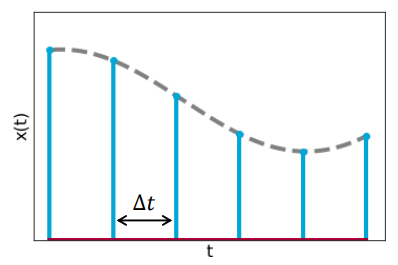

**Continuous signals**

A **quantized** signal may assume only countable number of values. Yet, changes from value to value may occur at any time. Think of describing an analog signal with 2 bits! The description of that signal can only have 4 possible values: ```00```, ```01```, ```10``` and ```11```

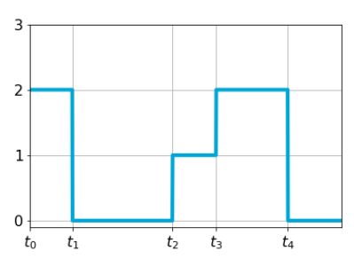

When we have more bits available, like 8, the signal description may have $2^8=256$ possible values. Clearly, the number of available bits defines the **resolution** of the quantization.

## Singularity function

### Unit impulse

A very important function for sampling is the **unit-impulse** or **Dirac-delta** function:

$$\delta(t)=0, \hspace{5px} t\neq 0 \hspace{20px} \int_{-\infty}^{\infty}\delta(t)dt=1$$

and its graph looks like:

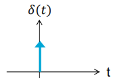

The **area** of the function equals 1, and this area is obtained in **infinitesimal** intervals of time. We use this function to represent phenomena that occur in **very short time intervals** compared to resolution capability of measuring device, but which produce almost instantaneous change in measured quantity.

However, no conventional function exists with properties of the Dirac delta pulse. Let us define:

$$\delta_{\epsilon}=\frac{1}{2\epsilon}\Pi\left(\frac{t}{2\epsilon}\right)=\begin{cases}\frac{1}{2\epsilon}:|t|\leq\epsilon\\0:|t|>\epsilon\end{cases}$$

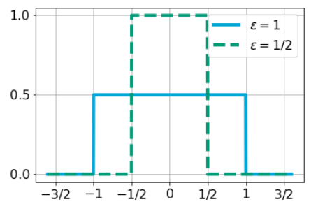

where $\epsilon\to 0$ yields a **unit impulse** function.

### Sifting property

A very useful property of the Dirac delta function is the **sifting property**:

$$\int_{-\infty}^{\infty}x(t)\delta(t-t_0)dt=x(t_0)$$

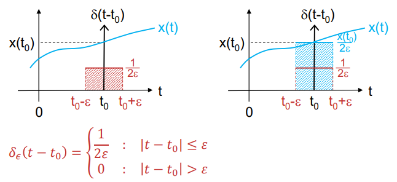

## Analog-to-digital conversion

Sampling can be modelled by multiplication of continuous-time signal $x(t)$ with sampling function $p(t)$.

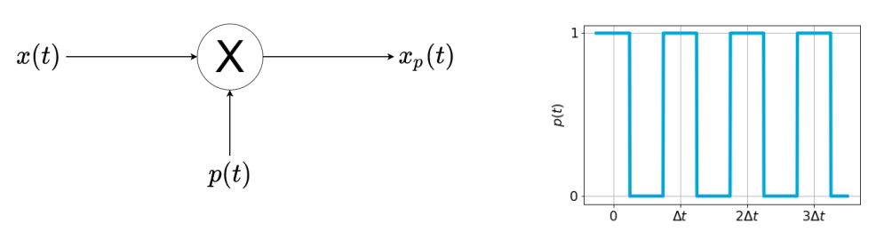

The sampled signal then becomes $x_p(t)=x(t)p(t)$.

---

The sampling function, $p(t)$, is assumed to be periodic pulse train with **sampling period** $\Delta t$ (note that earlier, $T$ or $T_0$ denoted the period of a periodic signal). In practice, time during which $p(t)$ is non-zero (pulse width) is very small relative to period $\Delta t$.

In fact, in digital systems, where sample is the number corresponding to the value of the signal $x(t)$ at the sampling instant, $t$, the **pulse width** of the sampling function is **infinitelly small**. Hence, we can model the sampling funtion as an **impulse train**

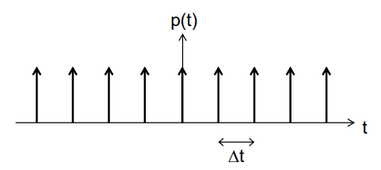

## Fourier transform of sampled signal

The impulse train $p(t)=\sum_{n=-\infty}^{\infty}\delta(t-n\Delta t)$ is periodic ($n\in\mathbb{Z}$), with fundamental period $\Delta t$, and can be written as Fourier series:

$$p(t)=\sum_{k=-\infty}^{\infty}P_ke^{j2\pi kf_0t},\hspace{5px}\text{with }k\in\mathbb{Z}$$

With fundamental frequency $f_0=\frac{1}{\Delta t}=f_s$, and Fourier coefficients $P_k$ as:

$$P_k=\frac{1}{\Delta t}\int_{-\frac{\Delta t}{2}}^{\frac{\Delta t}{2}}p(t)e^{-j2\pi kf_0t}dt=\frac{1}{\Delta t}\int_{-\frac{\Delta t}{2}}^{\frac{\Delta t}{2}}\delta(t)e^{-j2\pi kf_0t}dt=\frac{1}{\Delta t}=f_s$$

using the sifting property, and considering only one impulse occuring in the integration interval (at $t=0$). The Fourier series of $p(t)$ then becomes:

$$p(t)=f_s\sum_{k=-\infty}^{\infty}e^{j2\pi kf_st}$$

In the time domain, sampling is modelled as:

$$x_s(t)=\Delta tx(t)p(t)$$

multiplied with $\Delta t=\frac{1}{f_s}$ as a *correction factor*. Now, what happens to the spectrum $X(f)$ of signal $x(t)$ when it gets impulse train-sampled? What is $X_s(f)$ of $x_s(t)$?

The Fourier transfrom of $x_s(t)$ is:

$$X_s(f)=\int_{-\infty}^{\infty}\Delta tx(t)p(t)e^{-j2\pi ft}dt$$

Using the Fourier series of $p(t)$:

$$X_s(f)=\Delta t\int_{-\infty}^{\infty}\left(f_s\sum_{k=-\infty}^{\infty}e^{j2\pi kf_st}\right)x(t)e^{-j2\pi ft}dt$$

Interchanging integration and summation:

$$\begin{align}X_s(f)&=\underbrace{\Delta tf_s}_{1}\sum_{k=-\infty}^{\infty}\int_{-\infty}^{\infty}x(t)e^{j2\pi kf_st}e^{-j2\pi ft}dt=\\&=sum_{k=-\infty}^{\infty}\underbrace{\int_{-\infty}^{\infty}x(t)e^{-j2\pi(f-kf_s)t}dt}_{X(f-kf_s)}\end{align}$$

Finally, the Fourier transform of the *sampled* signal becomes:

$$X_s(f)=\sum_{k=-\infty}^{\infty}X(f-kf_s)$$

so, the spectrum of the sampled signal is the spectrum of the original signal, but repeated with **"period"** $f_s$ (in the frequency domain); copies of spectrum are called **aliases**

| 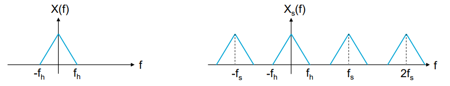 |
| :--: |
| *Spectrum of an assumed original signal $x(t)$ (left) and that of its sampled equivalent (right)* |

## Sampling theorem

**Band-limited** signals $x(t)$, having no frequency components above $f_h$ Hz, is *completely specified* by samples taken at **uniform** rate greater than $2f_h$ Hz.

```{warning} Definition

**Frequency $2f_h$ is called the *Nyquist rate***

This frequency is characteristic of the signal, whereas Nyquist frequency, $f_s/2$, is characteristic of the sampling system! In practice we consider only the domain $-\frac{f_s}{2}<f<\frac{f_s}{2}$ of the spectrum obtained from the sampled signal

```

### Aliasing

Note that in order to reconstruct original continuous-time signal from samples, it is crucial to **sample signal at a rate larger than Nyquist rate**. When sampling is below this rate, the adjacent spectra (aliases) will overlap, and it will be impossible to reconstruct signal from its samples.

This is called **aliasing**, and it is illustrated in the following example.

```{admonition} Example

As an example, we will study the effect of sampling a sinusoidal signal with frequency $f_c=5Hz$ - $x(t)=6\cos(10\pi t)$

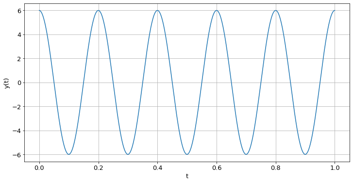

First, we look at the *correctly* sampled signal, with $f(s)=14Hz$ ($f_s>2f_c$). The spectrum (which is real, because $x(t)$ is even) of original continuous-time signal will have two Dirac-functions with weight 3, at $f=5Hz$ and $f=-5Hz$, i.e.

$$X(f)=\frac{6}{2}(\delta(f-5)+\delta(f+5))$$

Sampled at 14Hz, we find:

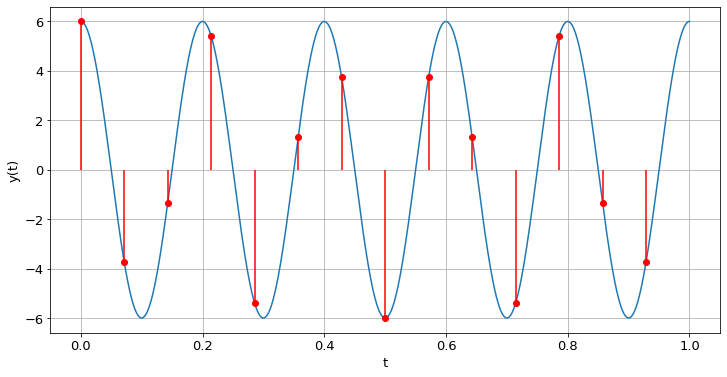

**Spectrum**

With $x(t)=6\cos(10\pi t)$ and $f_s=14Hz$:

$$X_s(f)=3\sum_{k=-\infty}^{\infty}(\delta(f+5-kf_s)+\delta(f-5-kf_s)), \hspace{5px}\text{with }k\in\mathbb{Z}$$

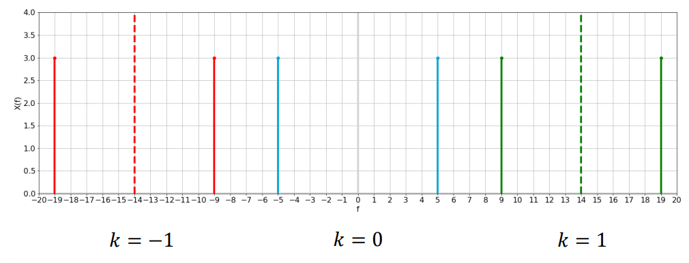

As we are only considering the domain $-\frac{f_s}{2}<f\leq\frac{f_s}{2}$:

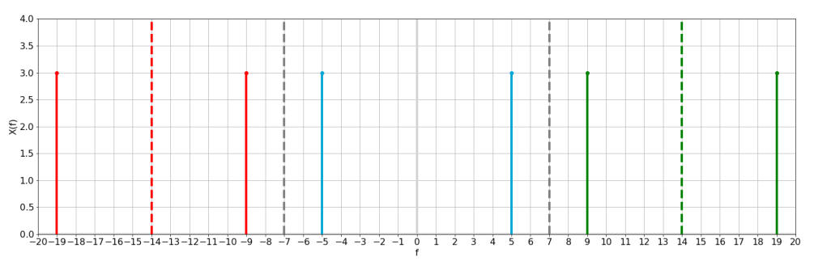

And we see that with this sampling we get a **correct result**!

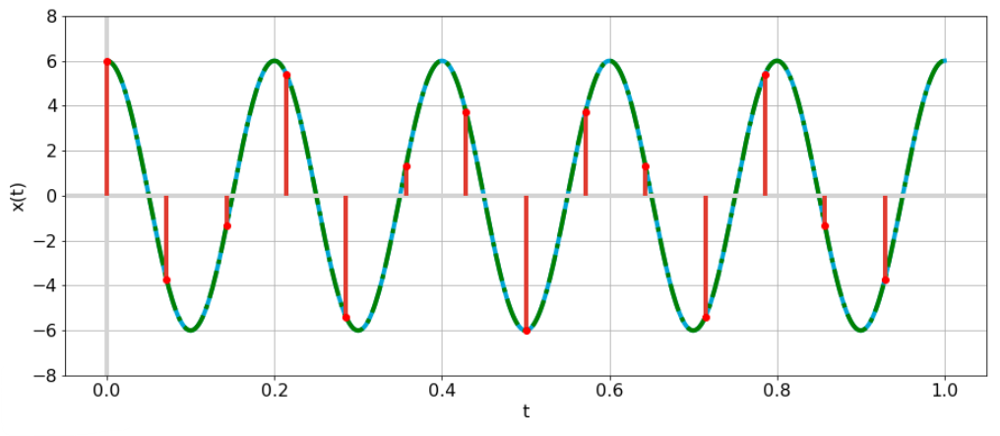

*But what if we try to sample our signal using a sampling frequency of 7Hz?*

Well, with this we violate the sampling theorem, as $f_s=7Hz$ and, therefore, $f_s\ngeq 2f_c$. We find:

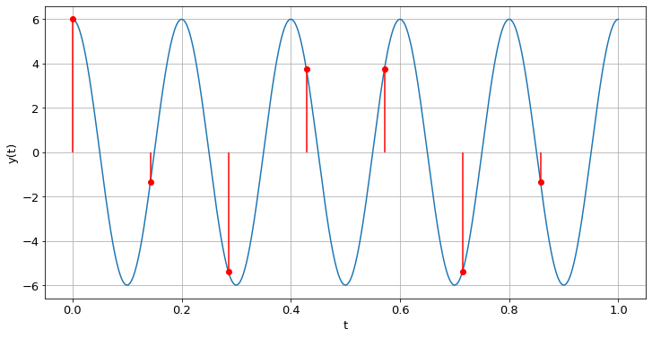

With this, we find the following spectrum:

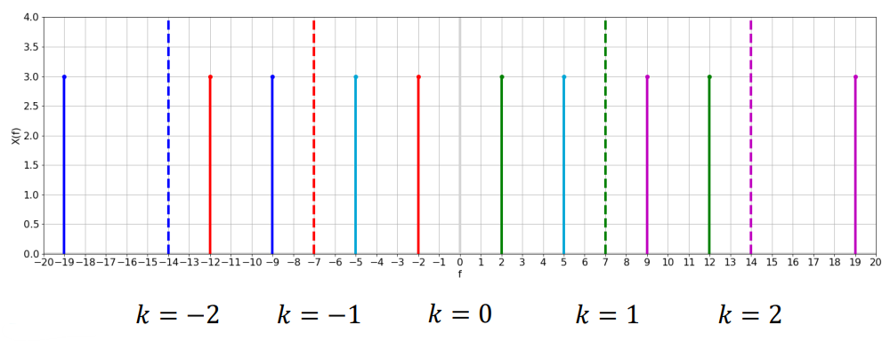

Once again, considering only the domain $-\frac{f_s}{2}<f\leq\frac{f_s}{2}$ represented in grey, we find:

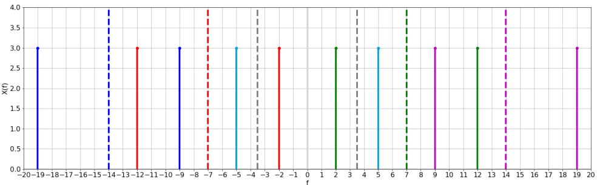

And we see we find an **incorrect result**, as the sampled and reconstructed signal (in dashed green) presents a lower frequency than the original signal (in blue):

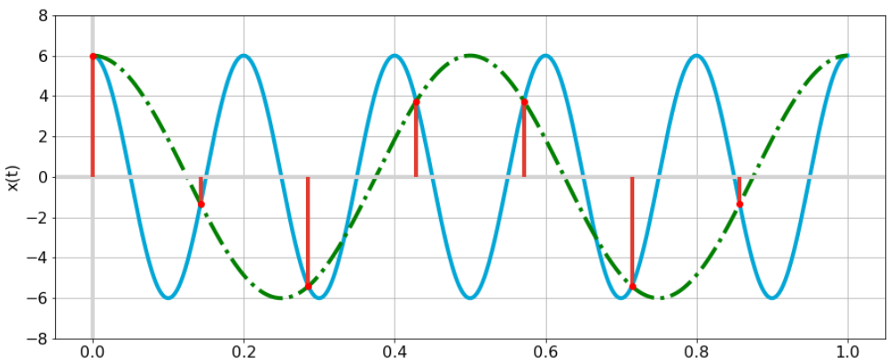

```

## Final summary

The Fourier transform of a **sampled signal**, $x_s(t)$, is given as:

$$X_s(f)=\sum_{k=\infty}^{\infty}X(f-kf_s)$$

where $f_s$ is the sampling frequency.

To prevent aliases, this frequency $f_s$ should be larger than $2f_h$, where $f_h$ is the highest frequency occurring in the signal!
