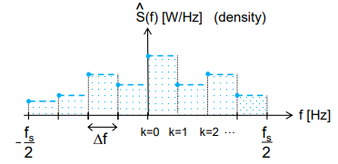

# Spectral Estimation

## Energy and power signals

The amplitude of an harmonic wave is related to its energy (denoted by $E$) and power (denoted by $P$).
In this chapter we introduce the Power Spectral Density (PSD) which describes how the signal power is distributed over frequency.
For later analyses it is relevant to know how much power is contained at what frequencies.
 
The PSD is used with many different observed signals (e.g. displacement in [m], and acceleration in [m/s<sup>2</sup>]), maintaining the notions of
power and energy, but the classical development originates from electrical engineering, starting with the fact that an electrical sensor delivers a voltage, which hopefully
is proportional to the observed physical phenomenon, in which we're interested.
 
We'll start with a flashback to high-school physics, and use Ohm's law. Suppose $u(t)$ is voltage across a resistor $R$ producing a time-varying current $i(t)$.

Instantaneous power is defined as $p(t)=u(t)i(t)$, and $u(t)=i(t)R$, so $p(t)=i^2(t)R=\frac{u^2(t)}{R}$. With $R=1\Omega$, the instantaneous power, in Ohm, is given as:

$$p(t)=u(t)i(t)=i^2(t)=u^2(t)$$

For 1 Ohm resistor, power $P$ in Watt [W], equals the square of the voltage $u(t)$ [V<sup>2</sup>].
The total energy $E$, in Joule [J], is obtained by integrating the power $P$ (power equals energy per unit time [W = J/s]).

Integrating over $|t|\leq T$, we define **total energy** and **average power** as

$$\begin{gather*}E=\lim_{T\to\infty}\int_{-T}^Tu^2(t)dt\hspace{10px}[J]\\ P=\lim_{T\to\infty}\frac{1}{2T}\int_{-T}^Tu^2(t)dt\hspace{10px}[W]\end{gather*}$$

For signal $x(t)$, the **total energy**, normalized to a unit resistance, is defined similarly as:

$$E=\lim_{T\to\infty}\int_{-T}^T|x(t)|^2dt$$

and **average power**, normalized to a unit resistance, as:

$$P=\lim_{T\to\infty}\frac{1}{2T}\int_{-T}^{T}|x(t)|^2dt$$

For real signals, the modulus signs can be removed from the two equations above.

## Parseval's theorem

```{admonition} Definition

Average (normalized) power of signal in **time domain** is the same as the average (normalized) power of corresponding a **signal in the frequency domain**; and similarly for total (normalized) energy.
```

:::{card} Derivation

```{admonition} MUDE Exam Information
:class: tip, dropdown
This derivation is provided for additional insight and will not be part of the exam.
```

### Fourier Series

**Average power** of **periodic** waveform $x(t)$ with period $T_0$ can be written as:

$$P=\frac{1}{T_0}\int_{T_0}|x(t)|^2dt$$

Since $|x(t)|^2=x(t)x^*(t)$, we can replace $x^*(t)$ with its complex exponential Fourier series:

$$P=\frac{1}{T_0}\int_{T_0}x(t)\left(\sum_{k=-\infty}^{\infty}X_k^*e^{-j2\pi kf_0t}\right)dt = \sum_{k=-\infty}^{\infty}X_k^*\underbrace{\frac{1}{T_0}\int_{T_0}x(t)e^{-j2\pi kf_0t}\,dt}_{X_k}$$

Where we just interchanged the order of summation and integration.

Now, we may write:

$$P=\frac{1}{T_0}\int_{T_0}|x(t)|^2dt=\sum_{k=-\infty}^{\infty}|X_k|^2=X_0^2+2\sum_{k=1}^{\infty}|X_k|^2$$

because $|X_k|$ is even.

In other words, **average power** of a **periodic** signal is simply the sum of powers in phasors of its Fourier Series, or just the sum of the squared moduli of its complex Fourier series coefficients.

```{note}

$X_0$ is signal average and $X_k$ are harmonic components

```

We derived that, for **periodic** signals $x(t)$, the **average power** in the time domain equals the average power in the frequency domain:

$$P=\frac{1}{T_0}\int_{T_0}|x(t)|^2dt=\sum_{k=-\infty}^{\infty}|X_k|^2$$

This is known as **Parseval's theorem**.

### Fourier Transform

Now we can also show that a similar theorem exists to express the total energy in *aperiodic* signals! We start with expressing the **total energy** of the **aperiodic** signal in time and frequency domain using an inverse Fourier transform:

$$E=\int_{-\infty}^{\infty}|x(t)|^2dt=\int_{-\infty}^{\infty}x^*(t)\left(\int_{-\infty}^{\infty}X(f)e^{j2\pi ft}df\right)dt$$

Reversing the integration order:

$$E=\int_{-\infty}^{\infty}X(f)\left(\int_{-\infty}^{\infty}x(t)e^{-j2\pi ft}dt\right)^*df=\int_{-\infty}^{\infty}X(f)X^*(f)df$$

We obtain Parseval's theorem for Fourier transforms that can be expressed as:

$$E=\int_{-\infty}^{\infty}|x(t)|^2dt=\int_{-\infty}^{\infty}|X(f)|^2\,df$$

Energy in the timedomain equals energy in the frequency domain.

### Discrete Fourier Transform

Starting from a discrete, finite sequence of samples, $x_n$, in the time domain, the **average power** start as:

$$
P=\frac{1}{T}\sum_{n=0}^{N-1}|x_n|^2 \,\Delta t
$$

where we have discretized the integral over $x^2(t)$, which then becomes:

$$
P=\frac{1}{N}\sum_{n=0}^{N-1}|x_n|^2
=\frac{1}{N^2\Delta t^2}\sum_{k=0}^{N-1}|X_k|^2
=\frac{1}{T^2}\sum_{k=0}^{N-1}|X_k|^2
$$

Note that $X_k$ denotes DFT-coefficients, with $\Delta t$ included ($X_k=\Delta t\sum_{n=0}^{N-1}x_ne^{-j\frac{2\pi}{N}kn}$). The full proof is ommitted (if you think this optional derivation box is long, you don't want to see that one!).

:::

For a sampled signal, with the coefficients $X_k$, obtained through the DFT (with the $\Delta t$ included), the power of the signal, contained in a frequency band of width $\Delta f=\frac{1}{T}$, at frequency $f=k\Delta f$ is:

$$
S(k\Delta f)=\frac{1}{T}|X_k|^2 \quad \textrm{for} \quad k=0,\dots,N-1
$$

and this is actually the **power density** [W/Hz].

Returning to a voltage signal $x(t)$, or its sampled, discrete time version $x_n$, we have, see the previous chapter on the DFT,
that $X_k$ is in [Vs] or equivalently in [V/Hz]. Then the unit of $S$ equals [V<sup>2</sup> s], which equals, with the above exposition on the 1 Ohm resistor, [W/Hz].

#### Periodogram

This turns out to be an *estimate* for the power spectral density (PSD), and it is referred to as a **periodogram** (estimate may be indicated by a hat-symbol, hence $\hat{S}$).

The product $\Delta fS(k\Delta f)$ will, therefore, represent the contribution by frequency band with width $\Delta f$ at a frequency $f=k\Delta f$, to a power $P$ of the signal.

The periodogram, $S(f)$, defined for $0\leq f<f_s$ or, equivalently, $-\frac{f_s}{2}<f\leq\frac{f_s}{2}$, with $f_s=\frac{1}{\Delta t}$ will be given by:



(psd)=
## Power Spectral Density (PSD)

<!-- Over a limited time duration, $T$, one can still use the notion of **power** for energy signals:

$$\underbrace{x_T(t)}_{\text{truncated}}=\begin{cases}x(t):-\frac{T}{2}<t<\frac{T}{2}\\ 0: \text{otherwise}\end{cases}$$

Therefore:

$$P=\lim_{T\to\infty}\frac{1}{T}\int_{-\frac{T}{2}}^{\frac{T}{2}}|x(t)|^2dt=\lim_{T\to\infty}\int_{-\infty}^{\infty}|x_T(t)|^2dt$$

and, using Parseval's theorem:

$$P=\lim_{T\to\infty}\frac{1}{T}\int_{-\infty}^{\infty}|X_T(f)|^2df=\int_{-\infty}^{\infty}\underbrace{\lim_{T\to\infty}\frac{|X_T(f)|^2}{T}}_{S(f)}df$$ -->

$S(f)$ represents the **power spectral density**, with $P$ being given trivially (considering the definition of power spectral **density**) by:

$$P=\int_{-\infty}^{\infty}S(f)df$$

Integrating the PSD over frequency yields the power contained in the signal.

## Summary

The **energy** and the **power** of a signal are given by:

$$\begin{gather*}E=\lim_{T\to\infty}\int_{-T}^{T}|x(t)|^2dt\\ P=\lim_{T\to\infty}\frac{1}{2T}\int_{-T}^T|x(t)|^2dt\end{gather*}$$

Finally, we derived and gave a formal definition for **Parseval's theorem** which reads (for an a-periodic signal) as:

$$E=\int_{-\infty}^{\infty}|x(t)|^2dt=\int_{-\infty}^{\infty}|X(f)|^2df$$