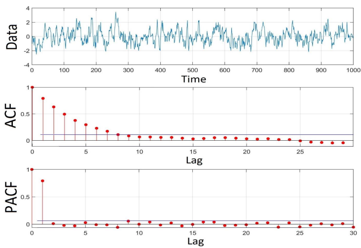
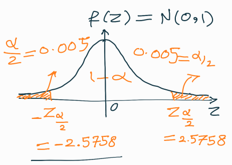

# Auto-covariance function (ACF)

The goal of this chapter will be to define cross-covariance and auto-covariance functions (ACF) for a stationary time series, and relation between ACF and power spectral density (PSD)

## Cross-covariance and cross-correlation

In general, *formal* and *empirical* cross-covariance and cross-correlation functions can be defined. Let us assume an arbitrary time series, $y=[y_1,y_2m,...,y_m]$, with mean $\mathbb{E}(y)=\mu_y$ and $x=[x_1,x_2,...,x_m]$, with mean $\mathbb{E}(x)=\mu_x$.

* The *formal* cross-covariance (between $x$ and $y$) is defined as (both $t$ and $\tau$ are integer indices)

$$\text{cov}(x_t, y_{t-\tau}) = Q_{xy}(\tau) = \sigma_{xy}(t) = \mathbb{E}((x_t-\mu_x)(y_{t-\tau}-\mu_y))$$

* The *formal* cross-correlation (between $x$ and $y$) is defined as

$$\text{corr}(x_t, y_{t-\tau}) = R_{xy}(\tau) = \mathbb{E}(x_t, y_{t-\tau})$$

Let us look to 2 practical examples:

* If $\tau=0$, we have $\text{cov}(0) = Q_{xy}(0)$

$$\begin{bmatrix}x_1 & x_2 & x_3 & x_4 & x_5 & x_6 & ... & ...\\ y_1 & y_2 & y_3 & y_4 & y_5 & y_6 & ... & ...\end{bmatrix}$$

* If $\tau=1$, we have $\text{cov}(1) = Q_{xy}(1)$

$$\begin{bmatrix}x_1 & x_2 & x_3 & x_4 & x_5 & x_6 & ... & ...\\ - & y_1 & y_2 & y_3 & y_4 & y_5 & y_6 & ...\end{bmatrix}$$

## Auto-covariance and auto-correlation

Such as with cross-covariance and cross-correlation, *formal* and *empirical* auto-covariance and auto-correlation functions can be defined. Let us assume an arbitrary time series, $y=[y_1,y_2m,...,y_m]$, with mean $\mathbb{E}(y)=\mu_y$.

* The *formal* auto-covariance (between $y$ and itself) is defined as

$$\text{cov}(y_t, y_{t-\tau}) = Q_{yy}(\tau) = \sigma_{yy}(t) = \mathbb{E}((y_t-\mu_y)(y_{t-\tau}-\mu_y))$$

* The *formal* auto-correlation (between $y$ and itself) is defined as

$$\text{corr}(y_t, y_{t-\tau}) = R_{yy}(\tau) = \mathbb{E}(y_t, y_{t-\tau})$$

```{note}
When we have a zero-mean time series, $\mu_y=0$, it follows that $Q_{yy}(t)=R_{yy}(t)$
```

Let us look to 2 practical examples:

* If $\tau=0$, we have $\text{cov}(0) = Q_{yy}(0)$

$$\begin{bmatrix}y_1 & y_2 & y_3 & y_4 & y_5 & y_6 & ... & ...\\ y_1 & y_2 & y_3 & y_4 & y_5 & y_6 & ... & ...\end{bmatrix}$$

* If $\tau=1$, we have $\text{cov}(1) = Q_{yy}(1)$

$$\begin{bmatrix}y_1 & y_2 & y_3 & y_4 & y_5 & y_6 & ... & ...\\ - & y_1 & y_2 & y_3 & y_4 & y_5 & y_6 & ...\end{bmatrix}$$

### Empirical auto-covariance

The least squares method or maximum likelihood method can be used to estimate the empirical auto-covariance function of time series. Let us see how!

**Least squares estimations**

For a stationary time series $y(t) = [y_1,y_2,...,y_m]$, the least squares estimate of the **auto-covariance function** is given by

$$\hat{Q}_{yy}(\tau) = \hat{\sigma}(\tau) = \frac{\sum_{i=1}^{m-\tau}(y_i-\mu_y)(y_{i+\tau}-\mu_y)}{m-\tau}, \hspace{25px} \tau=0,1,...,m-1$$

The least squares estimate of **auto-correlation** is (also called empirical auto-correlation function) then

$$\hat{R}_{yy}(\tau)=\frac{\sum_{i=1}^{m-\tau}y_i y_{i+\tau}}{m-\tau}, \hspace{25px} \tau=0,1,...,m-1$$

**Maximum likelihood estimations**

The maximum likelihood estimate of **auto-covariance** is (a biased estimation) given by

$$\hat{Q}_{yy}(\tau) = \hat{\sigma}(\tau) = \frac{\sum_{i=1}^{m-\tau}(y_i-\mu_y)(y_{i+\tau}-\mu_y)}{m}, \hspace{25px} \tau=0,1,...,m-1$$

And, finally, the maximum likeliho

### Covariance matrix based on auto-covariance

The structure of a covariance matrix for a stationary time series is purely symmetric and it looks like

$$Q_{yy} = \begin{bmatrix}\sigma_0 & \sigma_1 & \sigma_2 & ... & \sigma_{m-1}\\ \sigma_1 & \sigma_0 & \sigma_1 & ... & ...\\ \sigma_2 & \sigma_1 & \sigma_0 & ... & \sigma_2 \\ ... & ... & ... & ... & \sigma_1\\ \sigma_{m-1} & ... & \sigma_2 & \sigma_1 & \sigma_0\end{bmatrix}$$

There exist $m$ number of (co)variance components - **one** variance component, $\sigma_0 = \sigma^2$, and $m-1$ covariance components, $\sigma_i$.

```{note}
The covariance matrix $Q_{yy}$ is a so-called Toeplitz matrix!
```

## Normalized ACF

The least squares based estimation of the autocovariance function has the following properties:

* Empirical auto-covariance function is an unbiased estimate of its formal auto-covariance function

$$\mathbb{E}(\hat{\sigma}(\tau)) = \mathbb{E}(\hat{\sigma}_\tau) = Q_{yy}(\tau) = \sigma_\tau$$

* The normalized auto-covariance fucntion can directly be obtained from the auto-covariance function as

$$\hat{\rho}_{yy}(\tau) = \hat{\rho}_\tau = \frac{\hat{\sigma}(\tau)}{\hat{\sigma}(0)}, \hspace{20px}\tau = 0,...,m-1 \implies \hat{\rho}_{yy}(0) = 1$$

* The variance of normalized ACF can be approximated as

$$\sigma_{\hat{\rho}(\tau)}^2 = \frac{1}{m-\tau}+\frac{2\hat{\rho}^2(\tau)}{m}$$

* If $m$ is sufficiently large, $\hat{\rho}(\tau)$ is normally distributed as

$$\hat{\rho}(\tau) \sim \mathbb{N}(\rho(\tau),\sigma^2_{\hat{\rho}(\tau)})$$

### Power spectral density

The power spectral density (PSD) explains how the power (variance) of the signal is distributed over different frequencies. The PSD of a pure sine wave is flat except at its constituent frequency. Purely random noise has a flat power, indicating that all frequencies have identical contribution in making the variance of the signal!

#### PSD vs ACF

Knowledge on ACF, in time domain, is mathematically equivalent to knowledge on PSD, in the frequency domain, and vice-versa. And, from here, you might have a clue of where this is taking us... The PSD is the **discrete Fourier transform (DFT)** of the ACF

$$\text{DFT}(\hat{\sigma}_{yy}(\tau))=S_{yy}(k), \hspace{35px} \tau = 1,...,m \hspace{5px}\text{and}\hspace{5px} k = 1,...,m$$

Writing it out, this means

$$\text{DFT}\left(\frac{1}{m}\sum_{i=1}^my_iy_{i+\tau}\right)=\frac{1}{m\Delta t}Y(k)Y^*(k)=\frac{1}{m\Delta t}|Y(k)|^2$$

where

$$Y(k) = Y_k = \Delta t\sum_{i=1}^my_ie^{-j\frac{2\pi}{m}(k-1)(i-1)}$$

Inversely, the inverse discrete Fourier transform (IDFT) of the PSD is the ACF, so

$$\text{IDFT}(S_{yy}(k))=\hat{\sigma}(\tau), \hspace{35px} \tau = 1,...,m \hspace{5px}\text{and}\hspace{5px} k = 1,...,m$$

## Partial ACF

A partial ACF (PACF) is a covariance between an observation in a time series with observations at prior time steps with the relationships of intervening observations removed. We work this out using a simple example.

Let us assume that we have an autoregressive noise process of order one, AR(1),

$$y_t = \beta y_{t-1}+e_t, \hspace{30px} 0\leq\beta<1, \hspace{30px} t=2,...,m$$

where $e_t$ is an i.i.d noise process (e.g. distributed as $e_t\sim\mathbb{N}(0,\sigma_e^2)$). Multiple applications of the above *autoregressive* formula give

$$\begin{align*}&y_t=y_t\\ &y_{t+1} = \beta y_t + e_{t+1}\\ &y_{t+2}=\beta y_{t+1} + e_{t+2} = \beta^2 y_t + \beta e_{t+1} + e_{t+2}\\ &...\end{align*}$$

We can show that the covariance between $y_t$ and $y_{t+1}$ is

$$\text{cov}(y_t, y_{t+1}) = \mathbb{E}(y_t, y_{t+1}) = \sigma^2\beta$$

We can also show that the covariance between $y_t$ and $y_{t+2}$ is

$$\text{cov}(y_t, y_{t+2}) = \mathbb{E}(y_t, y_{t+2}) = \sigma^2\beta^2$$

### Worked example
Let us now take a look into a worked example on PACF to remove the intervening term, $\beta y_{t+1}$ between $y_t$ and $y_{t+2}$. As we saw before, ACF can be obtained from

$$\text{COV} = \text{cov}(y_t, y_{t+2}) = \mathbb{E}(y_t, y_{t+2}) = \sigma^2\beta^2$$

Regarding the partial ACF, we know from the autoregression $y_t = \beta y_{t-1}$ that $\hat{y}_t = \hat{y}_{t+2} = \beta y_{t+1}$. Therefore:

$$\text{PCOV} = \text{cov}(y_t-\hat{y}_t,y_{t+2}-\hat{y}_{t+2})=\text{cov}(y_t-\beta y_{t+1},y_{t+2}-\beta y_{t+1})$$

or

$$\text{PCOV} = \mathbb{E}((y_t-\beta y_{t+1})(y_{t+2}-\beta y_{t+1}))$$

or

$$\text{PCOV} = \mathbb{E}(y_ty_{t+2}-\beta y_t y_{t+1}-\beta y_{t+1}y_{t+2} + \beta^2y_{t+1}^2)$$

and, finally

$$\text{PCOV} = \sigma^2\beta^2-\beta\sigma^2\beta-\beta\sigma^2\beta+\sigma^2\beta^2=0$$

### Comparison - Normalized ACF vs PCF

A simulated example of $y_t = 0.8y_{t-1}+e_t$ having 1000 samples



## Short summary

Knowledge on auto-covariance functions of time series provides an insight into the stochastic model of time series.

**Auto-covariance function**

$$\hat{Q}_{yy}(\tau) = \hat{\sigma}(\tau) = \frac{\sum_{i=1}^{m-\tau}(y_i-\mu_y)(y_{i+\tau}-\mu_y)}{m-\tau}, \hspace{25px} \tau=0,1,...,m-1$$

**Normalized auto-covariance function (ACF)**

$$\hat{\rho}_{yy}(\tau) = \hat{\rho}_\tau = \frac{\hat{\sigma}(\tau)}{\hat{\sigma}(0)}, \hspace{20px}\tau = 0,...,m-1 \implies \hat{\rho}_{yy}(0) = 1$$

The partial ACF (pure correlation) considers removing the intervening observations.

## Worked example

Let us consider a time series of $m=100$ observations, such that

$$\hat{\rho}_{yy}(\tau=1) = \hat{\rho}(1)=0.4$$

and

$$\hat{\rho}(1) \sim \mathbb{N}(\rho(1),\sigma^2_{\hat{\rho}(1)})

where

$$\sigma^2_{\hat{\rho}(1)}=\frac{1}{m-1}+\frac{2\hat{\rho}^2(1)}{m-1}=0.0133\implies\sigma_{\hat{\rho}(1)}=0.1153$$

Performing an ADF test with

* $H_0$: $\rho(1)=0$
* $H_a$: $\rho(1)\neq 0$

and pursuing a confidence level of 99%, we get



and

$$\hat{\rho}(1)-Z_{\alpha/2}\sigma_{\hat{\rho}(1)}\leq\rho(1)\leq\hat{\rho}(1)+Z_{\alpha/2}\sigma_{\hat{\rho}(1)}\\0.1030\leq\rho(1)=0\leq0.6970$$