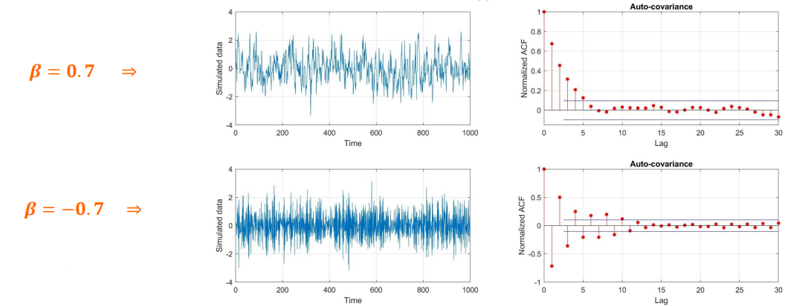
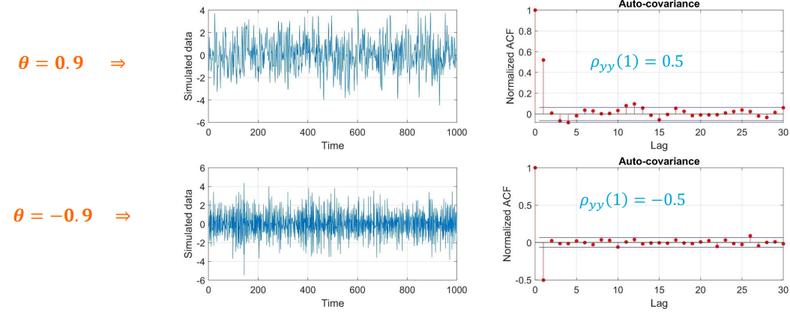

# ARMA process

The main goal is to introduce the Auto-Regressive Moving Average (ARMA) stochastic process, as a widely used stochastic process. This includes

* ARMA (p,q) process
* ARMA (p,0) = AR(p) process $\implies$ AR(1)
* ARMA (0,q) = MA(q) process $\implies$ MA(1)

## Process definition

In an ARMA model, we forecast the variable of interest using a linear combination of its past values plus the current and past errors. A zero mean ARMA process of orders $p$ and $q$ can be written as follows:

$$y_t = \overbrace{\beta_1y_{t-1}+...+\beta_py_{t-p}}^{\text{AR process}} + e_t + \overbrace{\theta_1e_{t-1}+...+\theta_qe_{t-q}}^{\text{MA process}}$$ 

or as

$$y_t = \sum_{i=1}^p \beta_iy_{t-i}+e_t+\sum_{i=1}^q \theta_ie_{t-i}$$

Each observation is made up of a **random error** at that epoch, a linear combination of **past observations**, and a linear combination of **past errors**. We note the process should still be stationary, satisfying

$$\mathbb{E}(y_t)=0, \hspace{20px} \mathbb{D}(y_t)=\sigma^2=\text{constant}$$

To have a better understanding of the process itself, we consider two special cases, $q=0$ and $p=0$.

### Special case 1 - ARMA$(p,0) = $ AR$(p)$

The first special case we are going to study considers $q=0$. A zero mean $p$-order autoregressive (AR) random process, abbreviated to ARMA(p,0) = AR(p), can be written as follows

$$y_t = \beta_1y_{t-1}+...+\beta_py_{t-p} + e_t$$

or

$$y_t = \sum_{i=1}^p \beta_iy_{t-i}+e_t$$

We will just focus on explaining $p=1$, i.e. AR(1). A **zero-mean first order autoregressive** process like this, can be written as follows

$$y_t = \beta y_{t-1}+e_t, \hspace{20px} -1\leq\beta<1, \hspace{20px} t=2,...,m$$

where $e_t$ is an i.i.d. noise process, e.g. distributed as $e_t\sim\mathbb{N}(0,\sigma_e^2)$

#### First-order AR(1)

**Formulation**

Initializing $y_1=e_1$, with $\mathbb{E}(y_1)=\mathbb{E}(e_1)=0$ and $\mathbb{D}(y_1)=\mathbb{D}(e_1)=\sigma^2$. Following this, multiple applications of the above "autoregressive" formula ($y_t = \beta y_{t-1} + e_t$) give:

$$
\begin{align*}
y_1&=e_1\\ 
y_2&=\beta y_1+e_2\\ 
y_3 &= \beta y_2+e_3 = \beta^2y_1+\beta e_2+e_3\\ 
&\vdots\\ 
y_m &= \beta y_{m-1} + e_m = \beta^{m-1}y_1+\beta^{m-2}e_2+...+\beta e_{m-1}+e_m
\end{align*}
$$

of which we still have (to impose the *stationarity*):

$$\mathbb{E}(y_t)=0 \hspace{5px}\text{and}\hspace{5px} \mathbb{D}(y_t)=\sigma^2, \hspace{10px} t=1,...,m$$

All the noise components, $e_t$, are uncorrelated as $\mathbb{E}(e_t,e_{t+\tau})=0$ if $\tau = 0$. If $\tau\neq 0$, then $\mathbb{E}(e_t,e_{t+\tau})=\sigma_e^2$.

**Auto-covariance**

The mean of the process is zero and, therefore:

$$\mathbb{E}(y_t) = \mathbb{E}(\beta y_{t-1}+e_t) = \beta\mathbb{E}(y_{t-1})+\mathbb{E}(e_t) = 0$$

The variance of the process should remain constant as:

$$\mathbb{D}(y_t) = \mathbb{D}(\beta y_{t-1}+e_t) = \beta^2\sigma^2+\sigma_e^2=\sigma^2, \hspace{10px} t\geq 2$$

resulting in

$$\sigma^2 = \frac{\sigma_e^2}{1-\beta^2} \Longleftrightarrow \sigma_e^2 = \sigma^2(1-\beta^2)$$

The auto-covariance (covariance between $y_t$ and $y_{t+\tau}$) is

$$Q_{yy}(y_t,y_{t+\tau})=\mathbb{E}(y_t,y_{t+\tau})$$

resulting in

$$Q_{yy}(y_t,y_{t+\tau}) = \mathbb{E}(y_t, y_{t+\tau}) = \mathbb{E}(y_t(\beta^\tau y_t + ...)) = \beta^\tau\mathbb{E}(y_t^2)=\sigma^2\beta^\tau$$

**Model structure**

$$\mathbb{E}(y) = \mathbb{E}\begin{bmatrix}y_1\\ y_2\\ ...\\ y_m\end{bmatrix} = \begin{bmatrix}0\\ 0\\ ...\\ 0\end{bmatrix}, \hspace{15px} \mathbb{D}(y)=Q_{yy}=\sigma^2\begin{bmatrix}1&\beta&...&\beta^{m-1}\\ \beta&1&...&\beta^{m-2}\\ ...&...&...&...\\ \beta^{m-1}&\beta^{m-2}&...&1\end{bmatrix}$$

* Auto-covariance function $\implies$ $Q_{yy}(\tau)=\sigma_\tau=\sigma^2\beta^\tau$
* Normalized auto-covariance function (ACF) $\implies$ $\rho_{yy}(\tau)=\rho_\tau=\beta^\tau$
* Larger value of $\beta$ indicates long-memory random process
* If $\beta=0$, this is called *purely random process* (white noise)
* $Q_{yy}(\tau)=Q_{yy}(-\tau)=Q_{yy}(|\tau|)$ and so is $\rho_{yy}(\tau)=\rho_{yy}(-\tau)=\rho_{yy}(|\tau|)$

**Simulated example**

A time series has been simulated to have a standard normal distribution, $y_i \sim \text{N}(0,1)$. This indicates that the first entry is $y_1 \sim \text{N}(0,1)$ and the remaining errors are $e_i \sim \text{N}(0.1-\beta^2)$, $i=2,...,m=1000$. Time correlation is visually seen in data.

Normalized ACF can clearly show the temporal correlation, $\rho_{yy}(\tau)=\beta^\tau$, where $\tau=0,1,2,...,m-1$



### Special case 2 - ARMA$(0,q) = $ MA$(q)$

A zero mean $q$-order moving average random process, abbreviated to ARMA(0,q) = MA(q), can be written as follows

$$y_t=\theta_1 e_{t-1}+...+\theta_q e_{t-q}+e_t$$

or

$$y_t=\sum_{i=1}^q \theta_i e_{t-i} + e_t$$

Here we will just focus on the case $q=1$, i.e. MA(1). A **zero-mean first order moving average process** like this one can be written as:

$$y_t = \theta e_{t-1} + e_t, \hspace{10px} -1\leq\theta<1 \hspace{10px} t=2,...,m$$

where $e_t$ is an i.i.d. noise process (white noise), e.g. distributed as $e_t\sim\text{N}(0,\sigma_e^2)$

#### First-order MA(1)

**Formulation**

Initializing $y_1$ and $e_1$, with $\mathbb{E}(y_1)=\mathbb{E}(e_1)=0$, $\mathbb{D}(y_1)=\sigma^2$ and $\mathbb{D}(e_1)=\sigma_e^2$. Following this, multiple applications of the above "moving average" formula ($y_t = \theta e_{t-1} + e_t$) give:

$$\begin{align*}y_1=e_1\\ y_2=\theta e_1+e_2\\ y_3 = \theta e_2+e_3\\ ...\\ y_m = \theta e_{m-1} + e_m\end{align*}$$

of which we still have (to impose the *stationarity*):

$$\mathbb{E}(y_t)=0 \hspace{5px}\text{and}\hspace{5px} \mathbb{D}(y_t)=\sigma^2, \hspace{10px} t=1,...,m$$

All the noise components, $e_t$, are uncorrelated as $\mathbb{E}(e_t,e_{t+\tau})=\sigma_e^2$ if $\tau = 0$. If $\tau\neq 0$, then $\mathbb{E}(e_t,e_{t+\tau})=0$.

**Auto-covariance**

The mean of the process is zero and, therefore:

$$\mathbb{E}(y_t) = \mathbb{E}(\theta e_{t-1}+e_t) = \theta\mathbb{E}(e_{t-1})+\mathbb{E}(e_t) = 0$$

The variance of the process should remain constant as:

$$\mathbb{D}(y_t) = \mathbb{D}(\theta e_{t-1}+e_t) = \theta^2\sigma_e^2+\sigma_e^2=\sigma^2, \hspace{10px} t\geq 2$$

resulting in

$$\sigma^2 = \frac{\sigma_e^2}{1+\theta^2} \Longleftrightarrow \sigma_e^2 = \frac{\sigma^2}{1+\theta^2}$$

The auto-covariance (covariance between $y_t$ and $y_{t+\tau}$) is

$$Q_{yy}(y_t,y_{t+\tau})=\mathbb{E}(y_t,y_{t+\tau}) = 0, \hspace{10px}\text{for}\hspace{5px}\tau\geq 2$$

resulting in

$$Q_{yy}(y_t, y_{t+1}) = \mathbb{E}((\theta e_{t-1} + e_t)(\theta e_t + e_{t+1})) = \sigma_e^2\theta\\ Q_{yy}(y_t, y_{t-1}) = \mathbb{E}((\theta e_{t-1} + e_t)(\theta e_{t-2} + e_{t-1})) = \sigma_e^2\theta$$

```{note}
Only $Q_{yy}(y_t, y_{t\pm 1}) = \mathbb{E}(y_t, y_{t\pm 1})\neq 0$
```

**Model structure**

$$\mathbb{E}(y) = \mathbb{E}\begin{bmatrix}y_1\\ y_2\\ ...\\ y_m\end{bmatrix} = \begin{bmatrix}0\\ 0\\ ...\\ 0\end{bmatrix}, \hspace{15px} \mathbb{D}(y)=Q_{yy}=\sigma^2\begin{bmatrix}1&\rho_1&0&...&0\\ \rho_1&1&\rho_1&...&0\\ 0&\rho_1&1&...&...\\ ...&...&...&...&\rho_1\\ 0&0&...&\rho_1&1\end{bmatrix}$$

* Auto-covariance function $\implies$ $Q_{yy}(\tau)=\sigma_\tau=\begin{cases}\frac{\sigma^2\theta}{1+\theta^2}, \hspace{5px}\text{if}\hspace{5px}\tau=1\\ 0, \hspace{5px}\text{if}\hspace{5px}\tau>1\end{cases}$

* Normalized auto-covariance function (ACF) $\implies$ $\rho_{yy}(\tau)=\rho_\tau=\begin{cases}\frac{\theta}{1+\theta^2}\end{cases}, \hspace{5px}\text{if}\hspace{5px}\tau=1\\ 0, \hspace{5px}\text{if}\hspace{5px}\tau\neq 1$

* ACF is even, $Q_{yy}(\tau)=Q_{yy}(-\tau)=Q_{yy}(|\tau|)$ and so is $\rho_{yy}(\tau)=\rho_{yy}(-\tau)=\rho_{yy}(|\tau|)$

**Simulated example**

A time series has been simulated to have a standard normal distribution, $e_i \sim \text{N}(0,1)$. This indicates that the entries of $y$ have $y_i \sim \text{N}(0.1+\theta^2)$, $i=1,...,m=1000$.

Normalized ACF can clearly show the temporal correlation, $\rho_{yy}(\tau)=\frac{\theta}{1+\theta^2}$, if $\tau=1$, and $\rho_{yy}(\tau)=0$ if $\tau>1$



## Brief Summary

The random processes (noise processes) explained are:

* ARMA(p,q) process

$$y_t = \sum_{i=1}^p \beta_iy_{t-i}+e_t+\sum_{i=1}^q\theta_ie_{t-1}$$

* AR(p) process

$$y_t = \sum_{i=1}^p \beta_iy_{t-i}+e_t$$

* MA(q) process

$$y_t = e_t+\sum_{i=1}^q\theta_ie_{t-1}$$

* The parameters of these stochastic processes should be estimated (e.g. by LSE or MLE)

## Worked example - Single Differencing

On this worked example, we will try to show that single differencing induces an MA(1). Let us consider

$$y=\begin{bmatrix}y_1\\ y_2\\ ...\\ y_m\end{bmatrix}, \hspace{10px} Q_{yy}=\sigma_\omega^2\begin{bmatrix}1&0&...&0\\ 0&1&...&0\\ ...&...&...&...\\ 0&0&...&1\end{bmatrix}=\sigma^2_\omega I_m$$

Having $\Delta y_1 = y_1$, then:

$$\begin{cases}\Delta y_2 = y_2 - y_1\\ \Delta y_3 = y_3-y_2\\ ...\\ \Delta y_m = y_m - y_{m-1}\end{cases}$$

In matrix notation, this can be written as:

$$\begin{bmatrix}\Delta y_2\\ \Delta y_3\\ ...\\ \Delta y_m\end{bmatrix} = \begin{bmatrix}-1&1&0&...&0&0\\ 0&-1&1&...&0&0\\ ...&...&...&...&...\\ 0&0&0&...&-1&1\end{bmatrix}\begin{bmatrix}y_1\\ y_2\\ ...\\ y_m\end{bmatrix} \Longleftrightarrow \Delta Y = TY$$

Therefore:

$$Q_{\Delta y\Delta y}=TQ_{yy}T^T = T\sigma_\omega^2I_mT^T=\sigma_\omega^2TT^T$$

which can simplify to:

$$Q_{\Delta y\Delta y} = \sigma_\omega^2TT^T = 2\sigma_\omega^2\begin{bmatrix}1&-0.5&0&...&0\\ -0.5&1&-0.5&...&0\\ 0&-0.5&1&...&0\\ ...&...&...&...&...\\ 0&0&0&...&1\end{bmatrix}$$

Now we need to find the value of $\theta$ to get $\Delta y_t$. Therefore:

$$\begin{cases}\rho_1=-0.5=\frac{\theta}{1+\theta^2}\\ \Delta y_t = \theta e_{t-1}+e_t\end{cases}\implies \theta=-1 \implies \Delta y_t = e_t-e_{t-1}$$