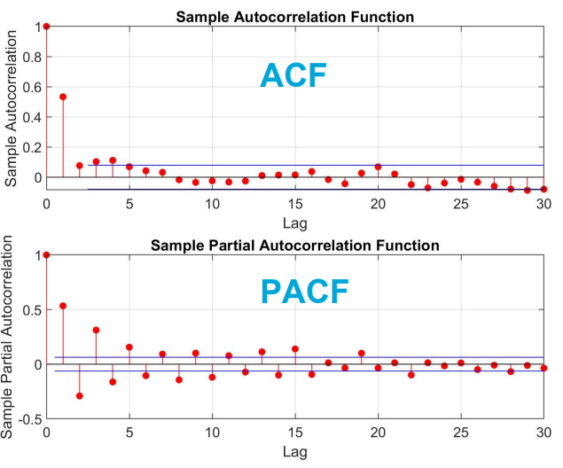

# Forecasting

## Best Linear Unbiased Prediction (BLUP)

Consider the (augmented) linear model of observation equations as

$$\begin{bmatrix}y \\ y_p\end{bmatrix}=\begin{bmatrix}A \\ A_p \end{bmatrix}x+\begin{bmatrix}e \\ e_p \end{bmatrix}, \hspace{10px}\mathbb{D}\left(\begin{array}{c}y\\ y_p\end{array}\right)=\begin{bmatrix}Q_{yy} & Q_{yy_p} \\Q_{y_py} & Q_{y_py_p} \end{bmatrix}$$

The best linear unbiased estimation, **BLUE**, of $x$ is:

$$\hat{x}=(A^TQ_{yy}^{-1}A)^{-1}A^TQ_{yy}^{-1}y, \hspace{10px} Q_{\hat{x}\hat{x}}=(A^TQ_{yy}^{-1}A)^{-1}$$

The best linear unbiased prediction, **BLUP**, of $y_p$ is

$$\hat{y_p}=A_p\hat{x}+Q_{y_py}Q_{yy}^{-1}(y-A\hat{x})$$

with the covariance matrix

$$Q_{\hat{y_p}\hat{y_p}}=A_pQ_{\hat{x}\hat{x}}A_p^T+Q_{y_py}Q_{yy}^{-1}Q_{\hat{e}\hat{e}}Q_{yy}^{-1}Q_{yy_p}$$

*Two processes play a role in prediction:*
* $A_p\hat{x}$ is the deterministic part (functional effects)
* $Q_{y_py}Q_{yy}^{-1}(y-A\hat{x})=Q_{y_py}Q_{yy}^{-1}\hat{e}$ is the stochastic part (stochastic process)

```{note}
$$\hat{y_p}=A_p\hat{x}+Q_{y_py}Q_y^{-1}\hat{e}

* For a purely random process (white noise), we have $Q_{y_py}=0$ and, therefore, stochastic process/part cannot affect the prediction;
* We focus on the ARMA random process to forecast future values. How to determine orders $p$ and $q$ in ARMA($p,q$)?
* We just explained that $\hat{e}$ has been computed from the least squares fit. The time series $\hat{e}$ can in principle can be obtained from different "transformation" methods such as
**differencing**, **function-based**, or **moving averaging**;
* For the sake of simplicity, the new time series 𝑒Ƹ is again denoted as the zero-mean stationary time series $y_t = y(t)$, of which the ‘non-stationarity’ effect has been removed from the data to make it stationary
```

## Identifying ARMA using ACF and PACF plots

In time series analysis, ACF and PACF plots can be use to provide the model orders: The value of $p$ for AR and the value of $q$ for MA, and hence to select the best model for forecasting.

Here we assume the time series is stationary (see "Stationarity" chapter). We can then plot the ACF and PACF to identify the orders of AR and MA (numbers $p$ and $q$ of coefficients $\beta_i$ and $\theta_i$) in the ARMA model.

We first look for a gradual diminishing pattern (tail-off pattern) in either ACF or PACF. The following guidelines can then be used to interpret ACF and PACF plots:

* If the **tail-off** pattern is at ACF, then AR (and not MA) is an appropriate model. The cut-off at PACF will then provide order $p$ for AR($p$);
* If the **tail-off** pattern is at PACF, then MA (and not AR) is an appropriate model. The cut-off at ACF will then provide order $q$ for MA($q$);
* If the **tail-off** pattern is at both ACF and PACF, then the stochastic process cannot be expressed just as AR or MA. The appropriate model is then ARMA.
* Test data is usually required to validate the selected orders $p$ and $q$.

### Identification of AR(1)

The tail-off pattern is at ACF. AR has a cut-off at PACF at lag 1. The best model is then AR(1) = ARMA($p=1,q=0$)


### Identification of MA(1)

The tail-off pattern is at PACF. MA has a cut-off at ACF at lag 1. The best model is then MA(1) = ARMA($p=0,q=1$)



### Parameter estimation of ARMA

So far we took a few steps to identify the ARMA process, i.e. to know the values of $p$ and $q$. The question now is: **how can we estimate the coefficients $\beta_1,...,\beta_p$ and $\theta_1,...,\theta_q$?**

Two well-known estimation principles of the Least Squares (LS) and Maximum Likelihood (ML) can be used to reach this goal. However, we only elaborate on AR(2) = ARMA(2,0) using the LS method to estimate $\beta_1$ and $\beta_2$. The method can simply be generalized to estimate ARMA($p,q$).

**Example: Parameter estimation of ARMA(2,0)**

The AR(2) is of the form

$$y(t)=\beta_1 y_{t-1}+\beta_2 y_{t-2}+e_t$$

This indicates that the predicted value is of the form

$$\hat{y}_{t|t-1}=\hat{\beta}_1y_{t-1}+\hat{\beta}_2y_{t-2}$$

```{note}
The hat in the previous expression indicates predicted value!
```

The difference between $y_t$ and $\hat{y}_{t|t-1}$ is called the prediction error:

$$e_{t|t-1}=y_t-\hat{y}_{t|t-1}$$

This prediction error can be formulated as:

$$e_{t|t-1}=y_t-\hat{y}_{t|t-1}=y_t-\hat{\beta}_1y_{t-1}-\hat{\beta}_2y_{t-2}$$

We start from $t=3$ to make $e_{t|t-1}$ as

$$\begin{gather}e_{3|2}=y_3-\beta_1y_2-\beta_2y_1\\ e_{4|3}\end{gather}\\ ...\\ e_{m|m-1}=y_m-\beta_1y_{m-1}-\beta_2y_{m-2}$$

Giving the gollowing linear model of observation equations ($y=A\beta+e$)

$$\begin{bmatrix}y_3 \\ y_4 \\ ... \\ y_m \end{bmatrix} = \begin{bmatrix}y_2 & y_1 \\y_3 & y_2\\ ... & ...\\ y_{m-1}&y_{m-2} \end{bmatrix}\begin{bmatrix}\beta_1 \\ \beta_2\end{bmatrix} + \begin{bmatrix}e_{3|2} \\ e_{4|3}\\ ... \\ e_{m|m-1} \end{bmatrix} \implies y = A\beta+e$$

The LS estimate of $\beta$ is

$$\hat{\beta}=(A^TQ_{yy}^{-1}A)^{-1}A^TQ_{yy}^{-1}y$$

## Forecasting using ARMA(p,q) process

After estimating the ARMA process parameters $\hat{\beta}_i,i=1,...,p$ and $\hat{\theta}_i,i=1,...,q$ they can be used to predict future values. The following expression on zero-mean ARMA can then be used:

$$\hat{y}_{t|t-1}=\hat{\beta}_1y_{t-1}+...+\hat{\beta}_py_{t-p}+\hat{\theta}_1e_{t-1}+...+\hat{\theta}_qe_{t-q}$$

The above formulation is in conjunction with the Best Linear Unbiased Predictor (BLUP) for $y_t$ in a given stochastic process. The general form of BLUP is

$$\hat{y}_p=A_p\hat{x}+Q_{y_py}Q_{yy}^{-1}\hat{e}$$

**Special case:** for a zero-mean process ($A=0$, $\hat{x}=0$, $\hat{e}=y$), we have

$$\hat{y}_t=Q_{y_{t|t-1}}Q^{-1}_{t-1,t-1}y=q_t^Ty=\sum_{i=1}^m q_iy_i$$

## Brief summary

The best linear unbiased prediction, **BLUP**, of $y_p$ is ($y_p$ is not observed, so we want to predict it; think of weather prediction for tomorrow):

$$\hat{y_p}=A_p\hat{x}+Q_{y_py}Q_{yy}^{-1}(y-A\hat{x}), \hspace{10px} p=m+1$$

or

$$\hat{y_p}=A_p\hat{x}+Q_{y_py}Q_{yy}^{-1}\hat{e} = y_F + y_S$$

**Two processes play a role in prediction:**
* $y_F = A_p\hat{x}$ is the deterministic part (functional effects). Least squares method (e.g. BLUE) can be used to estimate $\hat{x}$ and hence $A_p\hat{x}$
* $y_S = Q_{y_py}Q_{yy}^{-1}\hat{e}=M\hat{e}$ is the stochastic part (stochastic process). We considered ARMA process, but we may use other stochastic processes
* Forecasting by alternative methods such as Machine Learning is also possible!