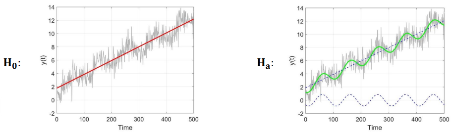
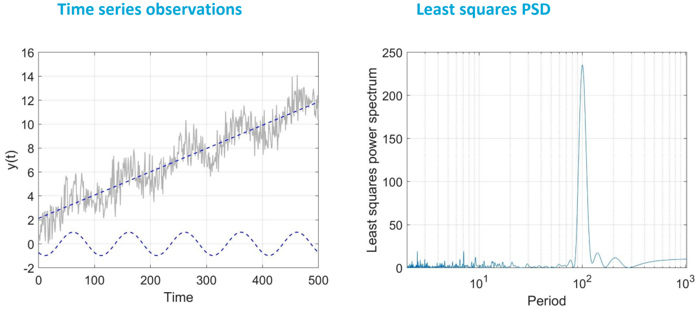

# Modelling and Estimation

The goal is to apply the **Best Linear Unbiased Estimation (BLUE)** and **hypothesis testing** to time series modelling, estimation and model identification, i.e.

* The BLUE of parameters of interest (on components of time series)
* Confidence intervals of parameters of interest
* Model identification using test statistics (harmonic estimation)

$$H_0: Y=\mathrm{Ax}+\epsilon \hspace{5px}\text{vs.}\hspace{5px} H_a: Y=\mathrm{Ax}+Cz+\epsilon$$

## Components of time series

In general, we may distinguish the following components in a time series:

* **Trend:** General behavior and variation of the process
* **Seasonality:** Regular seasonal variations
* **Offset:** A common practice in many time series
* **Noise:** White or colored noise

To make a linear model of observation equations, assume that the time series data, $Y=[Y(t_1),...,Y(t_m)]=[Y_1,...,Y_m]$ consists of four components as follows:

* Nose component/process (white, ARMA, etc.)
* A linear trend with an intercept $y_0$ and a rate $r$
* A seasonality signal expressed e.g. as a pure sine function $(\omega,A,\phi)=(\omega,a,b)$
* An offset at epoch $t_k$

## Best Linear Unbiased Estimation (BLUE)

If the components of time series are known, we may use the linear model of observation equations to estimate those components.

Consider the linear model of observation equations as

$$Y=\mathrm{Ax}+\epsilon, \hspace{10px} \mathbb{D}(Y)=\Sigma_{yy}$$

The BLUE of $x$ is:

$$\hat{X}=(A^T\Sigma_{yy}^{-1}A)^{-1}A^T\Sigma_{yy}^{-1}Y,\hspace{10px}\Sigma_{\hat{x}\hat{x}}=(A^T\Sigma_{yy}^{-1}A)^{-1}$$

The BLUE of $Y$ and $\epsilon$ is

$$\hat{Y}=P_AY,\hspace{10px}\Sigma_{\hat{y}\hat{y}}=P_A\Sigma_{yy}$$

and

$$\hat{\epsilon}=P_A^{\perp}y,\hspace{10px}\Sigma_{\hat{e}\hat{\epsilon}}=P_A^{\perp}\Sigma_{yy}$$

where $P_A = A(A^T\Sigma_{yy}^{-1}A)^{-1}A^T\Sigma_{yy}^{-1}$ and $P_A^{\perp}=I-A(A^T\Sigma_{yy}^{-1}A)^{-1}A^T\Sigma_{yy}^{-1}$ are two orthogonal projectors, such that

$$P_AP_A=P_A \hspace{5px}\text{and}\hspace{5px}P_A^{\perp}P_A^{\perp}=P_A^{\perp}$$

### Model of observation equations

The linear model, consisting of the above three components plus noise, is of the form

$$Y_t = y_0+rt+a\cos{\omega t}+b\sin{\omega t}+ou_k(t)+\epsilon_t$$

The linear model should indeed be written for all time instances $t_1,...,t_m$, resulting in $m$ equations as ($i=1,...,m$)

$$Y(t_1) = y_0+rt_1+a\cos{\omega t_1}+b\sin{\omega t_1}+ou_k(t_1)+\epsilon(t_1)\\ Y(t_2) = y_0+rt_2+a\cos{\omega t_2}+b\sin{\omega t_2}+ou_k(t_2)+\epsilon(t_2)\\ ... \\ Y(t_i) = y_0+rt_i+a\cos{\omega t_i}+b\sin{\omega t_i}+ou_k(t_i)+\epsilon(t_i)\\ ... \\ Y(t_m) = y_0+rt_m+a\cos{\omega t_m}+b\sin{\omega t_m}+ou_k(t_m)+\epsilon(t_m)$$

These equations can be written in a compact matrix notation as

$$Y=\mathrm{Ax}+\epsilon$$

where

$$
\overbrace{\begin{bmatrix}
Y_1\\ Y_2\\ \vdots\\ Y_k\\ \vdots\\ 
Y_m\end{bmatrix}}^{Y} = 
\overbrace{\begin{bmatrix}
1&t_1&\cos{\omega t_1}&\sin{\omega t_1}&0
\\  \vdots&\vdots&\vdots&\vdots&\vdots\\ 
1&t_{k-1}&\cos{\omega t_{k-1}}&\sin{\omega t_{k-1}}&0\\ 
1&t_k&\cos{\omega t_k}&\sin{\omega t_k}&1\\ 
\vdots&\vdots&\vdots&\vdots&\vdots\\ 
1&t_m&\cos{\omega t_m}&\sin{\omega t_m}&1\end{bmatrix}}^{A}\overbrace{\begin{bmatrix}y_0\\ r\\ a\\ b\\ o\end{bmatrix}}^{x}+\overbrace{\begin{bmatrix}\epsilon_1\\ \vdots\\ \epsilon_{k-1} \\ \epsilon_k\\ \vdots\\ \epsilon_m\end{bmatrix}}^{\epsilon}$$

with the $m$ x $m$ covariance matrix
%MMMMM should we keep sigma for the diagonal and c_i for the non-diagonal elements?
$$\mathbb{D}(Y)=\Sigma_{yy}=\begin{bmatrix}\sigma_1^2&\sigma_{12}&\dots&\sigma_{1m}\\ \sigma_{21}&\sigma_{2}^2&&\\ \vdots&\vdots&\ddots&\\ 
\sigma_{m1}&\sigma_{m2}&\dots&\sigma_{m}^2\end{bmatrix}$$

### Estimation of parameters
%MMMMM same as before?
If we assume the covariance matrix, $\mathbb{D}(Y)=\Sigma_{yy}$, is known, we can estimate $x$ using the BLUE: $\hat{X}=(A^T\Sigma_{yy}^{-1}A)^{-1}A^T\Sigma_{yy}^{-1}Y$, $\Sigma_{\hat{X}\hat{X}}=(A^T\Sigma_{yy}^{-1}A)^{-1}$, giving

$$\hat{X}=\begin{bmatrix}\hat{y_0}\\ \hat{r}\\ \hat{a}\\ \hat{b}\\ \hat{o}\end{bmatrix},\hspace{10px}\Sigma_{\hat{X}\hat{X}}=\begin{bmatrix}\sigma_{\hat{y}_0}^2& \sigma_{\hat{y}_0\hat{r}}& \sigma_{\hat{y}_0\hat{a}}& \sigma_{\hat{y}_0\hat{b}}& \sigma_{\hat{y_0}\hat{o}}\\ \sigma_{\hat{r}\hat{y}_0}& \sigma_{\hat{r}}^2& \sigma_{\hat{r}\hat{a}}& \sigma_{\hat{r}\hat{b}}& \sigma_{\hat{r}\hat{o}}\\ \sigma_{\hat{a}\hat{y_0}}& \sigma_{\hat{a}\hat{r}}& \sigma_{\hat{a}}^2& \sigma_{\hat{a}\hat{b}}& \sigma_{\hat{a}\hat{o}}\\ \sigma_{\hat{b}\hat{y_0}}& \sigma_{\hat{b}\hat{r}}& \sigma_{\hat{b}\hat{a}}& \sigma_{\hat{b}}^2& \sigma_{\hat{b}\hat{o}}\\ \sigma_{\hat{o}\hat{y_0}}& \sigma_{\hat{o}\hat{r}}& \sigma_{\hat{o}\hat{a}}& \sigma_{\hat{o}\hat{b}}& \sigma_{\hat{o}}^2\end{bmatrix}$$

Given $\hat{X}$ and $\Sigma_{\hat{X}\hat{X}}$, we can obtain a *confidence region* for the parameters. For example, assuming the observations are normally distributed, a 99% **confidence interval** for the rate $r$ is ($\alpha=0.01$):

$$\hat{r}-Z_{\alpha/2}\sigma_{\hat{r}} \leq r \leq \hat{r}+Z_{\alpha/2}\sigma_{\hat{r}}$$

where $\sigma_{\hat{r}} = \sqrt{(\Sigma_{\hat{X}\hat{X}})_{22}}$ is the standard deviation of $\hat{r}$ and $Z_{\alpha/2}=2.58$ is the critical value obtained from the standard normal distribution.

## Model identification

The design matrix $A$ is usually assumed to be known. So far, we have assumed the frequency $\omega$ of the periodic pattern (seasonality, for example) in a $a\cos{\omega t} + b\sin{\omega t}$ is known, so the design matrix $A$ can be directly obtained. In some applications, however, such information is hidden in the data, and needs to be identified/detected. Linear model identification is a way to reach this goal.

***How to determine $\omega$ if it is unknown a priori?***

### Discrete Fourier Transform (DFT)

The first method we will study is the **Discrete Fourier Transform**. The DFT or fast FT (FFT) of a real time series, $Y_t$, is a complex array as

$$\text{DFT}(Y(t))=Y(\nu)$$
%MMMMM in ACF it is written as Y_s(k). do the same? then later P_nu becomes P_k?
having a real and an imaginary part. The power at each frequency component can be computed by squaring the magnitude of that frequency component: **power spectral density** (PSD).

$$S_{yy}(\nu)=P_\nu=\frac{1}{m\Delta t}|Y(\nu)|^2$$

where $|Y(\nu)|$ is the magnitude at the frequency $\nu$. If a significant seasonality is present at frequency $\nu=\omega$, there should be a clear peak at this frequency, so

$$S_{yy}(\omega)=P_\omega=\frac{1}{m\Delta t}|Y(\omega)|^2$$

shows more peaked than the neighboring powers.

### Least-Squares Harmonic Estimation (LS-HE)

The second method we will study is hypothesis testing, here called **Least Squares Harmonic Estimation** (LS-HE). We make use of the hypothesis testing to test the validity of the linear model and, hence, to improve it.

We put forward two hypotheses:

$$H_0: Y=\mathrm{Ax}+\epsilon \hspace{5px}\text{vs.}\hspace{5px} H_a: Y=\mathrm{Ax}+Cz+\epsilon$$

```{admonition} Example
:class: tip, dropdown

$$H_0: Y_t=y_0+rt+\epsilon_t \hspace{10px} H_a: Y_t=y_0+rt+a\cos{\omega t}+b\sin{\omega t}+\epsilon_t$$

$$\begin{bmatrix}Y_1\\ Y_2\\ ...\\ Y_m\end{bmatrix} = \begin{bmatrix}1&t_1\\ 1&t_2\\ ...&...\\ 1&t_m\end{bmatrix}\begin{bmatrix}y_0\\ r\end{bmatrix} + \begin{bmatrix}\epsilon_1\\ \epsilon_2\\ ...\\ \epsilon_m\end{bmatrix}\hspace{5px}\text{vs.}\hspace{5px}\begin{bmatrix}Y_1\\ Y_2\\ ...\\ Y_m\end{bmatrix} = \begin{bmatrix}1&t_1\\ 1&t_2\\ ...&...\\ 1&t_m\end{bmatrix}\begin{bmatrix}y_0\\ r\end{bmatrix}+\begin{bmatrix}\cos{\omega t_1}&\sin{\omega t_1}\\ \cos{\omega t_2}&\sin{\omega t_2}\\ ...&...\\ \cos{\omega t_m}&\sin{\omega t_m}\end{bmatrix}\begin{bmatrix}a\\ b\end{bmatrix}+\begin{bmatrix}\epsilon_1\\ \epsilon_2\\ ...\\ \epsilon_m\end{bmatrix}$$



```

The test statistic is obtained using the following power (with $\hat{\epsilon}_0=P_A^\perp Y$, the least squares residuals under $H_0$)

$$T=\hat{\epsilon}_0^T\Sigma_{yy}^{-1}C(C^T\Sigma_{yy}^{-1}P_A^\perp C)^{-1}C^T\Sigma_{yy}^{-1}\hat{\epsilon}_0$$

This test statistic, having chi-square distribution, can be tested in a given confidence level (2 is the columns of $C$)

$$T\sim\chi^2(2,0)$$

**Special case:** for a zero-mean ($\hat{\epsilon}_0=Y$ and $A=0$) white noite ($\Sigma_{yy}=I$) time series, we have

$$T = Y^T C(C^TC)^{-1}C^TY$$

This, in fact, can be show to be identical to a scaled version (by factor 2) of PSD, as explained in the last subchapter.

```{note} Proof: Implementation of T(q=2) test statistics

As we have seen just before, the test statistics can be obtained and it is of the form:

$$T=\epsilon_0^T\Sigma_{yy}^{-1}C(C^T\Sigma_{yy}^{-1}P_A^\perp C)^{-1}C^T\Sigma_{yy}^{-1}\epsilon_0$$

or, with $P_A^{\perp}\Sigma_{yy}\Sigma_{yy}^{-1}=\Sigma_{\epsilon_0\epsilon_0}\Sigma_{yy}^{-1}$, as:

$$T_q=\epsilon_0^T\Sigma_{yy}^{-1}C(C^T\Sigma_{yy}^{-1}\Sigma_{\epsilon_0\epsilon_0}\Sigma_{yy}^{-1}C)^{-1}C^T\Sigma_{yy}^{-1}\epsilon_0$$

where

$$\Sigma_{\epsilon_0\epsilon_0}=\Sigma_{yy}-A(A^T\Sigma_{yy}^{-1}A)^{-1}A^T$$

If we assume $\Sigma_{yy}=\sigma^2I$, we then have

$$T_q=\epsilon_0^TC(C^T\Sigma_{\epsilon_0\epsilon_0}C)^{-1}C^T\epsilon_0=\sigma^{-2}\epsilon_0^TC(C^T(I-A(A^TA)^{-1}A^T)C)^{-1}C^T\epsilon_0$$

or

$$T_q=\sigma^{-2}\epsilon_0^TC(C^TC-C^TA(A^TA)^{-1}A^TC)^{-1}C^T\epsilon_0$$

```

#### Example LS power spectral density



## Worked proof: equality of PSD and LS-HE T-test statistics

[On the equality of the PSD and the LS-HE T-test statistics](./proof.pdf)

