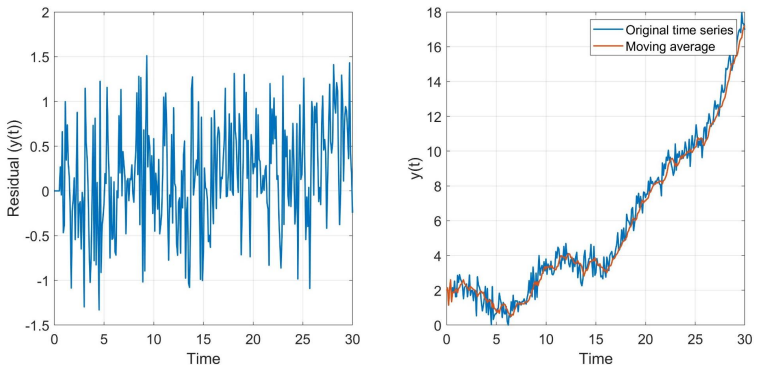
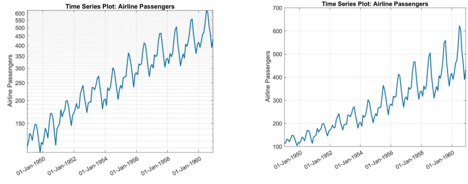
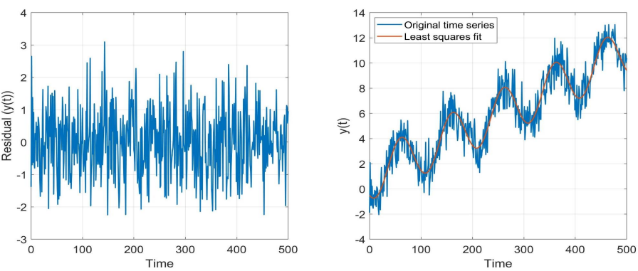

# Time Series Stationarity

**Definition:** a stationary time series is a stochastic process whose joint probability distribution function does not change when shifted in time.

This means that parameters such as *mean* and *(co)variance* should also remain constant over time and not follow any trend, seasonality or irregularity.

* Mean of the process is time-independent

$$\mathbb{E}(y(t))=\mathbb{E}(y_t)=\mu$$

* Covariance of the process is independent of t for each $\tau$

$$\text{cov}(y_t,y_{t-\tau})=\sigma_{t,t-\tau}=\mathbb{E}((y_t-\mu)(y_{t-\tau}-\mu))=\sigma_\tau$$

* If $\tau=0$, the variance becomes also constant with respect to time

$$\mathbb{D}(y_t)=\text{var}(y_t)=\sigma_0=\mathbb{E}((y_t-\mu)^2)=\sigma^2$$

## Why stationary time series?

We desire to have stationary time series because:

* Non-stationary time series models are usually more difficult for prediction
* Random processes require time series to be stationary
* Best linear unbiased predictor (BLUP) property can be formulated for stationary time series

```{note}
Sometimes studying the non-stationarity causes (trend and seasonality) is
the subject of question/research.

However, many real-world time series are indeed non-stationary. We have to find tools to ensure their stationarity.
```

## How should we ensure stationarity?

In general, there are 5 ways to make a non-stationary time series to a stationary one. They are known as transformation methods. They are itemized as follows:

* **Difference transformation of data**:
  * Single differencing, $\Delta y_t = y_t - y_{t-1}$
  * Double differencing, $\Delta^2 y_t = \Delta y_t - \Delta y_{t-1} = y_t - 2y_{t-1}+y_{t-2}$

* **Moving average of data**:
  * Moving average, $\bar{y}_t \longleftarrow \frac{1}{k}(y_{t-1}+...+y_{t-k})$
  * Handle residuals in stochastic model, $\Delta^2 y_t = \Delta y_t - \Delta y_{t-1} = y_t - 2y_{t-1}+y_{t-2}$

* **Function-based transformation of data**:
  * Log transformation, $y_t \longleftarrow \log(y_t)$
  * Square root transformation, $y_t \longleftarrow \sqrt{y_t}$

* **Functional model least squares fit (de-trending)**:
  * Modelling the trend and seasonality, $y=Ax+e$
  * Deal with residuals in the stochastic model, $y \longleftarrow e = y-Ax$

* **Combination of abovementioned methods**

### Single differencing

Single differencing of $y=[y_1,...,y_m]$ makes a time series $\Delta y_t=y_t - y_{t-1}, t\geq 2$ starting value of $\Delta y_1 = y_1$. This is a **regular transformation** of data, and hence allowed.

$$\begin{bmatrix}
    \Delta y_1 \\ \Delta y_2 \\ \Delta y_3 \\ ... \\ \Delta y_m
\end{bmatrix} = 
\begin{bmatrix}
    1 & 0 & 0 & ... & 0\\
    -1 & 1 & 0 & ... & 0\\
    0 & -1 & 1 & ... & 0\\
    ... & ... & ... & ... & ...\\
    0 & 0 & 0 & -1 & 1
\end{bmatrix}
\begin{bmatrix}
    y_1\\ y_2\\ y_3\\ ...\\ y_m
\end{bmatrix}\Longleftrightarrow
\begin{bmatrix}
    y_1\\ y_2\\ y_3\\ ...\\ y_m
\end{bmatrix} = 
\begin{bmatrix}
    1 & 0 & 0 & ... & 0\\
    1 & 1 & 0 & ... & 0\\
    1 & 1 & 1 & ... & 0\\
    ... & ... & ... & ... & ...\\
    1 & 1 & 1 & 1 & 1
\end{bmatrix}
\begin{bmatrix}
    \Delta y_1 \\ \Delta y_2 \\ \Delta y_3 \\ ... \\ \Delta y_m
\end{bmatrix}$$

### Moving average

The moving average of $y = [y_1, ..., y_m]$ will create a time series $\bar{y}_t = {\bar{y}_1,...,\bar{y}_m}$. The difference between two time series makes a $\Delta y_t = y_t - \bar{y}_t$.

**The recipe:**
* $\bar{y}_t \longleftarrow \frac{1}{k}(y_{t-1} + ... + y_{t-k})$
* $y_t \longleftarrow y_t - \bar{y}_t$



### Function-based transformation

A function-based transformation of $y=[y_1,...,y_m]$ makes a time series $s_t \longleftarrow f(y_t)$. For example, a log function would downscale the range of variations of the data. This is a nonlinear but *regular* transformation of data, and hence allowed.



### Least-squares fit

The least squares fit of a time series $y=[y_1, ..., y_m]^T$ makes a linear model of observation equations as $y = Ax + e$, which can read as $y = A\hat{x}+\hat{e}=\hat{y}+\hat{e}$. This will then give the de-trended time series, $\hat{e} = y - A\hat{x}$, which is assumed to be stationary.

The linear model of observation equations is:

$$y=Ax+e, \hspace{50px} \mathbb{D}(y)=Q_{yy}$$

The *best linear unbiased estimation* (BLUE) of $x$ is

$$\hat{x} = (A^TQ_{yy}^{-1}A)^{-1}A^TQ_{yy}^{-1}y, \hspace{50px} Q_{\hat{x}\hat{x}}=(A^TQ_{yy}^{-1}A)^{-1}$$

The BLUE of $y$ and $e$ are, then

$$\hat{y}=A(A^TQ_{yy}^{-1}A)^{-1}A^TQ_{yy}^{-1}y \implies \hat{e}=y-A\hat{x}$$

The **de-trended $\hat{e}$ is assumed to be stationary** for further **stochastic process**. This is also an admissible transformation because $y$ can uniquely be reconstructed as $y=A\hat{x}+\hat{e}$. Let us take a look into an example:



## Testing stationarity

Different tests can be performed to test whether or not a time series is stationary. One of the commonly used methods is the **Augmented Dickey-Fuller (ADF)** test. We just highlight some background and its use in this chapter.

If we have an auto-regressive noise process

$$y_t = \beta y_{t-1}+e_t$$

It is known that if $\beta=1$, the noise is **accumulated** and thus the process is **not stationary**. It is known to be a so-called *random walk noise* process (non-stationary). The single differencing gives

$$\Delta y_t = y_t - y_{t-1} = \beta y_{t-1}+e_t-y_{t-1}$$

or

$$\Delta y_t = (\beta - 1)y_{t-1}+e_t = \gamma y_{t-1} + e_t$$

The parameter $\gamma = \beta-1$ plays an important role to test the stationarity of the time series.

### ADF test

The ADF test is performed using the following two hypotheses:

* **Null Hypothesis ($H_0$)**: Time series is non-stationary ($\gamma=0\implies\beta=1$)
* **Alternate Hypothesis ($H_a$)**: Time series is stationary ($\gamma<0\implies\beta<1$)

The null hypothesis assumes that the time series consists of non-stationary noise, mainly **Random Walk** noise. Under the alternative hypothesis, the Random Walk noise is absent, so the time series is stationary.

The test statistic is (which can be tested in a given confidence level) given by:

$$T_{ADF}=\frac{\hat{\gamma}}{\sigma_{\hat{\gamma}}}$$

The test statistic, $T_{ADF}$ is a **negative number**. The more negative it is, the stronger the rejection of the hypothesis, and hence the more level of confidence that the series is a stationary process.

## Worked example

Let us consider the following time series

$$y(t) = y_0+vt+at^2+e_t$$

**Show that double differencing makes this time series stationary.**

We start by applying single differencing to the time series:

$$\begin{align*}\Delta y(t) = y(t)-y(t-1) &= y_0+rt+at^2+e_t-(y_0+r(t-1)+a(t-1)^2+e_{t-1}) \\&= r-a+2at+\Delta e_t\end{align*}$$

Repeating the process to achieve double differencing:

$$\begin{align*}\Delta^2 y(t) = \Delta y(t) - \Delta y(t-1) &= r-a+2at+\Delta e_t-(r-a+2a(t-1)+\Delta e_{t-1}) \\&= 2a+\Delta^2e_t\end{align*}$$