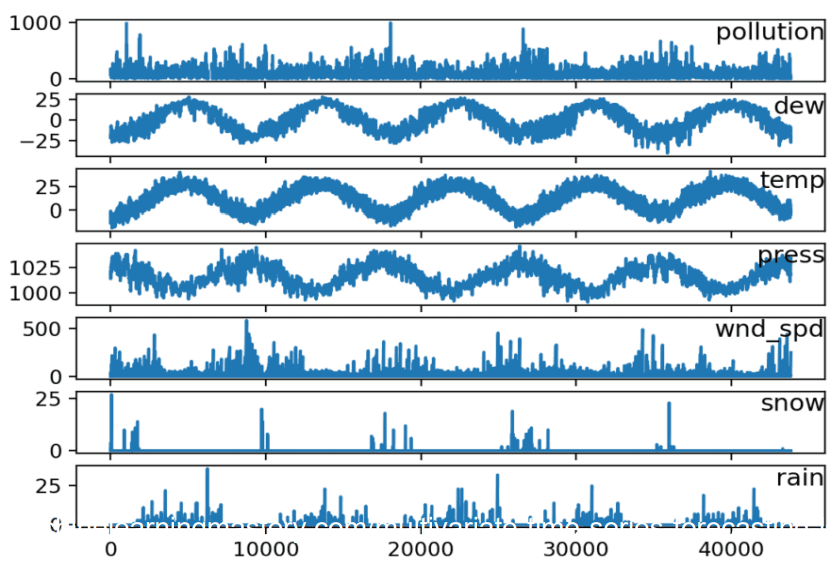
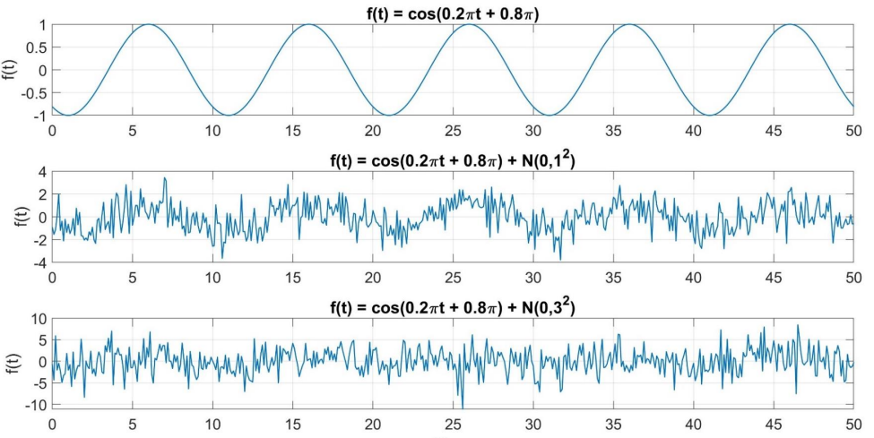

# Types of time series

Regarding time series, and depending on its properties they can be classified differently. Thus, let us start by distinguishing the different types of time series we can find.

**Continuous vs discrete**

When observations are made continuously through time, that gives rise to a **continuous** time series, even when the measured variable can only take a discrete set of values.

In practice, *observing* a continuous time series is impossible, but continuous modelling is possible!

On the other hand, it is now easy to describe a **discrete** time series - observations are only taken at specific time instances, even though they are usually equally spaced.

```{note}
In this course, we will only focus on **discrete** time series, with a focus on continuous modelling
```

**Parametric vs non-parametric**

* Parametric time series analysis
  * Consists of trend, signal and noise
  * Functional effect modelling
  * Stochastic effect modelling

* Non-parametric time series analysis *(data-driven methods)*
  * Singular spectrum analysis (SSA)
  * Wavelet transform
  * Machine learning methods

```{note}
By now, we will only take a deeper look to parametric time series!
```

**Univariate vs multivariate**

We call a time series **univariate** when only a single sequence of data is analyzed. Usually we study the time evolution of that one single variable!

On the other hand, it also seems now trivial to describe a **multivariate** time series - several sets of data for the same sequence of time periods are analyzed. As an example, we can look at the figure here presented that describes the evolution of pollution concentration that can be a function of all the other variables plotted (e.g. dew, temperature, pressure, wind direction, etc.)

```{note}
We will mainly focus on univariate time series analysis from here on!
```



**Static vs dynamic**

When analyzing time series, prediction and analysis of events can be performed in two different ways:

* Sequentially in a **recursive form**, called dynamic mode
* In a **batch form**, the so-called static mode

**Static mode** can be considered when the standard least squares method can be used to estimate time-invariant parameters, for example velocity.

On the other hand, **dynamic mode** can be considered when the dynamic least squares (e.g. Kalman filter) can be used to study and estimate time-varying parameters.

```{note}
We will mainly focus on static time series from here on!
```

## Examples

* insert examples from slides

# Additional concepts

Even though we have worked previously (on the Signal Processing chapter) considering the data just to be the signal of interest, here we assume the data is "contaminated" with noise, i.e.

$$y = \text{signal} + \text{noise} = s+n$$

Time series analysis means understanding patterns and, hence, extracting the **signal of interest** from the noisy data.

## Signal and noise

But, in the end, how can we describe both signal and noise?

* **Signal** - the meaningful information that we want to detect: deterministic characteristics by means of mathematical expressions

* **Noise** - random and undesired fluctuation that interferes with the signal: stochastic process needed

|  |
| :--: |
| *Example of a time series (top graph) affected by noise with different strength and likelihood (middle and bottom figures)* |

## Prediction, filtering and smoothing

There are different estimates of the state vector possible (mainly in dynamic systems)

